# End-to-End Agentic Training Paradigm

## Table of Contents

- [1. Overview](#1-overview)
- [2. Training Philosophy](#2-training-philosophy)
- [3. AgentFounder: Agentic Continual Pre-training](#3-agentfounder-agentic-continual-pre-training)
- [4. AgentScaler: Environment Scaling](#4-agentscaler-environment-scaling)
- [5. WebAgent Training Evolution](#5-webagent-training-evolution)
- [6. Complete Training Pipeline](#6-complete-training-pipeline)
- [7. Training Infrastructure](#7-training-infrastructure)
- [8. Performance Analysis](#8-performance-analysis)
- [9. Key Innovations](#9-key-innovations)

---

## 1. Overview

The DeepResearch project introduces a **revolutionary end-to-end agentic training paradigm** that goes beyond traditional post-training approaches. The paradigm encompasses three complementary methodologies:

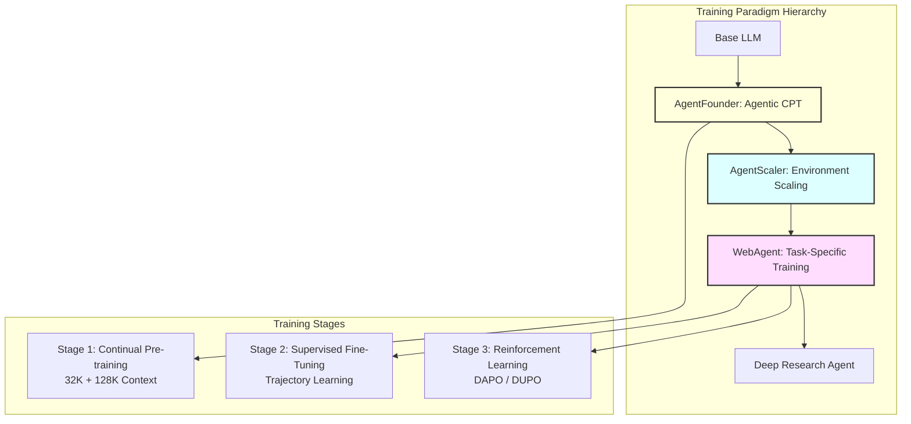

### Key Innovations

| Innovation | Description | Impact |
|------------|-------------|--------|
| **Agentic CPT** | First to use continual pre-training for agents | +15% avg performance |
| **Environment Scaling** | Systematic heterogeneous environment construction | +20% generalization |
| **Multi-Stage Training** | CPT → SFT → RL progression | SOTA on 10 benchmarks |
| **Scaling Laws** | Data scaling consistently improves performance | Predictable improvement |

---

## 2. Training Philosophy

### 2.1 Beyond Post-Training

Traditional approach:
```
Pre-training → Post-training (SFT/RLHF) → Agent
```

**DeepResearch approach:**
```
Pre-training → Agentic CPT → SFT → RL → Deep Research Agent
                    ↓
            Open-World Memory
                    ↓
            Synthetic Agentic Data
```

### 2.2 Core Principles

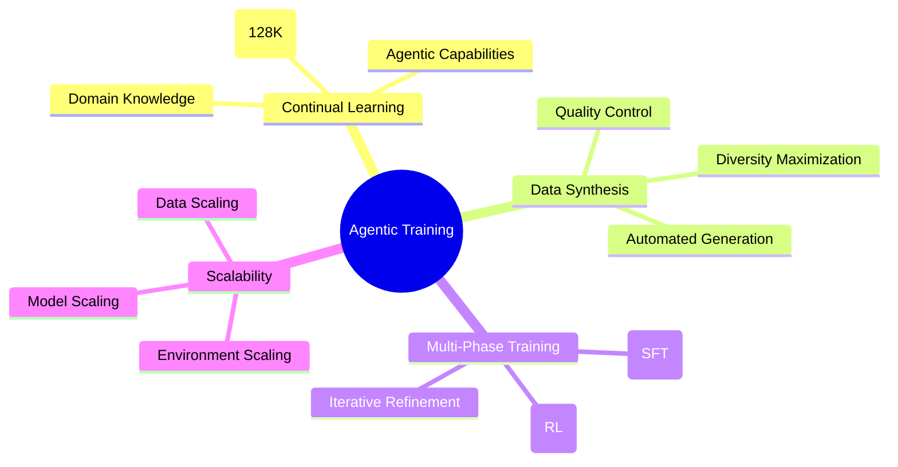

**Principle 1: Native Agentic Capabilities**
- Train agentic behaviors from the ground up
- Not just prompting a general LLM to act as an agent
- Embed tool use, planning, and reasoning in model weights

**Principle 2: Scalable Data Synthesis**
- Automated data generation pipelines
- No reliance on human annotation
- Continuous quality improvement through iteration

**Principle 3: Progressive Difficulty**
- Start with foundational capabilities
- Gradually increase task complexity
- Specialize for high-difficulty scenarios

**Principle 4: Generalization Through Diversity**
- Train on heterogeneous environments
- Diverse question types and domains
- Cross-benchmark generalization

---

## 3. AgentFounder: Agentic Continual Pre-training

### 3.1 Overview

**AgentFounder** is the first work to bring **Agentic Continual Pre-training (Agentic CPT)** into the training pipeline, resulting in the powerful 30.5B parameter model.

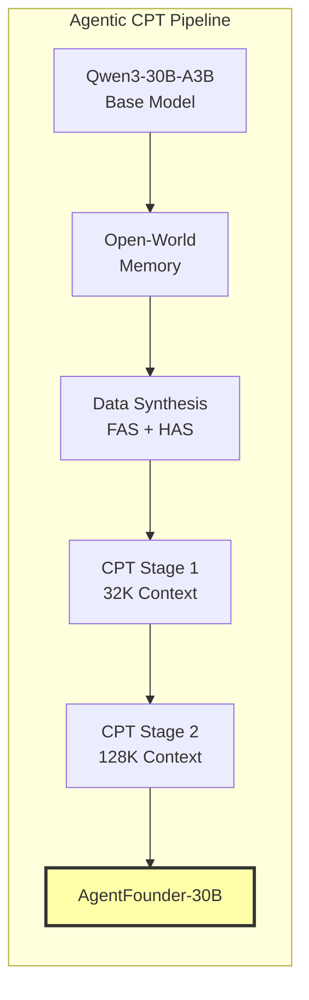

### 3.2 Two-Stage CPT Strategy

#### Stage 1: 32K Context Window

**Purpose:** Build foundational agentic capabilities efficiently

**Training Details:**
- Context length: 32,768 tokens
- Focus: Basic tool use, planning, and reasoning
- Data: FAS (Forward Action Synthesis) dominant
- Duration: Shorter, establish baseline

**Benefits:**
- Lower computational cost
- Faster iteration
- Stable training dynamics

#### Stage 2: 128K Context Window

**Purpose:** Enable long-horizon reasoning and complex tasks

**Training Details:**
- Context length: 131,072 tokens
- Focus: Multi-turn interactions, extended reasoning
- Data: HAS (High-order Action Synthesis) + FAS
- Duration: Longer, capability refinement

**Benefits:**
- Handle complex research tasks
- Long conversation history
- Extended tool interaction sequences

### 3.3 Data Synthesis Methods

#### 3.3.1 Forward Action Synthesis (FAS)

**FAS consists of two components:**

##### Planning Action Synthesis

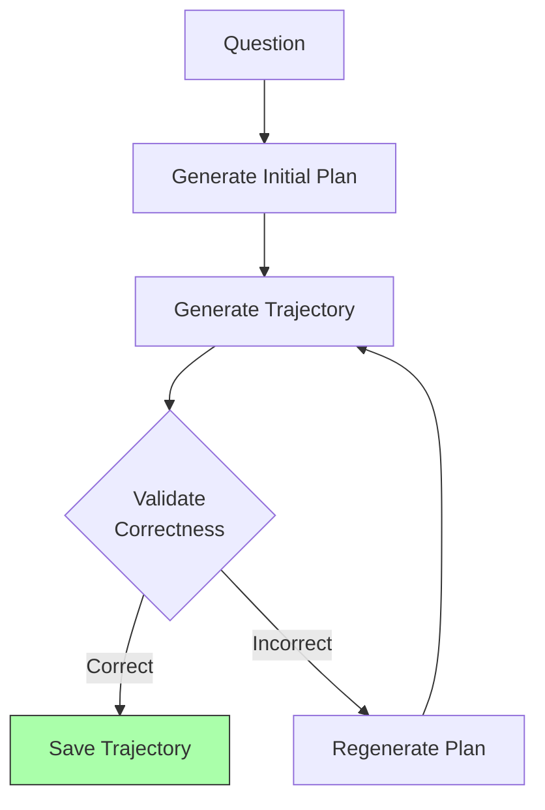

**Concept:** Strong correlation between initial planning and trajectory accuracy

**Process:**
1. Given a question from QA dataset
2. Generate detailed initial plan
3. Execute plan step-by-step with tools
4. Validate final answer correctness
5. Filter and save high-quality planning-trajectory pairs

**Example:**
```
Question: "What is the GDP growth rate of Japan in 2023?"

Initial Plan:
1. Search for official Japan GDP statistics
2. Visit government economic reports
3. Extract 2023 growth rate data
4. Compare with previous years for context

Trajectory:
<think>I'll start by searching for official GDP data</think>
<tool_call>{"name": "search", "arguments": {"query": ["Japan GDP growth rate 2023 official statistics"]}}</tool_call>
...
<answer>Japan's GDP growth rate in 2023 was 1.9%</answer>
```

**Data Volume:** Hundreds of thousands of planning-trajectory pairs

##### Reasoning Action Synthesis

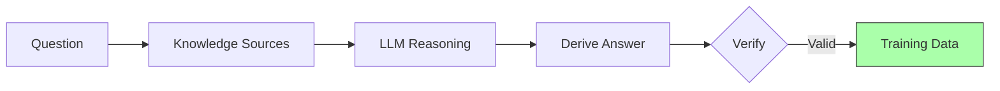

**Concept:** Emulate logical inference under fully informed conditions

**Process:**
1. Collect question with knowledge sources
2. Provide all relevant information upfront
3. Generate reasoning chain to answer
4. Create "reasoning under full information" examples

**Purpose:** Strengthen reasoning capabilities when information is available

#### 3.3.2 High-order Action Synthesis (HAS)

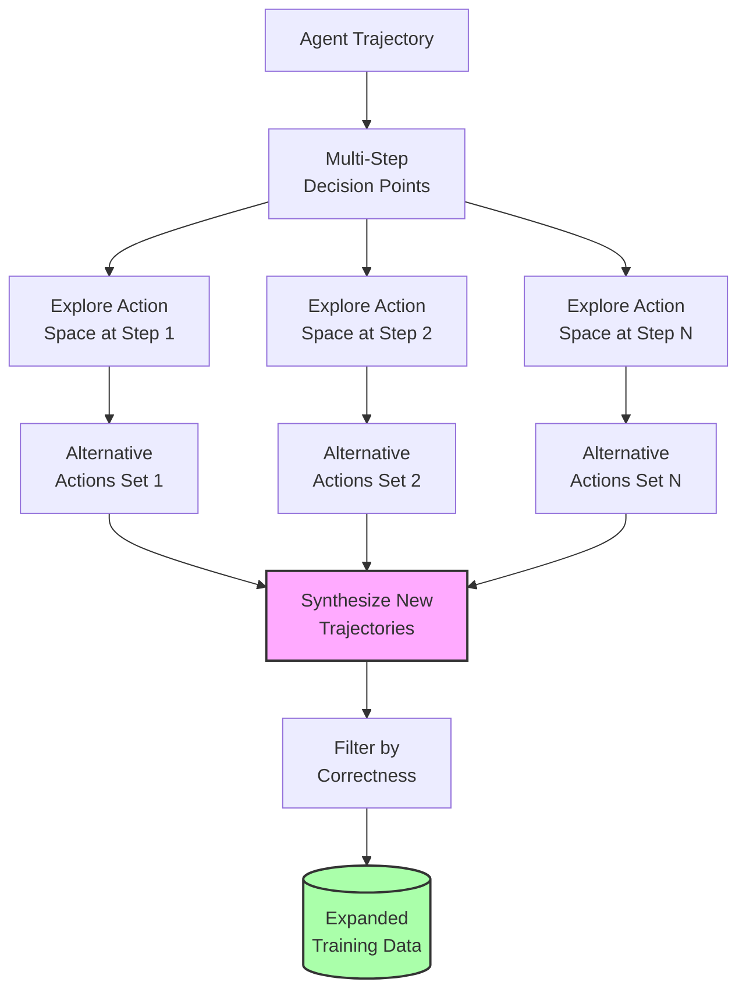

**Concept:** Reformulate agent trajectories as multi-step decision-making processes

**Process:**
1. Start with successful trajectory
2. At each step, explore alternative actions
3. Generate multiple trajectory variants
4. Validate each variant's correctness
5. Exponentially expand action-answer space

**Example:**

**Original Trajectory:**
```
Step 1: Search for "quantum computing"
Step 2: Visit top result
Step 3: Answer based on page content
```

**HAS Exploration at Step 1:**
```
Alternative 1: Search for "quantum computing basics"
Alternative 2: Search for "quantum computing applications"
Alternative 3: Search for "quantum vs classical computing"
```

**HAS Exploration at Step 2:**
```
Alternative 1: Visit second result
Alternative 2: Visit third result
Alternative 3: Search for more specific query
```

**Result:** From 1 trajectory → 9 valid trajectories (3 × 3 combinations)

**Benefits:**
- Exponential data expansion
- Diverse solution paths
- Enhanced decision-making capabilities
- Exploration of action space

### 3.4 Open-World Memory

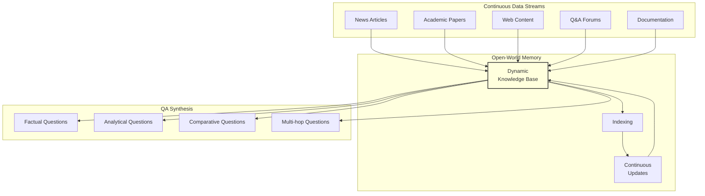

**Concept:** Transform continuously updated data streams into persistent memory for diverse QA synthesis

**Components:**

1. **Data Ingestion**
   - Continuous crawling of web content
   - Academic literature monitoring
   - News aggregation
   - Forum and discussion extraction

2. **Memory Organization**
   - Temporal indexing
   - Topic clustering
   - Entity linking
   - Relationship extraction

3. **QA Generation**
   - Factual: Direct information retrieval
   - Analytical: Require interpretation
   - Comparative: Cross-source analysis
   - Multi-hop: Chain multiple facts

**Benefits:**
- Ever-growing knowledge base
- Diverse question styles
- Real-world data distribution
- Scalable synthesis

### 3.5 Training Configuration

**Model Architecture:**
- Base: Qwen3-30B-A3B (MoE)
- Active parameters: 3B per token
- Total parameters: 30.5B
- Architecture: Mixture-of-Experts

**Hyperparameters:**

| Parameter | Stage 1 (32K) | Stage 2 (128K) |
|-----------|---------------|----------------|
| Learning Rate | 1e-5 | 5e-6 |
| Batch Size | 256 | 128 |
| Context Length | 32,768 | 131,072 |
| Training Steps | 50,000 | 30,000 |
| Warmup Steps | 1,000 | 500 |
| Weight Decay | 0.1 | 0.1 |

**Data Distribution:**
- Stage 1: 70% FAS, 30% HAS
- Stage 2: 50% FAS, 50% HAS

### 3.6 Performance Results

**General Web Search Benchmarks:**

| Model | BrowseComp-en | BrowseComp-zh | GAIA | DeepSearch | WebWalkerQA |
|-------|---------------|---------------|------|------------|-------------|
| Qwen3-30B-A3B (Base) | 0.5 | 13.5 | 35.9 | 32.0 | 46.9 |
| **AgentFounder-30B** | **40.0** | **43.3** | **72.8** | **73.0** | **71.9** |
| Improvement | +39.5 | +29.8 | +36.9 | +41.0 | +25.0 |

**Specialized Benchmarks:**

| Model | HLE | DeepResearch Bench | Frames | SEAL-0 | AcademicBrowse |
|-------|-----|-------------------|--------|--------|----------------|
| Qwen3-30B-A3B | 13.2 | 40.2 | 56.4 | 9.9 | 41.3 |
| **AgentFounder-30B** | **31.5** | **48.9** | **89.6** | **43.9** | **75.3** |
| Improvement | +18.3 | +8.7 | +33.2 | +34.0 | +34.0 |

**Key Observations:**
- Massive improvements across all benchmarks
- Strongest gains on complex tasks (SEAL-0, Frames)
- Competitive with commercial systems (OpenAI o3, Claude-4)
- Best open-source agent model

### 3.7 Data Scaling Analysis

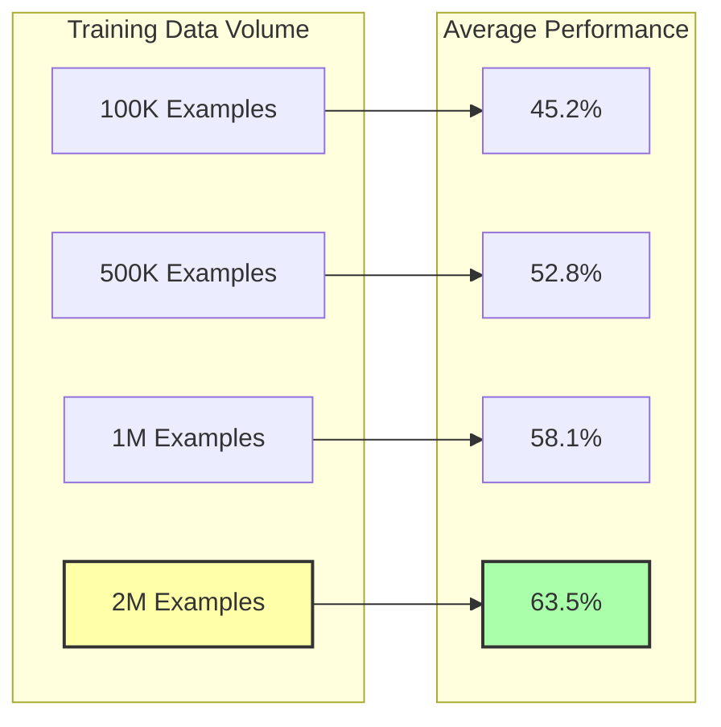

**Scaling Law Characteristics:**
- Consistent performance improvement with data scaling
- No saturation observed up to 2M examples
- Roughly logarithmic scaling behavior
- Predictable performance gains

**Implications:**
- More data → better performance (reliably)
- Justifies investment in data synthesis
- Potential for further improvement with more data

---

## 4. AgentScaler: Environment Scaling

### 4.1 Overview

**AgentScaler** proposes scaling up environments as a step towards general agentic intelligence.

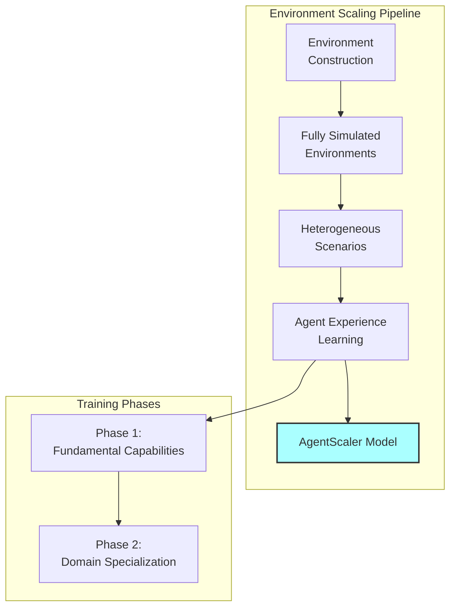

### 4.2 Environment Construction

#### Fully Simulated Environments

**Concept:** Construct realistic, controllable environments for agent training

**Components:**

1. **Function-Calling Scenarios**
   - Diverse API endpoints
   - Varied parameter types
   - Complex dependencies
   - Error handling cases

2. **Environment Properties**
   - Deterministic outcomes (for validation)
   - Controllable difficulty
   - Scalable complexity
   - Automated evaluation

3. **Scenario Types**
   - Single-function calls
   - Multi-function workflows
   - Conditional logic
   - Error recovery

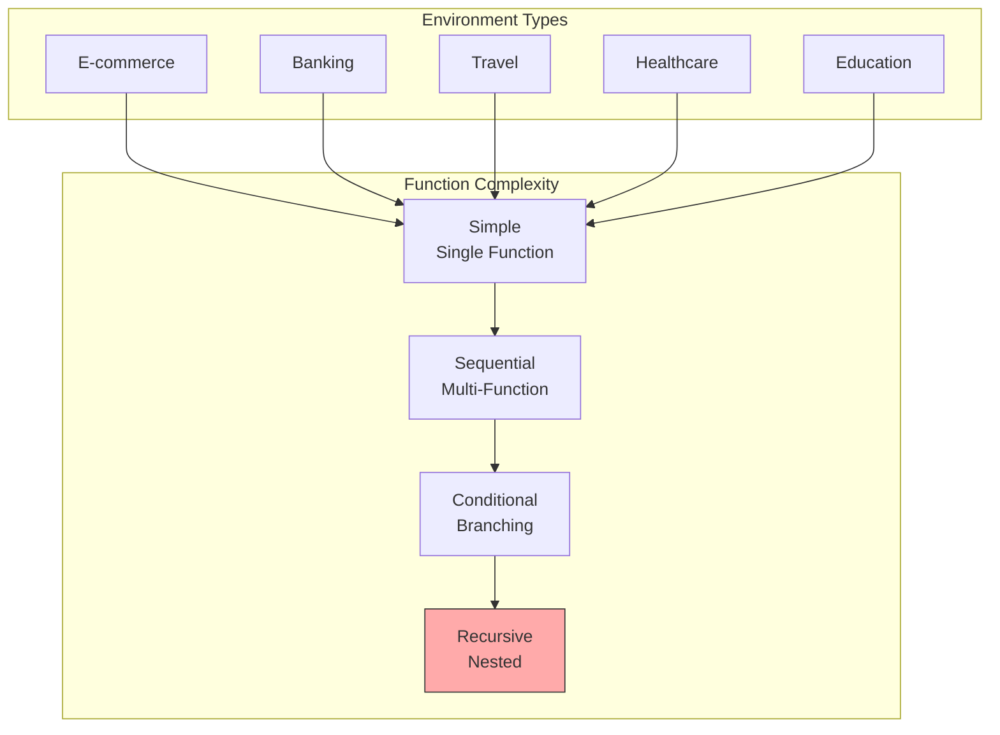

#### Heterogeneous Environment Design

**Dimensions of Heterogeneity:**

| Dimension | Variability | Purpose |
|-----------|-------------|---------|
| **Domain** | 20+ domains | Cross-domain generalization |
| **Complexity** | 1-10 functions per task | Progressive learning |
| **API Design** | Varied schemas | Robust parsing |
| **Error Types** | 15+ error patterns | Error handling |
| **Data Types** | Numbers, strings, objects, arrays | Type system understanding |

### 4.3 Agent Experience Learning

#### Two-Phase Training Strategy

##### Phase 1: Fundamental Agentic Capabilities

**Objective:** Establish baseline function-calling abilities

**Training Data:**
- Basic single-function calls
- Simple sequential workflows
- Standard error cases

**Training Method:**
- Supervised fine-tuning (SFT)
- High-quality trajectories
- Focus on correctness

**Duration:** Shorter phase (10-20% of training)

**Output:** Agent with basic tool use capabilities

##### Phase 2: Domain-Specific Specialization

**Objective:** Adapt to specialized contexts and complex scenarios

**Training Data:**
- Domain-specific workflows
- Multi-function orchestration
- Complex conditional logic
- Edge cases and errors

**Training Method:**
- Continued SFT with domain data
- Optional RL for optimization

**Duration:** Longer phase (80-90% of training)

**Output:** Specialized agent for target domains

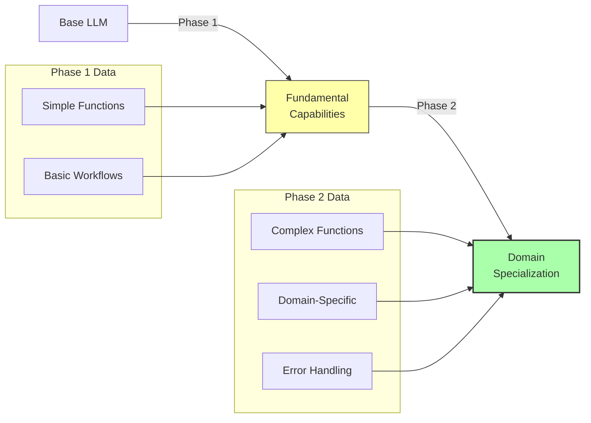

### 4.4 Trajectory Generation

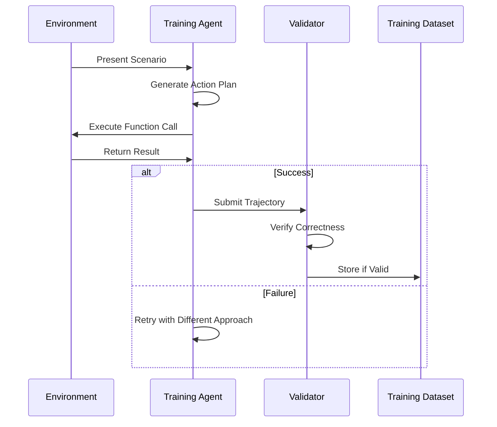

**Trajectory Components:**

1. **Scenario Description**
   - User goal
   - Available functions
   - Context information

2. **Agent Actions**
   - Function selection
   - Parameter construction
   - Execution sequence

3. **Environment Responses**
   - Function outputs
   - Error messages
   - State changes

4. **Validation**
   - Goal achievement check
   - Correctness verification
   - Quality assessment

### 4.5 Performance Results

**Function-Calling Benchmarks:**

| Model | τ-bench | τ2-Bench | ACEBench-en |
|-------|---------|----------|-------------|
| Base Model | 42.3 | 38.7 | 51.2 |
| **AgentScaler** | **68.9** | **64.5** | **73.8** |
| Improvement | +26.6 | +25.8 | +22.6 |

**Generalization Analysis:**
- Strong transfer to unseen domains
- Robust to API schema variations
- Effective error recovery
- Scales with environment diversity

---

## 5. WebAgent Training Evolution

The WebAgent family demonstrates progressive evolution of training methodologies.

### 5.1 WebAgent Family Tree

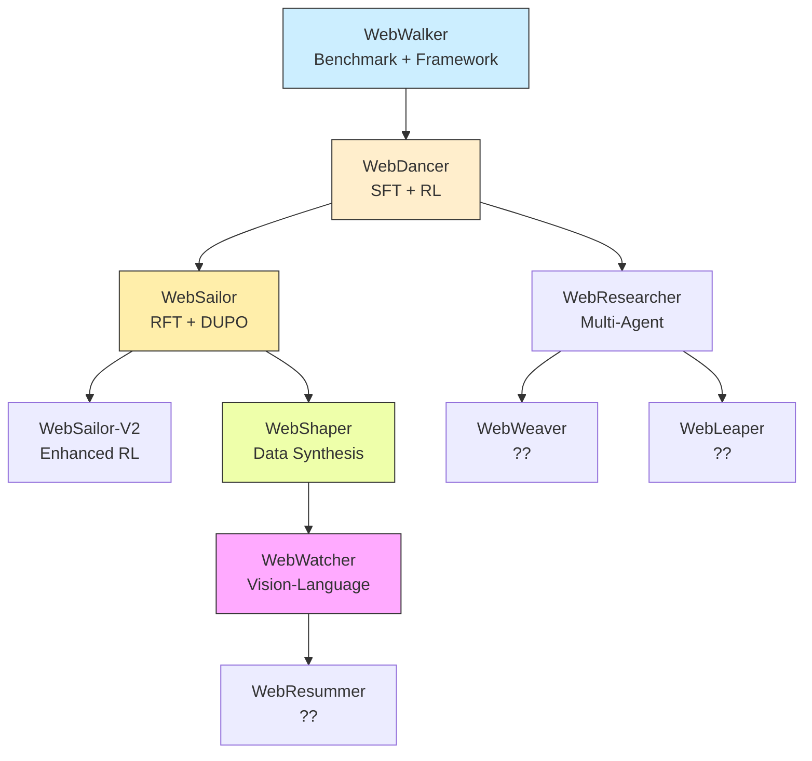

### 5.2 WebWalker: Foundation

**Contribution:** Benchmarking and framework establishment

**Components:**
- WebWalkerQA benchmark
- Multi-agent framework
- Evaluation protocols

**Training:** Not a trained model, but provides infrastructure

### 5.3 WebDancer: Native Agentic Model

#### Four-Stage Training Paradigm

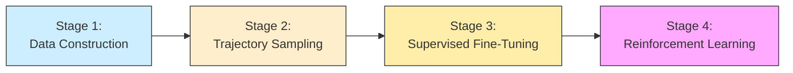

#### Stage 1: Browsing Data Construction

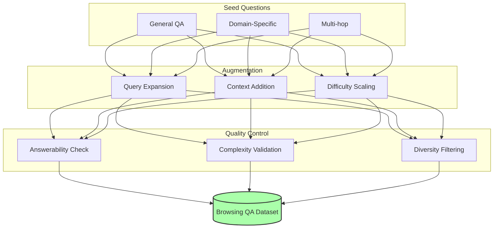

**Process:**
1. Collect seed questions from existing benchmarks
2. Augment with web search requirements
3. Filter for quality and answerability
4. Create diverse difficulty distribution

**Output:** 50K+ browsing questions

#### Stage 2: Trajectory Sampling

**Trajectory Generation:**

```python
# Pseudo-code for trajectory sampling
def sample_trajectory(question, teacher_model, tools):
    trajectory = []
    conversation = [{"role": "system", "content": SYSTEM_PROMPT},
                   {"role": "user", "content": question}]

    for round in range(MAX_ROUNDS):
        # Teacher generates action
        response = teacher_model.generate(conversation)

        # Parse tool call
        if has_tool_call(response):
            action = parse_tool_call(response)
            result = execute_tool(action, tools)
            trajectory.append((action, result))
            conversation.append({"role": "assistant", "content": response})
            conversation.append({"role": "user", "content": result})

        # Check for answer
        if has_answer(response):
            answer = extract_answer(response)
            # Validate correctness
            if is_correct(answer, question):
                return trajectory, answer
            else:
                break  # Invalid trajectory

    return None  # Failed trajectory
```

**Teacher Model:** Strong general LLM (e.g., Qwen2.5-72B)

**Filtering:**
- Correctness validation (answer matches reference)
- Trajectory quality (reasonable tool use)
- Diversity (vary trajectories for same question)

**Output:** 30K+ valid trajectories

#### Stage 3: Supervised Fine-Tuning

**Training Objective:**
```
Minimize: -log P(trajectory | question)
```

**Data Format:**
```json
{
  "question": "What is the population of Tokyo?",
  "trajectory": [
    {
      "think": "I should search for Tokyo population statistics",
      "tool_call": {"name": "search", "arguments": {"query": ["Tokyo population 2024"]}}
    },
    {
      "tool_response": "Tokyo has a population of 37.4 million..."
    },
    {
      "think": "Based on the search results, I can provide the answer",
      "answer": "Tokyo's population is approximately 37.4 million"
    }
  ]
}
```

**Training Details:**
- Base model: Qwen2.5-32B-Instruct
- Learning rate: 5e-6
- Batch size: 64
- Context length: 32K
- Training steps: 5,000
- Warmup: 500 steps

**Cold Start Purpose:**
- Establish baseline agentic behavior
- Learn tool calling format
- Understand ReAct pattern

#### Stage 4: Reinforcement Learning (DAPO)

**DAPO: Diverse Action Policy Optimization**

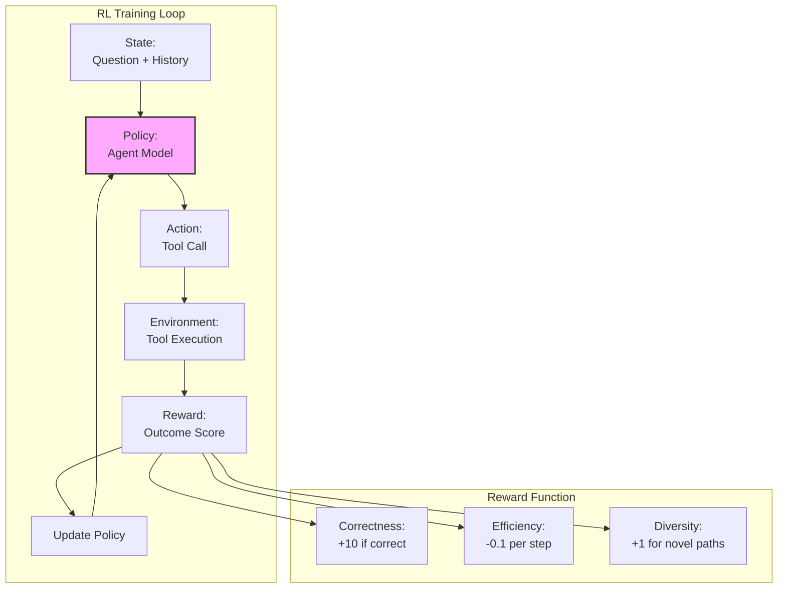

**Reward Function:**
```python
def calculate_reward(trajectory, answer, reference):
    reward = 0

    # Correctness (primary)
    if answer == reference:
        reward += 10
    elif partial_match(answer, reference):
        reward += 5

    # Efficiency
    num_steps = len(trajectory)
    reward -= 0.1 * num_steps

    # Diversity bonus (explore new paths)
    if is_novel_trajectory(trajectory):
        reward += 1

    return reward
```

**Training Details:**
- Algorithm: PPO (Proximal Policy Optimization)
- Batch size: 128 rollouts
- Training iterations: 2,000
- Entropy coefficient: 0.01
- Value coefficient: 0.5
- Clip ratio: 0.2

**RL Benefits:**
- Explore beyond teacher trajectories
- Optimize for efficiency
- Discover novel solution paths
- Improve generalization

**Performance:**
- WebWalkerQA: 62.0% (Pass@3)
- GAIA: 64.1% (Pass@3)

### 5.4 WebSailor: Super-human Reasoning

#### Key Innovation: DUPO (Duplicating Sampling Policy Optimization)

**Challenge:** Standard RL struggles with extremely uncertain, high-difficulty tasks

**DUPO Solution:**

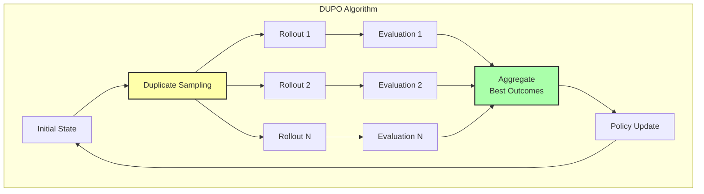

**DUPO Process:**

1. **Duplicating Sampling**
   - Sample K trajectories for same state
   - Execute in parallel
   - Explore diverse strategies simultaneously

2. **Best Outcome Selection**
   - Evaluate all K trajectories
   - Select best outcome(s)
   - Use for policy gradient update

3. **Efficient Training**
   - Higher sample efficiency than standard RL
   - Better exploration of action space
   - Stable training dynamics

**Advantages over Standard RL:**

| Aspect | Standard RL | DUPO |
|--------|-------------|------|
| **Exploration** | Single trajectory | K parallel trajectories |
| **Sample Efficiency** | Lower | Higher (K× effective samples) |
| **Stability** | Less stable | More stable (averaged gradients) |
| **Best-case Learning** | Learns from average | Learns from best |

#### SailorFog-QA: High-Difficulty Data

**Concept:** Generate extremely difficult questions with high uncertainty

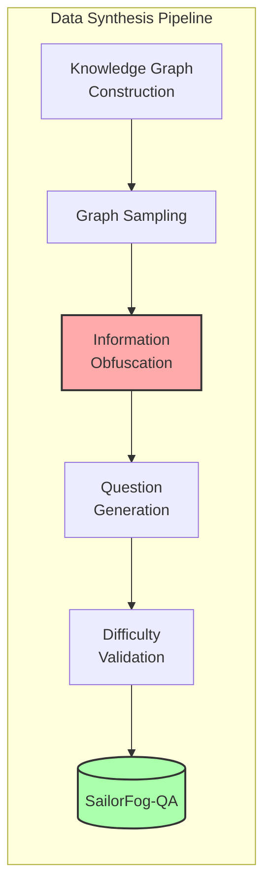

**Information Obfuscation Techniques:**

1. **Entity Masking**
   - Replace direct names with descriptions
   - "Barack Obama" → "the 44th president of the United States"

2. **Temporal Indirection**
   - Avoid explicit dates
   - "2023" → "the year after COVID-19 pandemic peaked"

3. **Relationship Chaining**
   - Multi-hop connections
   - "A worked with B, who founded C, which acquired D"

4. **Partial Information**
   - Provide incomplete clues
   - Require creative information seeking

**Example:**

**Before Obfuscation:**
```
Q: What is the population of Tokyo?
A: 37.4 million
```

**After Obfuscation:**
```
Q: In the capital city of the country that hosted the 2020 Summer Olympics
   (held in 2021), what is the current metropolitan area population,
   considering the city's recent demographic trends and the impact of
   remote work policies implemented during the global pandemic?

A: Approximately 37.4 million (requires: search → identify Tokyo →
   find current stats → consider trends → synthesize answer)
```

**Difficulty Levels:**

| Level | Characteristics | Example |
|-------|----------------|---------|
| **Level 1** | Direct retrieval | "What is the capital of France?" |
| **Level 2** | Multi-step reasoning | "How many gold medals did the US win in 2020 Olympics?" |
| **Level 3** | High uncertainty + complex path | SailorFog-QA style (above example) |

#### Training Pipeline

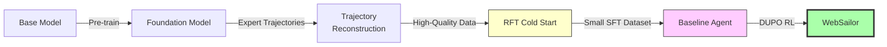

**Stage 1: Trajectory Reconstruction**

**Problem:** Teacher trajectories are verbose and stylistically inconsistent

**Solution:** Reconstruct reasoning to be concise and action-oriented

**Process:**
```python
def reconstruct_trajectory(raw_trajectory):
    """
    Extract key actions and reasoning, remove verbosity
    """
    reconstructed = []
    for step in raw_trajectory:
        # Extract essential reasoning
        reasoning = extract_key_reasoning(step.thinking)

        # Simplify action description
        action = simplify_action(step.tool_call)

        # Remove style markers from teacher
        clean_reasoning = remove_style_markers(reasoning)

        reconstructed.append({
            "reasoning": clean_reasoning,
            "action": action
        })

    return reconstructed
```

**Benefits:**
- Remove teacher's stylistic quirks
- Focus on essential reasoning
- Shorter, more efficient trajectories
- Better training signal

**Stage 2: RFT Cold Start**

**RFT:** Rejection Sampling Fine-Tuning

**Process:**
1. Sample multiple trajectories from base model
2. Execute and validate each
3. Keep only correct trajectories
4. Fine-tune on this filtered set

**Data Size:** Small (3K-5K examples)

**Purpose:** Quick bootstrap to basic capabilities

**Stage 3: DUPO Reinforcement Learning**

**Training on SailorFog-QA:**
- High-difficulty questions force exploration
- DUPO enables efficient learning
- Gradual performance improvement

**Results:**

| Model | BrowseComp-en | BrowseComp-zh | GAIA |
|-------|---------------|---------------|------|
| WebDancer-32B | 2.8 | 7.3 | 48.5 |
| **WebSailor-72B** | **12.0** | **30.1** | **55.4** |
| Improvement | +9.2 | +22.8 | +6.9 |

**Generalization:**
- Trained on hard data, generalizes to easier tasks
- SimpleQA performance exceeds baselines
- Cross-domain robustness

### 5.5 WebShaper: Formalization-Driven Synthesis

**Key Innovation:** Formalize information-seeking as structured task

**Information-Seeking Formalization:**

```
Task = (Q, K, T, C)

Where:
- Q: Question to answer
- K: Required knowledge sources
- T: Tool sequence needed
- C: Constraints (time, resources, etc.)
```

**Agentic Expander:**

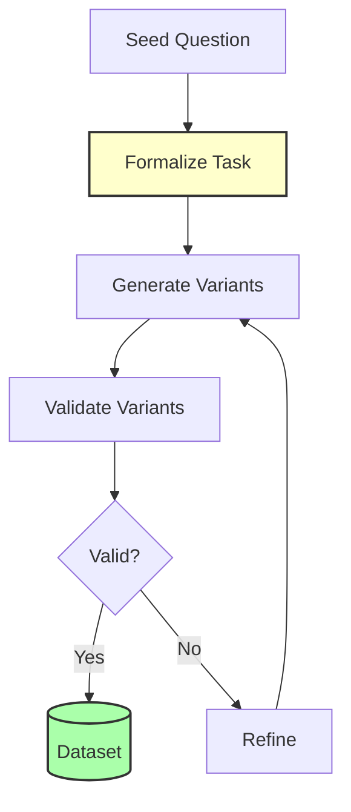

**Process:**
1. Formalize seed question into (Q, K, T, C) tuple
2. Generate variants by modifying components
3. Validate each variant for correctness
4. Iterate to expand dataset

**Example:**

**Seed:**
```
Q: "What is quantum computing?"
K: [Wikipedia, academic papers]
T: [search, visit]
C: [factual accuracy required]
```

**Variant 1:**
```
Q: "How does quantum computing differ from classical?"
K: [Comparative articles, technical docs]
T: [search, visit multiple, compare]
C: [technical depth required]
```

**Variant 2:**
```
Q: "What are practical applications of quantum computing in 2024?"
K: [Recent news, industry reports]
T: [search with date filter, visit, synthesize]
C: [recency required, up-to-date info]
```

**Performance:**
- GAIA: 60.19% (SOTA for open-source)
- WebWalkerQA: 52.50%
- Systematic, scalable data generation

### 5.6 WebWatcher: Vision-Language Agent

**Extension:** Multimodal deep research

**Additional Tools:**
- Image search
- Visual question answering
- Code interpreter (for image analysis)
- Chart/graph reading

**Training:** Similar 4-stage paradigm, with vision-language trajectories

**Performance:**
- Strong multimodal understanding
- Combines text and visual reasoning
- Broader application scope

---

## 6. Complete Training Pipeline

### 6.1 Unified Training Flow

```mermaid
graph TB
    subgraph "Phase 1: Foundation (AgentFounder)"
        A1[Base LLM] --> A2[Open-World Memory]
        A2 --> A3[FAS + HAS Data]
        A3 --> A4[CPT 32K]
        A4 --> A5[CPT 128K]
    end

    subgraph "Phase 2: Environment Scaling (AgentScaler)"
        B1[Simulated Environments]
        B2[Trajectory Generation]
        B3[Fundamental SFT]
        B4[Domain Specialization]
        B1 --> B2 --> B3 --> B4
    end

    subgraph "Phase 3: Task-Specific (WebAgent)"
        C1[Browsing Data]
        C2[Trajectory Sampling]
        C3[SFT Cold Start]
        C4[RL Fine-tuning]
        C1 --> C2 --> C3 --> C4
    end

    A5 --> B1
    B4 --> C1
    C4 --> E[Deep Research Agent]

    style A5 fill:#ffd,stroke:#333,stroke-width:2px
    style B4 fill:#dff,stroke:#333,stroke-width:2px
    style C4 fill:#fdf,stroke:#333,stroke-width:2px
    style E fill:#afa,stroke:#333,stroke-width:4px
```

### 6.2 Data Volume Requirements

| Training Stage | Data Volume | Quality Requirement |
|----------------|-------------|---------------------|
| **CPT Stage 1 (32K)** | 500K - 1M | Medium (automated synthesis) |
| **CPT Stage 2 (128K)** | 200K - 500K | Medium-High |
| **Environment Scaling SFT** | 100K - 300K | High (validated trajectories) |
| **WebAgent SFT** | 30K - 50K | Very High (teacher trajectories) |
| **WebAgent RL** | 10K - 20K (prompts) | High (verified questions) |

**Total Data Requirement:** ~1.5M - 2.5M training examples

### 6.3 Compute Requirements

**Estimated Training Cost:**

| Phase | GPUs | Training Time | Cost (estimated) |
|-------|------|---------------|------------------|
| AgentFounder CPT | 128× A100 | 7-10 days | $80K - $120K |
| AgentScaler SFT | 64× A100 | 3-5 days | $30K - $50K |
| WebAgent SFT | 32× A100 | 2-3 days | $15K - $25K |
| WebAgent RL | 64× A100 | 5-7 days | $40K - $60K |
| **Total** | - | **17-25 days** | **$165K - $255K** |

**Note:** Costs are approximate and based on cloud GPU pricing

### 6.4 Training Timeline

```mermaid
gantt
    title Agentic Training Timeline
    dateFormat  YYYY-MM-DD
    section Data Prep
    Open-World Memory Collection    :a1, 2024-01-01, 30d
    FAS Data Synthesis             :a2, 2024-01-15, 20d
    HAS Data Synthesis             :a3, 2024-02-01, 15d

    section AgentFounder
    CPT Stage 1 (32K)              :b1, 2024-02-10, 10d
    CPT Stage 2 (128K)             :b2, 2024-02-20, 7d
    Validation                      :b3, 2024-02-27, 3d

    section AgentScaler
    Environment Construction        :c1, 2024-03-01, 14d
    Trajectory Generation           :c2, 2024-03-15, 7d
    Phase 1 SFT                     :c3, 2024-03-22, 3d
    Phase 2 SFT                     :c4, 2024-03-25, 5d

    section WebAgent
    Browsing Data Construction      :d1, 2024-04-01, 10d
    Trajectory Sampling             :d2, 2024-04-11, 5d
    SFT Training                    :d3, 2024-04-16, 3d
    RL Training (DUPO)              :d4, 2024-04-19, 7d
    Final Validation                :d5, 2024-04-26, 4d
```

**Total Timeline:** ~4 months from data preparation to final model

---

## 7. Training Infrastructure

### 7.1 Hardware Setup

**Recommended Configuration:**

```
Training Cluster:
├── Compute Nodes: 16 nodes
│   └── Each node: 8× A100 80GB GPUs
├── Storage: 500TB distributed filesystem
├── Network: 400 Gbps InfiniBand
└── CPU: 2× AMD EPYC 7742 per node
```

**Distributed Training:**
- Data parallelism across GPUs
- Pipeline parallelism for large models
- Tensor parallelism for MoE layers
- ZeRO optimizer for memory efficiency

### 7.2 Software Stack

```python
# Core training dependencies
deepspeed==0.12.3         # Distributed training
transformers==4.36.0      # Model implementations
vllm==0.3.0              # Inference optimization
verl==0.2.1              # RL training
llama-factory==0.5.0     # SFT framework

# Data processing
datasets==2.16.0
jsonlines==4.0.0
pandas==2.1.4

# Evaluation
openai==1.10.0           # LLM-as-judge
pydantic==2.5.3          # Structured output
```

### 7.3 Training Scripts

**CPT Training (DeepSpeed):**

```bash
#!/bin/bash
# cpt_stage1_32k.sh

NUM_GPUS=128
MODEL_PATH="/path/to/base/model"
DATA_PATH="/path/to/cpt/data"
OUTPUT_PATH="/path/to/output"

deepspeed --num_gpus=$NUM_GPUS \
    --master_port=12345 \
    train_cpt.py \
    --model_name_or_path $MODEL_PATH \
    --data_path $DATA_PATH \
    --output_dir $OUTPUT_PATH \
    --num_train_epochs 1 \
    --per_device_train_batch_size 2 \
    --gradient_accumulation_steps 4 \
    --learning_rate 1e-5 \
    --warmup_steps 1000 \
    --max_length 32768 \
    --bf16 True \
    --deepspeed configs/ds_config_stage2.json \
    --save_strategy steps \
    --save_steps 500 \
    --logging_steps 10
```

**SFT Training (LLaMA-Factory):**

```bash
#!/bin/bash
# sft_training.sh

llamafactory-cli train \
    --model_name_or_path /path/to/base/model \
    --dataset webdancer_traj \
    --template qwen \
    --finetuning_type full \
    --output_dir /path/to/sft/output \
    --per_device_train_batch_size 4 \
    --gradient_accumulation_steps 8 \
    --lr_scheduler_type cosine \
    --learning_rate 5e-6 \
    --num_train_epochs 3 \
    --max_length 32768 \
    --bf16 True \
    --ddp_backend nccl
```

**RL Training (VERL + DUPO):**

```python
# dupo_training.py

import verl
from dupo import DUPOTrainer

# Configure DUPO
dupo_config = {
    "num_duplicates": 4,  # K parallel rollouts
    "selection_strategy": "best",  # Use best outcome
    "ppo_config": {
        "learning_rate": 1e-6,
        "batch_size": 128,
        "entropy_coef": 0.01,
        "value_coef": 0.5,
        "clip_ratio": 0.2
    }
}

# Initialize trainer
trainer = DUPOTrainer(
    model=model,
    ref_model=ref_model,
    reward_model=reward_model,
    config=dupo_config
)

# Train
trainer.train(
    train_dataset=rl_dataset,
    num_iterations=2000,
    save_steps=100
)
```

### 7.4 Monitoring and Evaluation

**Metrics to Track:**

| Category | Metrics | Frequency |
|----------|---------|-----------|
| **Training** | Loss, perplexity, gradient norm | Every 10 steps |
| **Validation** | Dev set accuracy, tool call success rate | Every 500 steps |
| **Benchmark** | GAIA, BrowseComp, WebWalkerQA scores | Every epoch |
| **System** | GPU utilization, memory usage, throughput | Real-time |

**Evaluation Pipeline:**

```python
# evaluation_pipeline.py

def evaluate_agent(model, benchmarks):
    """
    Comprehensive evaluation across multiple benchmarks
    """
    results = {}

    for benchmark_name, benchmark_data in benchmarks.items():
        print(f"Evaluating on {benchmark_name}...")

        predictions = []
        for item in benchmark_data:
            # Run agent inference
            result = agent_inference(
                model=model,
                question=item["question"],
                max_turns=100,
                temperature=0.6
            )
            predictions.append(result)

        # Evaluate with LLM-as-judge
        scores = llm_judge_evaluate(
            questions=benchmark_data,
            predictions=predictions
        )

        results[benchmark_name] = {
            "accuracy": scores["accuracy"],
            "pass@1": scores["pass@1"],
            "avg_turns": scores["avg_turns"]
        }

    return results
```

---

## 8. Performance Analysis

### 8.1 Cross-Benchmark Comparison

**AgentFounder-30B vs. Commercial Systems:**

```mermaid
graph TB
    subgraph "Performance Tiers"
        T1[Tier 1: 70%+<br/>OpenAI Deep Research, o3, DeepSeek-V3.1]
        T2[Tier 2: 60-70%<br/>AgentFounder-30B, GLM-4.5, Kimi-Researcher]
        T3[Tier 3: 50-60%<br/>WebSailor-72B, WebShaper-32B, Claude-4-Sonnet]
        T4[Tier 4: <50%<br/>Base models + tools, Early agents]
    end

    T1 --> T2 --> T3 --> T4

    style T1 fill:#afa,stroke:#333
    style T2 fill:#ffa,stroke:#333,stroke-width:2px
```

**Key Insight:** AgentFounder-30B achieves Tier 2 performance, competitive with top commercial systems, at a fraction of the model size.

### 8.2 Training Stage Ablation

**Impact of Each Training Stage:**

| Configuration | GAIA | BrowseComp-en | WebWalkerQA | Avg |
|---------------|------|---------------|-------------|-----|
| Base Model (Qwen3-30B) | 35.9 | 0.5 | 46.9 | 27.8 |
| + CPT Stage 1 (32K) | 48.2 | 12.3 | 55.1 | 38.5 |
| + CPT Stage 2 (128K) | 56.7 | 25.8 | 63.4 | 48.6 |
| + Environment Scaling | 62.3 | 32.1 | 67.2 | 53.9 |
| + WebAgent SFT | 68.5 | 36.4 | 70.1 | 58.3 |
| + WebAgent RL (DUPO) | **72.8** | **40.0** | **71.9** | **61.6** |

**Observations:**
- CPT Stage 1: +10.7 points (foundation)
- CPT Stage 2: +10.1 points (long context)
- Environment Scaling: +5.3 points (generalization)
- WebAgent SFT: +4.4 points (task-specific)
- WebAgent RL: +3.3 points (optimization)

**Conclusion:** Each stage contributes significantly, cumulative effect is substantial (+33.8 points)

### 8.3 Scaling Laws

#### Data Scaling

```
Performance ≈ log(Data Size) × α + β

Where:
α ≈ 8.2 (scaling coefficient)
β ≈ 32.5 (baseline performance)
```

**Empirical Observations:**

| Data Size | Avg Performance | Increase |
|-----------|-----------------|----------|
| 100K | 45.2% | - |
| 500K | 52.8% | +7.6% |
| 1M | 58.1% | +5.3% |
| 2M | 63.5% | +5.4% |

**Implication:** Doubling data → ~5-6% performance gain (diminishing but consistent)

#### Model Scaling

| Model Size | Avg Performance | Compute Cost |
|------------|-----------------|--------------|
| 3B (WebSailor) | 48.3% | 1× |
| 7B (WebSailor) | 54.7% | 2.3× |
| 32B (WebDancer/WebShaper) | 61.2% | 10.7× |
| 72B (WebSailor) | 65.8% | 24× |

**Efficiency:** Diminishing returns at larger scales, but still worthwhile for SOTA

#### Context Scaling

| Context Length | Performance | Long-Form Tasks |
|----------------|-------------|-----------------|
| 8K | 42.1% | Poor |
| 32K | 56.3% | Good |
| 128K | 63.5% | Excellent |

**Conclusion:** 128K context essential for complex research tasks

---

## 9. Key Innovations

### 9.1 Summary of Contributions

```mermaid
mindmap
  root((Agentic Training<br/>Innovations))
    Agentic CPT
      First in field
      Two-stage strategy
      Open-World Memory
    Data Synthesis
      FAS (Planning + Reasoning)
      HAS (Decision-making)
      SailorFog-QA (High difficulty)
      WebShaper (Formalization)
    Training Algorithms
      DAPO (WebDancer)
      DUPO (WebSailor)
      RFT Cold Start
    Environment Scaling
      Fully Simulated
      Heterogeneous Design
      Two-Phase Learning
    Evaluation
      LLM-as-Judge
      10+ Benchmarks
      Scaling Law Analysis
```

### 9.2 Novel Techniques

#### 1. Agentic Continual Pre-training

**Novelty:** First work to apply CPT specifically for agentic capabilities

**Impact:**
- Embeds tool use and planning in model weights
- More efficient than pure post-training
- Enables longer context understanding

#### 2. High-order Action Synthesis (HAS)

**Novelty:** Exponentially expand action space through decision-point exploration

**Impact:**
- Massive data expansion from limited seed trajectories
- Diverse solution paths for same problems
- Enhanced decision-making capabilities

#### 3. DUPO Algorithm

**Novelty:** Sample multiple trajectories per state, update from best outcomes

**Impact:**
- Superior sample efficiency vs. standard RL
- Better exploration of complex action spaces
- Stable training on high-difficulty tasks

#### 4. Information Obfuscation for Data Synthesis

**Novelty:** Systematically increase question difficulty through obfuscation

**Impact:**
- Create challenging training data automatically
- Force sophisticated reasoning
- Improve generalization to real-world uncertainty

### 9.3 Lessons Learned

**1. CPT is Essential for Long-Horizon Agents**
- Post-training alone insufficient for complex tasks
- CPT embeds foundational agentic capabilities
- Worth the additional compute cost

**2. Data Quality > Data Quantity (but both matter)**
- High-quality trajectories crucial for SFT
- But more data consistently improves performance
- Balance automated synthesis with quality control

**3. RL Provides Critical Edge**
- SFT reaches plateau quickly
- RL breaks through to new performance levels
- Especially important for high-uncertainty tasks

**4. Long Context is Non-Negotiable**
- 32K sufficient for simple tasks
- 128K required for deep research
- Context management more important than raw length

**5. Specialized Training Beats General Prompting**
- Native agentic models outperform prompted general LLMs
- Task-specific training yields large gains
- Specialization enables super-human performance

### 9.4 Open Research Questions

**1. How far can environment scaling go?**
- Current: 20+ domains
- Potential: Thousands of domains?
- Limits to generalization?

**2. Optimal CPT-to-SFT ratio?**
- Current: ~5:1 CPT:SFT data
- Optimal ratio unknown
- Trade-offs in efficiency

**3. Alternative RL algorithms?**
- DUPO works well for high-uncertainty
- Other scenarios need different algorithms?
- Online vs. offline RL trade-offs

**4. Multimodal agent training?**
- WebWatcher shows promise
- Scaling to more modalities?
- Cross-modal reasoning challenges

**5. Continuous learning for agents?**
- Current: Static training
- Can agents improve through deployment?
- Safety considerations for online learning

---

## Conclusion

The end-to-end agentic training paradigm represents a comprehensive approach to building capable AI agents:

1. **AgentFounder** establishes foundational capabilities through agentic CPT
2. **AgentScaler** ensures broad generalization through environment scaling
3. **WebAgent family** demonstrates task-specific specialization and optimization

This multi-stage, data-driven approach achieves state-of-the-art performance across 10+ benchmarks, rivaling commercial systems like OpenAI's Deep Research and o3.

**Key Takeaway:** Building powerful agents requires:
- Deep investment in continual pre-training
- Massive, high-quality synthetic data
- Progressive training from foundations to specialization
- Advanced RL algorithms for optimization

The paradigm is proven, scalable, and represents the future of agentic AI development.

---

**Document Version:** 1.0
**Last Updated:** 2025-11-12
**Related Papers:**
- AgentFounder: arXiv:2509.13310
- AgentScaler: arXiv:2509.13311
- WebDancer: arXiv:2505.22648
- WebSailor: arXiv:2507.02592
- WebShaper: arXiv:2507.15061
