# Fully Automated, Highly Scalable Data Synthesis Pipeline

## Table of Contents

- [1. Overview](#1-overview)
- [2. Pipeline Architecture](#2-pipeline-architecture)
- [3. Open-World Memory System](#3-open-world-memory-system)
- [4. Forward Action Synthesis (FAS)](#4-forward-action-synthesis-fas)
- [5. High-order Action Synthesis (HAS)](#5-high-order-action-synthesis-has)
- [6. SailorFog-QA: Difficult Question Generation](#6-sailorfog-qa-difficult-question-generation)
- [7. WebShaper: Formalization-Driven Synthesis](#7-webshaper-formalization-driven-synthesis)
- [8. Quality Control & Validation](#8-quality-control--validation)
- [9. Scaling Strategies](#9-scaling-strategies)
- [10. Implementation Guide](#10-implementation-guide)
- [11. Performance Metrics](#11-performance-metrics)

---

## 1. Overview

The DeepResearch project features a **fully automated, highly scalable data synthesis pipeline** that generates high-quality training data for agentic systems without human annotation. This pipeline is the cornerstone enabling the training of state-of-the-art agents.

### 1.1 Key Characteristics

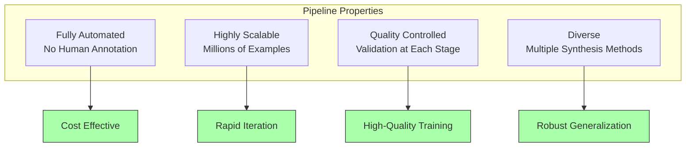

### 1.2 Synthesis Methods Overview

| Method | Purpose | Output | Automation | Scalability |
|--------|---------|--------|------------|-------------|
| **Open-World Memory** | Base QA generation | Questions + Answers | 100% | Very High |
| **FAS - Planning** | Planning trajectories | Initial plans + trajectories | 100% | Very High |
| **FAS - Reasoning** | Logical inference | Reasoning chains | 100% | High |
| **HAS** | Action space exploration | Expanded trajectories | 100% | Medium-High |
| **SailorFog-QA** | High-difficulty questions | Obfuscated questions | 95% | High |
| **WebShaper** | Formalized synthesis | Structured IS tasks | 98% | Very High |

**Total Pipeline Capacity:** 2M+ examples per month (single cluster)

---

## 2. Pipeline Architecture

### 2.1 End-to-End Data Flow

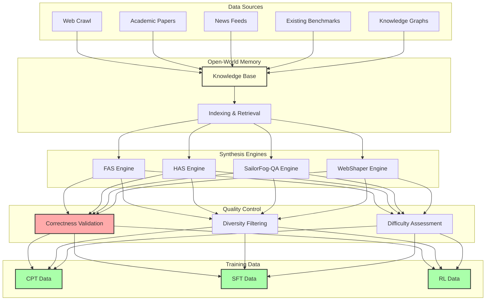

### 2.2 Pipeline Stages

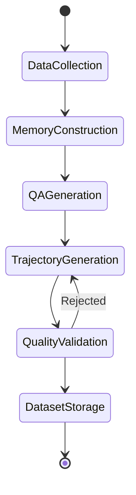

**Stage 1: Data Collection**
- Continuous web crawling
- Academic paper monitoring
- News aggregation
- Benchmark curation

**Stage 2: Memory Construction**
- Entity extraction
- Relationship mapping
- Temporal indexing
- Topic clustering

**Stage 3: QA Generation**
- Question template application
- Answer derivation
- Difficulty calibration
- Diversity enforcement

**Stage 4: Trajectory Generation**
- Teacher model execution
- Tool interaction recording
- Reasoning chain extraction
- Multiple rollouts

**Stage 5: Quality Validation**
- Correctness checking
- Completeness verification
- Diversity scoring
- Difficulty assessment

**Stage 6: Dataset Storage**
- Format conversion
- Metadata enrichment
- Version control
- Distribution preparation

---

## 3. Open-World Memory System

### 3.1 Concept

**Open-World Memory** transforms continuously updated data streams into a persistent, queryable knowledge base for QA synthesis.

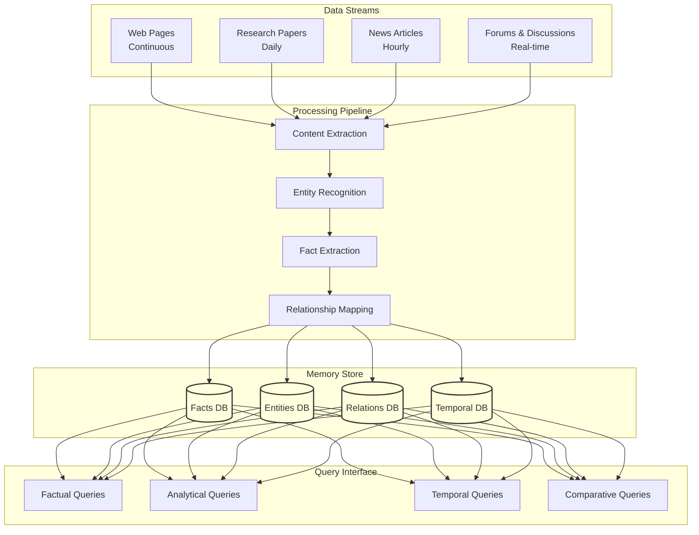

### 3.2 Data Collection

#### Web Crawling

```python
# Pseudo-code for web crawling
class WebCrawler:
    def __init__(self, seed_urls, rate_limit=100):
        self.frontier = seed_urls
        self.visited = set()
        self.rate_limit = rate_limit

    def crawl(self):
        while self.frontier:
            url = self.frontier.pop(0)
            if url in self.visited:
                continue

            # Fetch page
            page = self.fetch_page(url)
            self.visited.add(url)

            # Extract content
            content = self.extract_content(page)

            # Store in memory
            self.store_content(content)

            # Extract new URLs
            new_urls = self.extract_urls(page)
            self.frontier.extend(new_urls)

            # Rate limiting
            time.sleep(1.0 / self.rate_limit)
```

**Crawl Strategies:**
- **Breadth-First:** Start from high-quality seeds (Wikipedia, .edu domains)
- **Depth-First:** Deep dive into specific topics
- **Focused:** Prioritize based on topic relevance
- **Temporal:** Prioritize recent content

**Volume:** 10M+ pages per month

#### Academic Paper Monitoring

```python
class PaperMonitor:
    def __init__(self, sources):
        self.sources = sources  # arXiv, PubMed, etc.
        self.last_check = {}

    def check_updates(self):
        new_papers = []

        for source in self.sources:
            # Get papers since last check
            papers = self.fetch_new_papers(
                source,
                since=self.last_check.get(source)
            )

            for paper in papers:
                # Extract metadata
                metadata = self.extract_metadata(paper)

                # Extract full text
                full_text = self.extract_full_text(paper)

                # Store in memory
                self.store_paper(metadata, full_text)

                new_papers.append(paper)

            self.last_check[source] = datetime.now()

        return new_papers
```

**Sources:**
- arXiv (daily updates)
- PubMed (medical papers)
- Google Scholar
- ACL Anthology (NLP)
- Conference proceedings

**Volume:** 50K+ papers per month

#### News Aggregation

**Real-time News Sources:**
- RSS feeds from major news outlets
- Twitter/X trending topics
- Reddit discussions
- Hacker News front page

**Processing:**
1. Fetch articles in real-time
2. Extract key facts
3. Cluster related articles
4. Track evolving stories

**Volume:** 100K+ articles per month

### 3.3 Memory Organization

#### Entity Recognition & Linking

```python
class EntityLinker:
    def __init__(self, knowledge_base):
        self.kb = knowledge_base
        self.entity_recognizer = load_ner_model()

    def process_text(self, text):
        # Recognize entities
        entities = self.entity_recognizer.extract(text)

        # Link to knowledge base
        linked_entities = []
        for entity in entities:
            # Find canonical form in KB
            canonical = self.kb.find_entity(entity)

            if canonical:
                linked_entities.append({
                    "text": entity.text,
                    "canonical_id": canonical.id,
                    "type": entity.type,
                    "confidence": entity.confidence
                })
            else:
                # Create new entity
                new_id = self.kb.create_entity(entity)
                linked_entities.append({
                    "text": entity.text,
                    "canonical_id": new_id,
                    "type": entity.type,
                    "confidence": entity.confidence
                })

        return linked_entities
```

**Entity Types:**
- Person (PER)
- Organization (ORG)
- Location (LOC)
- Date/Time (DATE)
- Event (EVENT)
- Product (PRODUCT)
- Concept (CONCEPT)

#### Fact Extraction

```python
class FactExtractor:
    def __init__(self):
        self.triplet_model = load_triplet_extraction_model()

    def extract_facts(self, text, entities):
        # Extract (subject, predicate, object) triplets
        triplets = self.triplet_model.extract(text, entities)

        facts = []
        for triplet in triplets:
            fact = {
                "subject": triplet.subject,
                "predicate": triplet.predicate,
                "object": triplet.object,
                "source": text,
                "confidence": triplet.confidence,
                "timestamp": datetime.now()
            }
            facts.append(fact)

        return facts
```

**Example:**

**Input Text:**
```
"Elon Musk founded SpaceX in 2002. SpaceX successfully launched
the Falcon 9 rocket in 2010."
```

**Extracted Facts:**
```
1. (Elon Musk, founded, SpaceX)
2. (SpaceX, founded_in, 2002)
3. (SpaceX, launched, Falcon 9)
4. (Falcon 9, is_a, rocket)
5. (Falcon 9, launched_in, 2010)
```

#### Temporal Indexing

```python
class TemporalIndex:
    def __init__(self):
        self.time_indexed_facts = defaultdict(list)

    def index_fact(self, fact):
        # Extract temporal information
        temporal_info = self.extract_temporal(fact)

        if temporal_info:
            timestamp = temporal_info["timestamp"]
            self.time_indexed_facts[timestamp].append(fact)

    def query_timerange(self, start, end):
        """Query facts within time range"""
        results = []
        for timestamp in self.time_indexed_facts:
            if start <= timestamp <= end:
                results.extend(self.time_indexed_facts[timestamp])
        return results
```

**Use Cases:**
- "What happened in 2023?" queries
- "Latest information about X" queries
- Temporal reasoning questions

### 3.4 QA Generation from Memory

#### Question Templates

```python
class QuestionGenerator:
    def __init__(self, memory):
        self.memory = memory
        self.templates = self.load_templates()

    def generate_questions(self, num_questions=1000):
        questions = []

        for template in self.templates:
            # Sample facts matching template
            matching_facts = self.memory.query(template.pattern)

            for fact in matching_facts:
                # Instantiate template
                question = template.instantiate(fact)
                answer = self.derive_answer(fact, template)

                questions.append({
                    "question": question,
                    "answer": answer,
                    "template_id": template.id,
                    "source_fact": fact
                })

                if len(questions) >= num_questions:
                    return questions

        return questions
```

**Template Types:**

##### 1. Factual Templates

```
Template: "What is the [ATTRIBUTE] of [ENTITY]?"
Example: "What is the population of Tokyo?"

Pattern: (ENTITY, has_attribute, ATTRIBUTE)
Answer Derivation: Direct lookup
```

##### 2. Analytical Templates

```
Template: "Why did [EVENT] happen?"
Example: "Why did the stock market crash in 2008?"

Pattern: (EVENT, caused_by, REASONS)
Answer Derivation: Causal chain extraction
```

##### 3. Comparative Templates

```
Template: "How does [ENTITY1] compare to [ENTITY2] in terms of [ATTRIBUTE]?"
Example: "How does Python compare to Java in terms of performance?"

Pattern: (ENTITY1, has_attribute, VALUE1) AND (ENTITY2, has_attribute, VALUE2)
Answer Derivation: Comparison analysis
```

##### 4. Multi-hop Templates

```
Template: "What is the [ATTRIBUTE] of the [RELATIONSHIP] of [ENTITY]?"
Example: "What is the GDP of the country that hosted the 2020 Olympics?"

Pattern: Chain multiple facts
Answer Derivation: Multi-step reasoning
```

#### Difficulty Calibration

```python
class DifficultyCalibrator:
    def __init__(self):
        self.difficulty_metrics = {
            "directness": self.measure_directness,
            "ambiguity": self.measure_ambiguity,
            "reasoning_steps": self.measure_reasoning_steps,
            "knowledge_depth": self.measure_knowledge_depth
        }

    def calibrate_difficulty(self, question, answer):
        scores = {}

        for metric_name, metric_func in self.difficulty_metrics.items():
            scores[metric_name] = metric_func(question, answer)

        # Combine scores
        overall_difficulty = self.combine_scores(scores)

        return {
            "difficulty_score": overall_difficulty,
            "level": self.assign_level(overall_difficulty),
            "breakdown": scores
        }

    def measure_directness(self, question, answer):
        """
        How directly is the answer stated in the question?
        Low score = answer requires inference
        """
        # Use NLI model to check if answer is entailed by question
        entailment_score = self.nli_model.predict(question, answer)
        return 1.0 - entailment_score

    def measure_reasoning_steps(self, question, answer):
        """
        Number of reasoning steps required
        """
        # Estimate from knowledge graph path length
        path = self.memory.find_path(
            source=self.extract_entities(question),
            target=self.extract_entities(answer)
        )
        return len(path)
```

**Difficulty Levels:**

| Level | Score Range | Characteristics | Example |
|-------|-------------|-----------------|---------|
| **Easy** | 0.0 - 3.0 | Direct fact lookup | "What is the capital of France?" |
| **Medium** | 3.0 - 6.0 | Simple reasoning, 2-3 steps | "Who wrote the book that inspired the movie 'The Shawshank Redemption'?" |
| **Hard** | 6.0 - 8.0 | Multi-hop, ambiguity | "What is the birth year of the founder of the company that created the iPhone?" |
| **Expert** | 8.0 - 10.0 | Complex reasoning, high uncertainty | SailorFog-QA style questions |

### 3.5 Diversity Enforcement

```python
class DiversityEnforcer:
    def __init__(self):
        self.topic_distribution = Counter()
        self.entity_usage = Counter()

    def filter_for_diversity(self, candidate_questions, target_count):
        selected = []
        embeddings = self.compute_embeddings(candidate_questions)

        for i, question in enumerate(candidate_questions):
            # Check topic balance
            topic = self.classify_topic(question)
            if self.topic_distribution[topic] > target_count / 20:
                continue  # Skip over-represented topics

            # Check entity diversity
            entities = self.extract_entities(question)
            if any(self.entity_usage[e] > 10 for e in entities):
                continue  # Skip over-used entities

            # Check semantic diversity
            if self.is_too_similar(embeddings[i], selected):
                continue

            # Add to selected set
            selected.append(question)
            self.topic_distribution[topic] += 1
            for e in entities:
                self.entity_usage[e] += 1

            if len(selected) >= target_count:
                break

        return selected

    def is_too_similar(self, embedding, selected_embeddings, threshold=0.85):
        for selected_emb in selected_embeddings:
            similarity = cosine_similarity(embedding, selected_emb)
            if similarity > threshold:
                return True
        return False
```

**Diversity Dimensions:**
- Topic distribution (balanced across domains)
- Entity coverage (avoid repetition)
- Question style (varied templates)
- Difficulty distribution (all levels represented)
- Temporal spread (cover different time periods)

---

## 4. Forward Action Synthesis (FAS)

### 4.1 Planning Action Synthesis

#### Concept

Generate trajectories by first creating detailed plans, then executing them.

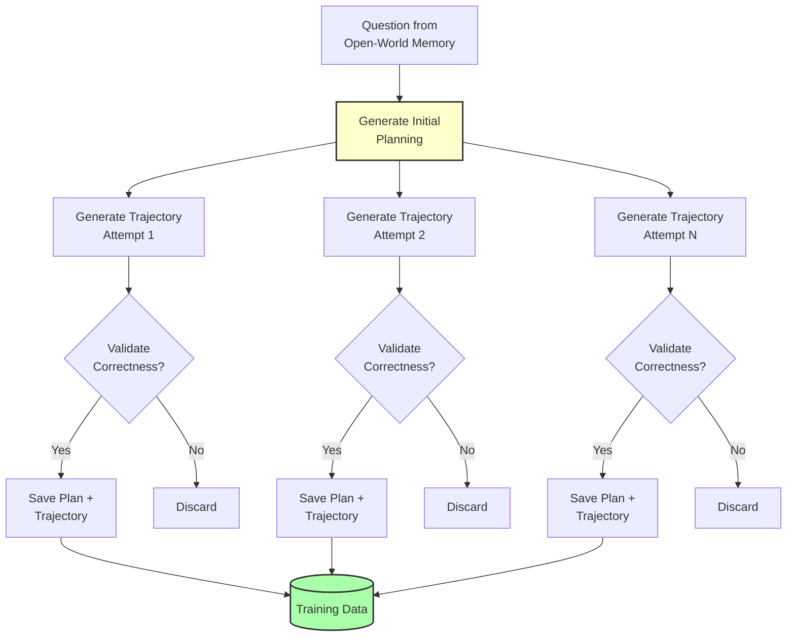

#### Implementation

```python
class PlanningActionSynthesis:
    def __init__(self, teacher_model, tools):
        self.teacher = teacher_model
        self.tools = tools
        self.validator = AnswerValidator()

    def synthesize(self, question, reference_answer, num_attempts=5):
        """
        Generate planning-trajectory pairs
        """
        valid_trajectories = []

        for attempt in range(num_attempts):
            # Step 1: Generate initial plan
            plan = self.generate_plan(question)

            # Step 2: Execute plan to generate trajectory
            trajectory = self.execute_plan(question, plan)

            # Step 3: Validate answer
            final_answer = self.extract_answer(trajectory)
            is_correct = self.validator.validate(
                final_answer,
                reference_answer
            )

            if is_correct:
                valid_trajectories.append({
                    "question": question,
                    "initial_plan": plan,
                    "trajectory": trajectory,
                    "final_answer": final_answer,
                    "reference_answer": reference_answer
                })

        return valid_trajectories

    def generate_plan(self, question):
        """
        Generate detailed initial plan
        """
        prompt = f"""
        Given the question: {question}

        Create a detailed step-by-step plan to answer this question.
        Consider:
        1. What information do you need?
        2. How will you search for this information?
        3. What tools will you use?
        4. In what order will you execute steps?

        Plan:
        """

        plan = self.teacher.generate(prompt)
        return self.parse_plan(plan)

    def execute_plan(self, question, plan):
        """
        Execute plan step-by-step with tools
        """
        messages = [
            {"role": "system", "content": AGENT_SYSTEM_PROMPT},
            {"role": "user", "content": question},
            {"role": "assistant", "content": f"<think>My plan is:\n{plan}\n\nNow I'll execute it.</think>"}
        ]

        trajectory = []
        max_steps = 20

        for step in range(max_steps):
            # Generate next action
            response = self.teacher.generate(messages)

            # Parse tool call
            if "<tool_call>" in response:
                tool_call = self.parse_tool_call(response)
                result = self.execute_tool(tool_call, self.tools)

                trajectory.append({
                    "step": step,
                    "thinking": self.extract_thinking(response),
                    "action": tool_call,
                    "observation": result
                })

                messages.append({"role": "assistant", "content": response})
                messages.append({"role": "user", "content": f"<tool_response>{result}</tool_response>"})

            # Check for answer
            if "<answer>" in response:
                trajectory.append({
                    "step": step,
                    "thinking": self.extract_thinking(response),
                    "final_answer": self.extract_answer(response)
                })
                break

        return trajectory
```

#### Plan Quality Assessment

```python
class PlanQualityScorer:
    def __init__(self):
        self.criteria = {
            "specificity": self.score_specificity,
            "completeness": self.score_completeness,
            "feasibility": self.score_feasibility,
            "efficiency": self.score_efficiency
        }

    def score_plan(self, plan, question):
        scores = {}

        for criterion, scorer_func in self.criteria.items():
            scores[criterion] = scorer_func(plan, question)

        overall_score = np.mean(list(scores.values()))

        return {
            "overall": overall_score,
            "breakdown": scores
        }

    def score_specificity(self, plan, question):
        """
        Are the steps specific and actionable?
        """
        # Count vague terms
        vague_terms = ["maybe", "probably", "possibly", "somehow"]
        vague_count = sum(plan.lower().count(term) for term in vague_terms)

        # Count specific tool mentions
        tool_mentions = sum(tool in plan for tool in ["search", "visit", "python"])

        specificity_score = (tool_mentions - vague_count) / len(plan.split())
        return max(0, min(1, specificity_score * 10))

    def score_completeness(self, plan, question):
        """
        Does the plan cover all necessary steps?
        """
        # Check for key planning elements
        has_information_gathering = any(keyword in plan.lower()
                                        for keyword in ["search", "find", "look up"])
        has_analysis = any(keyword in plan.lower()
                          for keyword in ["analyze", "compare", "evaluate"])
        has_synthesis = any(keyword in plan.lower()
                           for keyword in ["combine", "synthesize", "conclude"])

        completeness_score = sum([has_information_gathering,
                                  has_analysis,
                                  has_synthesis]) / 3.0
        return completeness_score
```

#### Output Format

```json
{
  "question": "What is the GDP growth rate of Japan in 2023?",
  "reference_answer": "1.9%",
  "initial_plan": "1. Search for official Japan GDP statistics for 2023\n2. Visit government economic reports or IMF data\n3. Extract the specific growth rate figure\n4. Verify with multiple sources if needed\n5. Provide the answer with confidence",
  "trajectory": [
    {
      "step": 0,
      "thinking": "I'll start by searching for official GDP data for Japan in 2023",
      "action": {
        "name": "search",
        "arguments": {"query": ["Japan GDP growth rate 2023 official statistics"]}
      },
      "observation": "Search results show IMF and World Bank data..."
    },
    {
      "step": 1,
      "thinking": "I found relevant sources. Let me visit the IMF report.",
      "action": {
        "name": "visit",
        "arguments": {
          "url": ["https://www.imf.org/japan-gdp-2023"],
          "goal": "Extract Japan's GDP growth rate for 2023"
        }
      },
      "observation": "According to the IMF report, Japan's GDP grew by 1.9% in 2023..."
    },
    {
      "step": 2,
      "thinking": "I have the official figure. I can provide the answer.",
      "final_answer": "Japan's GDP growth rate in 2023 was 1.9%"
    }
  ],
  "validation": {
    "is_correct": true,
    "confidence": 0.95
  }
}
```

### 4.2 Reasoning Action Synthesis

#### Concept

Generate reasoning chains under fully informed conditions (all knowledge provided upfront).

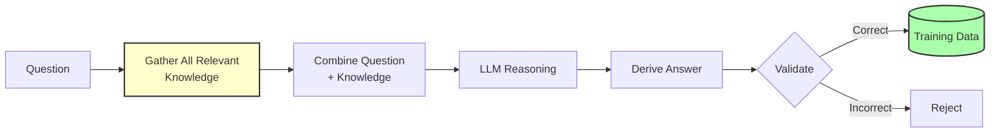

#### Implementation

```python
class ReasoningActionSynthesis:
    def __init__(self, memory, reasoning_model):
        self.memory = memory
        self.model = reasoning_model

    def synthesize(self, question, reference_answer):
        """
        Generate reasoning chain with full information
        """
        # Step 1: Gather all relevant knowledge
        knowledge = self.gather_knowledge(question, reference_answer)

        # Step 2: Construct reasoning prompt
        reasoning_prompt = self.construct_prompt(question, knowledge)

        # Step 3: Generate reasoning chain
        reasoning_chain = self.model.generate(reasoning_prompt)

        # Step 4: Extract answer
        derived_answer = self.extract_answer(reasoning_chain)

        # Step 5: Validate
        is_correct = self.validate(derived_answer, reference_answer)

        if is_correct:
            return {
                "question": question,
                "knowledge": knowledge,
                "reasoning": reasoning_chain,
                "answer": derived_answer,
                "reference": reference_answer
            }
        else:
            return None

    def gather_knowledge(self, question, reference_answer):
        """
        Query memory for all relevant facts
        """
        # Extract key entities and concepts
        entities = self.extract_entities(question)
        entities.extend(self.extract_entities(reference_answer))

        # Query memory for facts involving these entities
        relevant_facts = []
        for entity in entities:
            facts = self.memory.query_entity(entity)
            relevant_facts.extend(facts)

        # Also query for question keywords
        keywords = self.extract_keywords(question)
        for keyword in keywords:
            facts = self.memory.query_keyword(keyword)
            relevant_facts.extend(facts)

        # Deduplicate and rank by relevance
        unique_facts = self.deduplicate(relevant_facts)
        ranked_facts = self.rank_by_relevance(unique_facts, question)

        return ranked_facts[:10]  # Top 10 most relevant facts

    def construct_prompt(self, question, knowledge):
        """
        Create reasoning prompt with full knowledge
        """
        knowledge_text = "\n".join([
            f"- {fact['subject']} {fact['predicate']} {fact['object']}"
            for fact in knowledge
        ])

        prompt = f"""
        Given the following knowledge:

        {knowledge_text}

        Question: {question}

        Using only the provided knowledge, derive the answer through logical reasoning.
        Think step by step and explain your reasoning process.

        Reasoning:
        """

        return prompt
```

#### Example

**Input:**
```
Question: "What is the birth year of the founder of SpaceX?"

Knowledge:
- Elon Musk founded SpaceX
- Elon Musk was born in 1971
- SpaceX was founded in 2002
- SpaceX is a space exploration company
```

**Generated Reasoning:**
```
Step 1: Identify the founder of SpaceX
From the knowledge: "Elon Musk founded SpaceX"
Therefore, the founder is Elon Musk.

Step 2: Find Elon Musk's birth year
From the knowledge: "Elon Musk was born in 1971"
Therefore, the birth year is 1971.

Step 3: Provide the answer
The founder of SpaceX is Elon Musk, who was born in 1971.

Answer: 1971
```

#### Benefits of Reasoning Action Synthesis

- **Strengthens logical reasoning:** Model learns to derive conclusions from facts
- **Reduces hallucination:** Reasoning grounded in provided knowledge
- **Improves interpretability:** Explicit reasoning chains
- **Generalizes better:** Learns reasoning patterns, not just facts

---

## 5. High-order Action Synthesis (HAS)

### 5.1 Concept

**HAS** exponentially expands the action space by exploring alternative actions at each decision point in a trajectory.

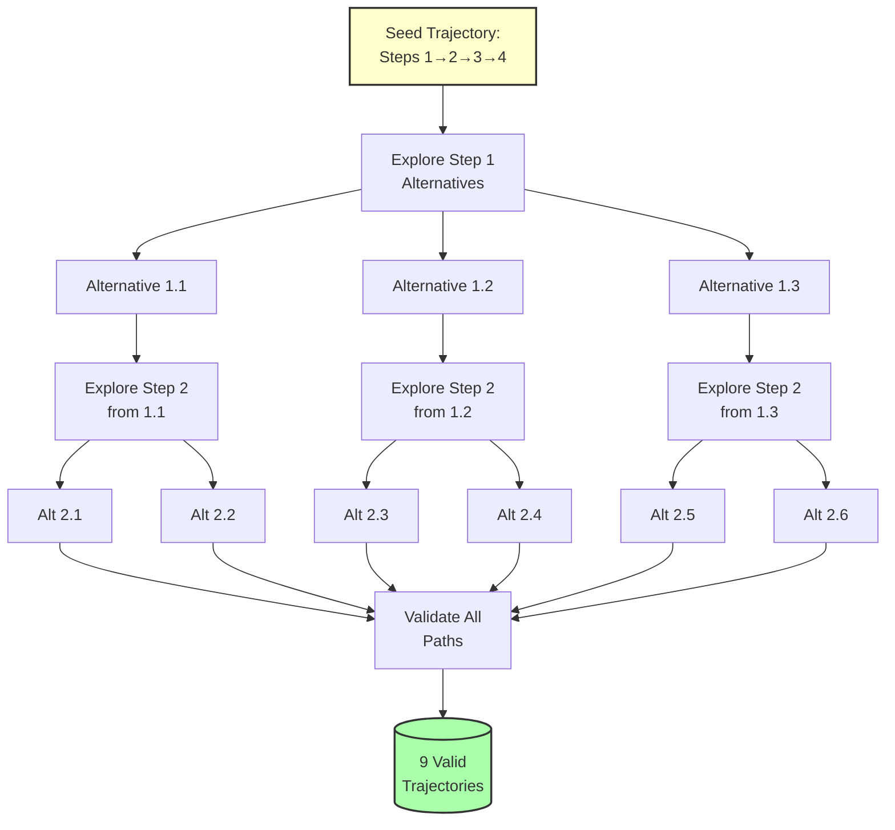

### 5.2 Implementation

```python
class HighOrderActionSynthesis:
    def __init__(self, agent_model, tools):
        self.agent = agent_model
        self.tools = tools
        self.validator = AnswerValidator()

    def synthesize(self, seed_trajectory, question, reference_answer):
        """
        Expand trajectory through multi-step decision exploration
        """
        expanded_trajectories = []

        # Extract decision points from seed trajectory
        decision_points = self.identify_decision_points(seed_trajectory)

        # For each decision point, explore alternatives
        for i, decision_point in enumerate(decision_points):
            # Generate alternative actions
            alternatives = self.generate_alternatives(
                decision_point,
                seed_trajectory,
                num_alternatives=3
            )

            # For each alternative, generate continuation
            for alt in alternatives:
                # Create trajectory variant with this alternative
                variant = self.create_variant(
                    seed_trajectory,
                    decision_point_idx=i,
                    alternative_action=alt
                )

                # Execute variant from decision point onward
                completed_variant = self.execute_from_point(
                    variant,
                    start_idx=i,
                    question=question
                )

                # Validate final answer
                final_answer = self.extract_answer(completed_variant)
                if self.validator.validate(final_answer, reference_answer):
                    expanded_trajectories.append(completed_variant)

        return expanded_trajectories

    def identify_decision_points(self, trajectory):
        """
        Identify points where alternative actions are possible
        """
        decision_points = []

        for i, step in enumerate(trajectory):
            if step["type"] == "tool_call":
                # This is a decision point
                decision_points.append({
                    "index": i,
                    "action": step["action"],
                    "context": trajectory[:i]  # Everything before this point
                })

        return decision_points

    def generate_alternatives(self, decision_point, seed_trajectory, num_alternatives=3):
        """
        Generate alternative actions for a decision point
        """
        context = decision_point["context"]
        original_action = decision_point["action"]

        # Construct prompt for alternative generation
        prompt = self.construct_alternative_prompt(context, original_action)

        alternatives = []
        for _ in range(num_alternatives):
            # Generate alternative action
            alt_response = self.agent.generate(prompt, temperature=0.9)
            alt_action = self.parse_action(alt_response)

            # Ensure it's different from original
            if alt_action != original_action:
                alternatives.append(alt_action)

        return alternatives

    def construct_alternative_prompt(self, context, original_action):
        """
        Create prompt to generate alternative actions
        """
        context_str = self.format_context(context)

        prompt = f"""
        Given the following context:
        {context_str}

        The original action taken was:
        {original_action}

        Suggest an alternative action that could achieve the same goal
        but through a different approach. The alternative should be:
        1. Different from the original action
        2. Plausible and reasonable
        3. Likely to contribute to answering the question

        Alternative action:
        """

        return prompt

    def execute_from_point(self, partial_trajectory, start_idx, question):
        """
        Execute trajectory from a specific point onward
        """
        # Initialize state up to start point
        messages = self.build_messages_from_trajectory(
            partial_trajectory[:start_idx],
            question
        )

        # Continue execution
        max_additional_steps = 15
        completed = partial_trajectory.copy()

        for step in range(max_additional_steps):
            # Generate next action
            response = self.agent.generate(messages)

            # Parse and execute
            if "<tool_call>" in response:
                tool_call = self.parse_tool_call(response)
                result = self.execute_tool(tool_call, self.tools)

                completed.append({
                    "step": start_idx + step,
                    "type": "tool_call",
                    "thinking": self.extract_thinking(response),
                    "action": tool_call,
                    "observation": result
                })

                messages.append({"role": "assistant", "content": response})
                messages.append({"role": "user", "content": f"<tool_response>{result}</tool_response>"})

            # Check for answer
            if "<answer>" in response:
                completed.append({
                    "step": start_idx + step,
                    "type": "answer",
                    "final_answer": self.extract_answer(response)
                })
                break

        return completed
```

### 5.3 Alternative Generation Strategies

#### Strategy 1: Tool Substitution

Replace one tool with another that can achieve similar results.

**Example:**
```
Original: search(query="quantum computing applications")

Alternatives:
1. scholar(query="quantum computing applications") - Use academic search
2. visit(url="wikipedia.org/wiki/Quantum_computing", goal="Find applications")
   - Direct visit to known resource
3. python(code="# Web scrape quantum computing sites")
   - Programmatic approach
```

#### Strategy 2: Query Variation

Keep the same tool, but vary the query/parameters.

**Example:**
```
Original: search(query="GDP growth Japan 2023")

Alternatives:
1. search(query="Japan economic growth 2023")
2. search(query="IMF Japan GDP statistics 2023")
3. search(query="日本 GDP 成長率 2023") - Different language
```

#### Strategy 3: Ordering Changes

Execute the same actions but in a different order.

**Example:**
```
Original Order:
1. Search for "quantum computing"
2. Visit top result
3. Search for "quantum applications"

Alternative Order:
1. Search for "quantum applications"
2. Search for "quantum computing"
3. Visit aggregated results
```

#### Strategy 4: Granularity Adjustment

Break down a single action into multiple smaller actions, or vice versa.

**Example:**
```
Original (Single action):
search(query="Who is the CEO of Tesla and what is their net worth?")

Alternative (Multiple actions):
1. search(query="CEO of Tesla")
2. search(query="[CEO_NAME] net worth")
```

### 5.4 Validation and Filtering

```python
class HASValidator:
    def __init__(self):
        self.correctness_checker = AnswerValidator()
        self.diversity_scorer = DiversityScorer()

    def validate_expanded_trajectories(self, trajectories, reference_answer):
        """
        Filter expanded trajectories for quality and diversity
        """
        # Step 1: Check correctness
        correct_trajectories = []
        for traj in trajectories:
            final_answer = self.extract_answer(traj)
            if self.correctness_checker.validate(final_answer, reference_answer):
                correct_trajectories.append(traj)

        # Step 2: Score diversity
        diversity_scores = []
        for i, traj in enumerate(correct_trajectories):
            # Compare to all other correct trajectories
            diversity = self.diversity_scorer.score(traj, correct_trajectories)
            diversity_scores.append((i, diversity))

        # Step 3: Select diverse subset
        selected = self.select_diverse_subset(
            correct_trajectories,
            diversity_scores,
            max_count=10
        )

        return selected

    def select_diverse_subset(self, trajectories, diversity_scores, max_count):
        """
        Select maximally diverse subset
        """
        # Sort by diversity score (descending)
        sorted_indices = sorted(diversity_scores, key=lambda x: x[1], reverse=True)

        selected = []
        for idx, score in sorted_indices[:max_count]:
            selected.append(trajectories[idx])

        return selected
```

### 5.5 Scaling Properties

**From 1 Seed Trajectory:**

| Decision Points | Alternatives per Point | Total Variants | Valid (est. 60%) |
|----------------|------------------------|----------------|------------------|
| 2 | 3 | 9 | 5-6 |
| 3 | 3 | 27 | 16 |
| 4 | 3 | 81 | 48 |
| 5 | 3 | 243 | 145 |

**With 10K Seed Trajectories:**
- Average 3 decision points each
- 3 alternatives per point
- 27 variants per seed
- **270K total trajectories** (before filtering)
- **~160K valid trajectories** (after filtering)

**Data Amplification:** 16× expansion from seed data

---

## 6. SailorFog-QA: Difficult Question Generation

### 6.1 Concept

Generate extremely difficult questions through **knowledge graph construction** and **information obfuscation**.

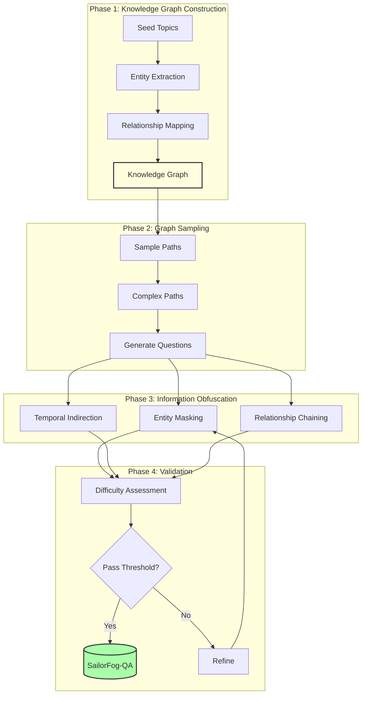

### 6.2 Knowledge Graph Construction

```python
class KnowledgeGraphBuilder:
    def __init__(self):
        self.graph = nx.DiGraph()
        self.entity_resolver = EntityResolver()

    def build_from_documents(self, documents):
        """
        Construct knowledge graph from document corpus
        """
        for doc in documents:
            # Extract entities
            entities = self.extract_entities(doc)

            # Extract relationships
            relationships = self.extract_relationships(doc, entities)

            # Add to graph
            for entity in entities:
                canonical_id = self.entity_resolver.resolve(entity)
                self.graph.add_node(canonical_id, **entity.attributes)

            for rel in relationships:
                self.graph.add_edge(
                    rel.subject,
                    rel.object,
                    relation=rel.predicate,
                    confidence=rel.confidence,
                    source=doc.id
                )

        return self.graph

    def extract_relationships(self, doc, entities):
        """
        Extract (subject, predicate, object) triplets
        """
        relationships = []

        # Use dependency parsing + pattern matching
        for sentence in doc.sentences:
            # Parse sentence structure
            parsed = self.dependency_parser.parse(sentence)

            # Apply extraction patterns
            for pattern in self.relation_patterns:
                matches = pattern.match(parsed, entities)
                relationships.extend(matches)

        return relationships
```

**Example Knowledge Graph:**

```
Entities:
- E1: "Elon Musk" (Person)
- E2: "SpaceX" (Organization)
- E3: "Tesla" (Organization)
- E4: "PayPal" (Organization)
- E5: "Falcon 9" (Product)
- E6: "Mars" (Location)

Relationships:
- (E1, founded, E2)
- (E1, founded, E3)
- (E1, co-founded, E4)
- (E2, developed, E5)
- (E2, mission_to, E6)
- (E3, produces, "electric vehicles")
- (E4, acquired_by, "eBay")
```

### 6.3 Graph Sampling

```python
class GraphSampler:
    def __init__(self, knowledge_graph):
        self.graph = knowledge_graph

    def sample_complex_path(self, min_length=3, max_length=6):
        """
        Sample multi-hop path from graph
        """
        # Randomly select start node
        start_node = random.choice(list(self.graph.nodes()))

        # Perform random walk
        path = [start_node]
        current = start_node

        for _ in range(max_length):
            # Get neighbors
            neighbors = list(self.graph.neighbors(current))

            if not neighbors:
                break

            # Select next node
            next_node = random.choice(neighbors)
            path.append(next_node)
            current = next_node

            # Stop if reached min length and low-connectivity node
            if len(path) >= min_length and len(neighbors) <= 2:
                break

        return path

    def generate_question_from_path(self, path):
        """
        Generate question requiring traversal of this path
        """
        # Get start and end nodes
        start = path[0]
        end = path[-1]

        # Get intermediate relationships
        relationships = []
        for i in range(len(path) - 1):
            rel = self.graph.get_edge_data(path[i], path[i+1])
            relationships.append(rel['relation'])

        # Construct question
        question = self.construct_multi_hop_question(
            start_entity=start,
            end_entity=end,
            relationships=relationships
        )

        # Derive answer
        answer = self.get_node_attribute(end, 'name')

        return question, answer, path
```

**Example:**

**Path:** Elon Musk → SpaceX → Falcon 9 → First Launch Date

**Before Obfuscation:**
```
Q: When was the Falcon 9 first launched?
A: June 4, 2010
```

### 6.4 Information Obfuscation

#### Technique 1: Entity Masking

Replace explicit entity names with descriptive phrases.

```python
class EntityMasker:
    def __init__(self):
        self.entity_descriptors = self.load_descriptors()

    def mask_entity(self, entity):
        """
        Replace entity name with description
        """
        # Get entity type
        entity_type = entity['type']

        # Generate descriptive phrase
        if entity_type == "Person":
            descriptor = self.generate_person_descriptor(entity)
        elif entity_type == "Organization":
            descriptor = self.generate_org_descriptor(entity)
        elif entity_type == "Product":
            descriptor = self.generate_product_descriptor(entity)
        else:
            descriptor = self.generate_generic_descriptor(entity)

        return descriptor

    def generate_person_descriptor(self, person):
        """
        Generate descriptive phrase for a person
        """
        # Get key attributes
        accomplishments = person.get('accomplishments', [])
        roles = person.get('roles', [])

        # Select most distinctive accomplishment
        if accomplishments:
            descriptor = f"the person who {accomplishments[0]}"
        elif roles:
            descriptor = f"the {roles[0]}"
        else:
            # Fallback to relationships
            descriptor = self.describe_by_relationship(person)

        return descriptor
```

**Examples:**

| Original | Masked |
|----------|--------|
| "Elon Musk" | "the entrepreneur who founded SpaceX and Tesla" |
| "SpaceX" | "the private space exploration company" |
| "Falcon 9" | "the reusable rocket developed by the company founded by Elon Musk" |
| "Mars" | "the fourth planet from the Sun" |

#### Technique 2: Temporal Indirection

Avoid explicit dates, use relative or indirect temporal references.

```python
class TemporalObfuscator:
    def __init__(self):
        self.temporal_patterns = self.load_patterns()

    def obfuscate_date(self, date, context):
        """
        Replace explicit date with indirect reference
        """
        # Strategy 1: Relative to event
        related_events = self.find_nearby_events(date)
        if related_events:
            return f"the year after {related_events[0]['name']}"

        # Strategy 2: Descriptive period
        period = self.identify_period(date)
        return f"during the {period}"

    def find_nearby_events(self, date):
        """
        Find notable events near this date
        """
        # Query for historical events
        events = self.event_database.query_timerange(
            start=date - timedelta(years=2),
            end=date + timedelta(years=2)
        )

        # Rank by notability
        notable_events = sorted(events, key=lambda e: e['notability'], reverse=True)

        return notable_events
```

**Examples:**

| Original | Obfuscated |
|----------|------------|
| "2010" | "the year after the first Bitcoin block was mined" |
| "2023" | "the year following the global pandemic peak" |
| "June 4" | "in early summer" |

#### Technique 3: Relationship Chaining

Express facts through chains of relationships rather than directly.

```python
class RelationshipChainer:
    def __init__(self, knowledge_graph):
        self.graph = knowledge_graph

    def create_chain(self, target_entity, chain_length=3):
        """
        Express target entity through relationship chain
        """
        # Find path to target
        paths = []
        for start_node in self.graph.nodes():
            try:
                path = nx.shortest_path(
                    self.graph,
                    start_node,
                    target_entity,
                    length=chain_length
                )
                paths.append(path)
            except:
                continue

        # Select most interesting path
        best_path = self.select_interesting_path(paths)

        # Convert to description
        description = self.path_to_description(best_path)

        return description

    def path_to_description(self, path):
        """
        Convert relationship path to descriptive text
        """
        descriptions = []

        for i in range(len(path) - 1):
            rel = self.graph.get_edge_data(path[i], path[i+1])
            relation = rel['relation']

            descriptions.append(f"{relation} {path[i+1]['name']}")

        return " → ".join(descriptions)
```

**Example:**

**Direct:**
```
"What is the mission target of SpaceX?"
Answer: "Mars"
```

**Chained:**
```
"What is the destination planet of the missions planned by the company
 founded by the entrepreneur who also created the electric vehicle company
 that popularized consumer EVs?"

Chain: Elon Musk → founded → Tesla → (same person) → founded → SpaceX
       → mission_to → Mars

Answer: "Mars"
```

### 6.5 Difficulty Validation

```python
class DifficultyValidator:
    def __init__(self):
        self.baseline_models = self.load_baseline_models()

    def assess_difficulty(self, question, answer):
        """
        Assess question difficulty across multiple dimensions
        """
        scores = {}

        # Dimension 1: Baseline model performance
        scores['model_difficulty'] = self.test_baseline_models(question, answer)

        # Dimension 2: Information retrieval difficulty
        scores['retrieval_difficulty'] = self.assess_retrieval(question)

        # Dimension 3: Reasoning complexity
        scores['reasoning_difficulty'] = self.assess_reasoning(question)

        # Dimension 4: Ambiguity level
        scores['ambiguity'] = self.measure_ambiguity(question)

        # Combine scores
        overall_difficulty = self.combine_scores(scores)

        return {
            'overall': overall_difficulty,
            'breakdown': scores,
            'level': self.assign_level(overall_difficulty)
        }

    def test_baseline_models(self, question, answer):
        """
        Test how well baseline models can answer
        """
        correct_count = 0

        for model in self.baseline_models:
            prediction = model.answer(question)
            if self.is_correct(prediction, answer):
                correct_count += 1

        # Lower correct rate = higher difficulty
        difficulty = 1.0 - (correct_count / len(self.baseline_models))

        return difficulty

    def assess_retrieval(self, question):
        """
        How difficult is it to retrieve relevant information?
        """
        # Extract key terms
        key_terms = self.extract_key_terms(question)

        # Query search engine
        search_results = self.search(key_terms)

        # Check if answer is in top results
        answer_in_top_k = self.check_answer_in_results(search_results, k=10)

        if answer_in_top_k:
            return 0.3  # Easy to retrieve
        else:
            return 0.9  # Hard to retrieve
```

**Difficulty Thresholds:**

| Level | Score Range | Pass Rate (Strong Models) | Characteristics |
|-------|-------------|---------------------------|-----------------|
| **Level 1** | 0-3 | >80% | Direct factual |
| **Level 2** | 3-6 | 50-80% | Multi-step reasoning |
| **Level 3** | 6-8 | 20-50% | High uncertainty |
| **SailorFog** | 8-10 | <20% | Extreme difficulty |

### 6.6 Output Format

```json
{
  "question": "What year was the reusable orbital rocket system, developed by the private space company founded by the entrepreneur who also created the world's most valuable electric vehicle manufacturer, first successfully launched and recovered?",
  "answer": "2015",
  "difficulty_score": 8.7,
  "difficulty_level": "SailorFog",
  "difficulty_breakdown": {
    "model_difficulty": 0.92,
    "retrieval_difficulty": 0.85,
    "reasoning_difficulty": 0.78,
    "ambiguity": 0.88
  },
  "knowledge_path": [
    "Elon Musk",
    "founded",
    "Tesla",
    "(same person)",
    "founded",
    "SpaceX",
    "developed",
    "Falcon 9",
    "first_successful_landing",
    "2015"
  ],
  "obfuscation_techniques": [
    "entity_masking",
    "relationship_chaining",
    "temporal_indirection"
  ],
  "baseline_performance": {
    "gpt-3.5": false,
    "gpt-4": false,
    "claude-2": false,
    "qwen-72b": true
  }
}
```

---

## 7. WebShaper: Formalization-Driven Synthesis

### 7.1 Information-Seeking Formalization

**Core Idea:** Formalize information-seeking as a structured tuple: `(Q, K, T, C)`

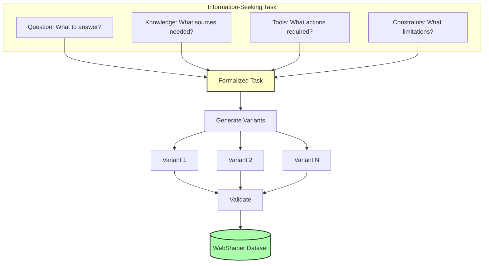

### 7.2 Task Formalization

```python
class InformationSeekingTask:
    def __init__(self, question, knowledge_sources, tool_sequence, constraints):
        self.Q = question
        self.K = knowledge_sources
        self.T = tool_sequence
        self.C = constraints

    def formalize(self):
        """
        Convert to structured representation
        """
        return {
            "question": {
                "text": self.Q,
                "type": self.classify_question_type(),
                "entities": self.extract_entities(),
                "intent": self.identify_intent()
            },
            "knowledge": {
                "required_sources": self.K,
                "source_types": [self.classify_source(k) for k in self.K],
                "knowledge_depth": self.assess_depth()
            },
            "tools": {
                "sequence": self.T,
                "total_steps": len(self.T),
                "tool_types": [t.name for t in self.T]
            },
            "constraints": {
                "time_limit": self.C.get('time_limit'),
                "source_restrictions": self.C.get('source_restrictions'),
                "answer_format": self.C.get('answer_format')
            }
        }

    def classify_question_type(self):
        """
        Classify question into categories
        """
        if self.is_factual():
            return "factual"
        elif self.is_analytical():
            return "analytical"
        elif self.is_comparative():
            return "comparative"
        elif self.is_procedural():
            return "procedural"
        else:
            return "complex"
```

**Example Formalization:**

**Input Question:** "What is the latest GDP growth rate for Japan?"

**Formalized Task:**
```python
task = InformationSeekingTask(
    question="What is the latest GDP growth rate for Japan?",
    knowledge_sources=[
        {"type": "official_statistics", "source": "IMF/World Bank"},
        {"type": "news_articles", "recency": "last 6 months"}
    ],
    tool_sequence=[
        Tool("search", {"query": "Japan GDP growth latest"}),
        Tool("visit", {"url": "[result_url]", "goal": "Extract GDP figure"}),
        Tool("verify", {"cross_reference": True})
    ],
    constraints={
        "recency": "most recent data",
        "source_authority": "official only",
        "answer_format": "percentage with year"
    }
)
```

### 7.3 Agentic Expander

**Concept:** Iteratively generate and validate question variants based on formalization.

```mermaid
graph TB
    S[Seed Task<br/>(Q, K, T, C)] --> F[Formalize]

    F --> M1[Modify Q]
    F --> M2[Modify K]
    F --> M3[Modify T]
    F --> M4[Modify C]

    M1 --> G1[Generate Variant 1]
    M2 --> G2[Generate Variant 2]
    M3 --> G3[Generate Variant 3]
    M4 --> G4[Generate Variant 4]

    G1 & G2 & G3 & G4 --> V{Validate}

    V -->|Valid| D[(Dataset)]
    V -->|Invalid| R[Refine]
    R --> M1

    style S fill:#ffc,stroke:#333,stroke-width:2px
    style D fill:#afa,stroke:#333,stroke-width:2px
```

```python
class AgenticExpander:
    def __init__(self, formalization_model, validation_model):
        self.formalizer = formalization_model
        self.validator = validation_model

    def expand(self, seed_task, expansion_count=10):
        """
        Generate multiple variants from seed task
        """
        formalized = seed_task.formalize()
        variants = []

        for i in range(expansion_count):
            # Select random modification strategy
            strategy = self.select_strategy()

            # Generate variant
            variant = self.apply_strategy(formalized, strategy)

            # Validate variant
            is_valid, validation_report = self.validator.validate(variant)

            if is_valid:
                variants.append(variant)
            else:
                # Try to refine
                refined = self.refine(variant, validation_report)
                if refined:
                    variants.append(refined)

        return variants

    def select_strategy(self):
        """
        Select modification strategy
        """
        strategies = [
            "modify_question_complexity",
            "change_knowledge_sources",
            "alter_tool_sequence",
            "adjust_constraints",
            "combine_multiple_aspects"
        ]

        return random.choice(strategies)

    def apply_strategy(self, formalized_task, strategy):
        """
        Apply modification strategy to generate variant
        """
        if strategy == "modify_question_complexity":
            return self.modify_question(formalized_task)
        elif strategy == "change_knowledge_sources":
            return self.change_sources(formalized_task)
        elif strategy == "alter_tool_sequence":
            return self.alter_tools(formalized_task)
        elif strategy == "adjust_constraints":
            return self.adjust_constraints(formalized_task)
        elif strategy == "combine_multiple_aspects":
            return self.combine_modifications(formalized_task)

    def modify_question(self, task):
        """
        Generate question variant with different complexity
        """
        original_q = task['question']['text']

        # Strategy 1: Add temporal constraint
        variant_q1 = self.add_temporal_constraint(original_q)

        # Strategy 2: Add comparative element
        variant_q2 = self.add_comparative_element(original_q)

        # Strategy 3: Increase specificity
        variant_q3 = self.increase_specificity(original_q)

        # Select best variant
        variants = [variant_q1, variant_q2, variant_q3]
        selected = self.select_best_variant(variants, task)

        # Create new task with modified question
        new_task = task.copy()
        new_task['question']['text'] = selected

        return new_task
```

### 7.4 Modification Strategies

#### Strategy 1: Question Complexity Modification

```python
def add_temporal_constraint(question):
    """
    Add temporal aspect to question
    """
    # Extract main query
    base = remove_temporal_info(question)

    # Add new temporal constraint
    temporal_variants = [
        f"{base} in the last 5 years",
        f"{base} as of the most recent data",
        f"How has {base} changed over time"
    ]

    return random.choice(temporal_variants)
```

**Example:**
```
Original: "What is the GDP of Japan?"

Variants:
1. "What is the GDP of Japan in the last 5 years?"
2. "What is the GDP of Japan as of the most recent data?"
3. "How has the GDP of Japan changed over the past decade?"
```

#### Strategy 2: Knowledge Source Variation

```python
def change_sources(task):
    """
    Modify required knowledge sources
    """
    original_sources = task['knowledge']['required_sources']

    # Generate alternative source combinations
    alternative_sources = []

    for source in original_sources:
        # Find alternative sources with similar information
        alternatives = self.find_alternative_sources(source)
        alternative_sources.extend(alternatives)

    # Create new task
    new_task = task.copy()
    new_task['knowledge']['required_sources'] = alternative_sources

    return new_task
```

**Example:**
```
Original Sources:
- IMF GDP statistics
- World Bank reports

Alternative Sources:
- OECD economic data
- National government statistics
- Academic economic papers
```

#### Strategy 3: Tool Sequence Alteration

```python
def alter_tools(task):
    """
    Modify tool usage sequence
    """
    original_sequence = task['tools']['sequence']

    # Strategy 3a: Add intermediate tool
    if len(original_sequence) < 5:
        new_tool = self.suggest_intermediate_tool(original_sequence)
        insertion_point = random.randint(1, len(original_sequence))
        new_sequence = (original_sequence[:insertion_point] +
                       [new_tool] +
                       original_sequence[insertion_point:])

    # Strategy 3b: Replace tool
    elif random.random() < 0.5:
        replace_idx = random.randint(0, len(original_sequence) - 1)
        alternative_tool = self.find_alternative_tool(original_sequence[replace_idx])
        new_sequence = original_sequence.copy()
        new_sequence[replace_idx] = alternative_tool

    # Strategy 3c: Reorder tools
    else:
        new_sequence = self.reorder_tools(original_sequence)

    new_task = task.copy()
    new_task['tools']['sequence'] = new_sequence

    return new_task
```

**Example:**
```
Original Sequence:
1. search("Japan GDP")
2. visit(url, goal="extract GDP")

Variant A (Add intermediate):
1. search("Japan GDP")
2. python("analyze search results")
3. visit(url, goal="extract GDP")

Variant B (Replace tool):
1. scholar("Japan GDP academic papers")
2. visit(url, goal="extract GDP")

Variant C (Reorder):
1. visit("wikipedia.org/Japan_economy", goal="get overview")
2. search("Japan GDP official statistics")
```

#### Strategy 4: Constraint Adjustment

```python
def adjust_constraints(task):
    """
    Modify task constraints
    """
    original_constraints = task['constraints']

    # Add new constraint
    new_constraint_options = [
        {"type": "format", "value": "must include confidence score"},
        {"type": "source", "value": "only peer-reviewed sources"},
        {"type": "language", "value": "must check non-English sources"},
        {"type": "verification", "value": "cross-reference with multiple sources"}
    ]

    selected_constraint = random.choice(new_constraint_options)

    new_task = task.copy()
    new_task['constraints'][selected_constraint['type']] = selected_constraint['value']

    return new_task
```

**Example:**
```
Original Constraints:
- Recency: most recent data
- Source: official statistics

Modified Constraints:
- Recency: most recent data
- Source: official statistics
- Format: must include confidence score
- Verification: cross-reference with 2+ sources
```

### 7.5 Validation Pipeline

```python
class VariantValidator:
    def __init__(self):
        self.answerability_checker = AnswerabilityChecker()
        self.difficulty_assessor = DifficultyAssessor()
        self.quality_scorer = QualityScorer()

    def validate(self, variant_task):
        """
        Comprehensive validation of generated variant
        """
        results = {}

        # Check 1: Answerability
        results['answerable'] = self.answerability_checker.check(variant_task)

        # Check 2: Difficulty appropriate
        difficulty = self.difficulty_assessor.assess(variant_task)
        results['difficulty_ok'] = 3.0 <= difficulty <= 9.0

        # Check 3: Well-formed
        results['well_formed'] = self.check_well_formed(variant_task)

        # Check 4: Not duplicate
        results['unique'] = self.check_uniqueness(variant_task)

        # Check 5: Quality score
        quality = self.quality_scorer.score(variant_task)
        results['quality_ok'] = quality >= 0.7

        # Overall validation
        is_valid = all(results.values())

        return is_valid, results

    def check_well_formed(self, task):
        """
        Check if task is well-formed
        """
        checks = [
            task['question']['text'] != "",
            len(task['question']['text']) >= 10,
            task['question']['text'].endswith('?'),
            len(task['knowledge']['required_sources']) > 0,
            len(task['tools']['sequence']) > 0
        ]

        return all(checks)
```

### 7.6 Performance

**WebShaper Dataset Statistics:**

| Metric | Value |
|--------|-------|
| Total Questions | 150K+ |
| Avg. Questions per Seed | 15 |
| Validation Pass Rate | 73% |
| Difficulty Distribution | Uniform across levels |
| Topic Coverage | 50+ domains |
| Tool Diversity | All 5 tools well-represented |

**Model Performance (WebShaper-32B):**

| Benchmark | Score |
|-----------|-------|
| GAIA | 60.19% (SOTA open-source) |
| WebWalkerQA | 52.50% |
| BrowseComp-en | 15.7% |
| BrowseComp-zh | 32.0% |

---

## 8. Quality Control & Validation

### 8.1 Multi-Stage Validation

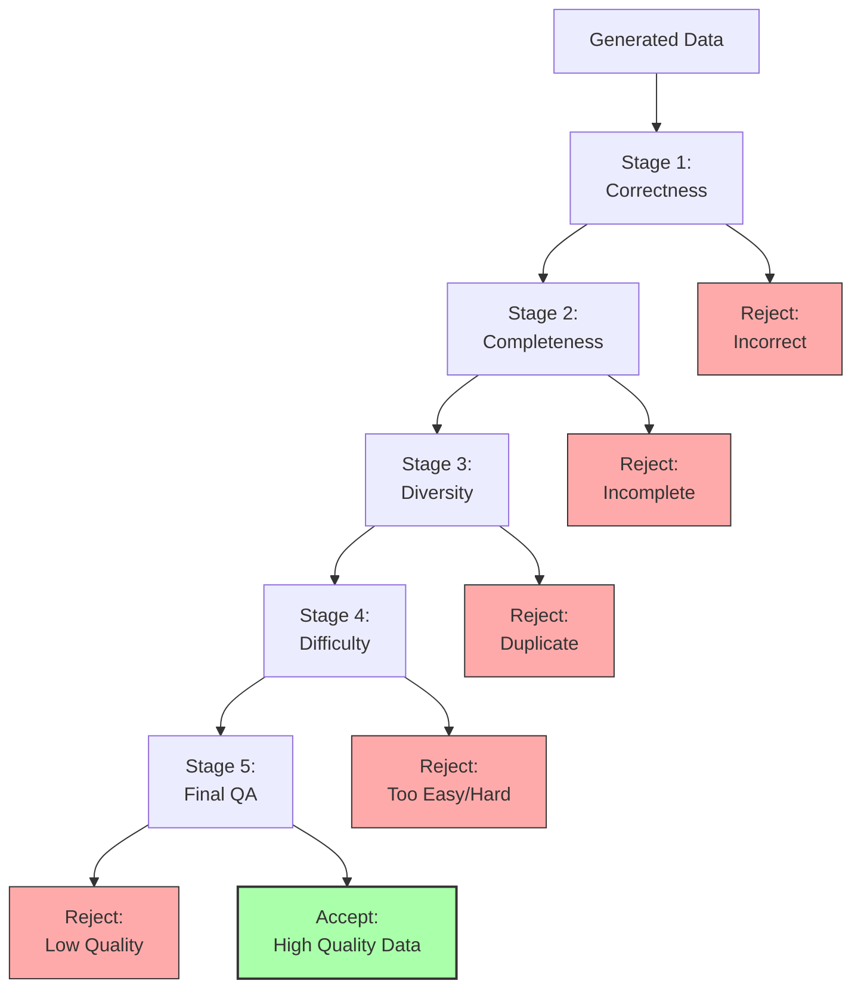

### 8.2 Correctness Validation

```python
class CorrectnessValidator:
    def __init__(self):
        self.answer_matcher = AnswerMatcher()
        self.fact_checker = FactChecker()

    def validate_correctness(self, question, predicted_answer, reference_answer):
        """
        Check if predicted answer is correct
        """
        # Method 1: Exact match
        if self.answer_matcher.exact_match(predicted_answer, reference_answer):
            return True, 1.0

        # Method 2: Semantic match
        semantic_score = self.answer_matcher.semantic_match(
            predicted_answer,
            reference_answer
        )
        if semantic_score > 0.9:
            return True, semantic_score

        # Method 3: Fact checking
        facts_predicted = self.fact_checker.extract_facts(predicted_answer)
        facts_reference = self.fact_checker.extract_facts(reference_answer)

        fact_overlap = self.compute_fact_overlap(facts_predicted, facts_reference)

        if fact_overlap > 0.8:
            return True, fact_overlap

        # Failed all checks
        return False, 0.0
```

### 8.3 Completeness Validation

```python
class CompletenessValidator:
    def validate_trajectory(self, trajectory):
        """
        Check if trajectory is complete and coherent
        """
        checks = {
            "has_final_answer": self.check_final_answer(trajectory),
            "reasonable_length": self.check_length(trajectory),
            "tool_calls_valid": self.check_tool_calls(trajectory),
            "logical_flow": self.check_logical_flow(trajectory)
        }

        is_complete = all(checks.values())

        return is_complete, checks

    def check_final_answer(self, trajectory):
        """
        Ensure trajectory ends with answer
        """
        last_step = trajectory[-1]
        return "final_answer" in last_step or "answer" in last_step

    def check_logical_flow(self, trajectory):
        """
        Ensure steps follow logically
        """
        for i in range(len(trajectory) - 1):
            current_step = trajectory[i]
            next_step = trajectory[i + 1]

            # Check if next step references previous observations
            if not self.is_logically_connected(current_step, next_step):
                return False

        return True
```

### 8.4 Diversity Validation

```python
class DiversityValidator:
    def __init__(self):
        self.embedder = SentenceTransformer('all-mpnet-base-v2')
        self.seen_embeddings = []

    def check_diversity(self, new_example, threshold=0.85):
        """
        Check if new example is sufficiently different
        """
        # Compute embedding
        new_embedding = self.embedder.encode(new_example['question'])

        # Compare to seen examples
        for seen_emb in self.seen_embeddings:
            similarity = cosine_similarity(new_embedding, seen_emb)
            if similarity > threshold:
                return False  # Too similar

        # Add to seen set
        self.seen_embeddings.append(new_embedding)

        return True
```

### 8.5 Quality Scoring

```python
class QualityScorer:
    def score_example(self, example):
        """
        Comprehensive quality score
        """
        scores = {}

        # Criterion 1: Question quality
        scores['question_quality'] = self.score_question(example['question'])

        # Criterion 2: Answer quality
        scores['answer_quality'] = self.score_answer(example['answer'])

        # Criterion 3: Trajectory quality (if available)
        if 'trajectory' in example:
            scores['trajectory_quality'] = self.score_trajectory(example['trajectory'])

        # Criterion 4: Difficulty appropriateness
        scores['difficulty_score'] = self.score_difficulty(example)

        # Combine scores
        overall_quality = np.mean(list(scores.values()))

        return overall_quality, scores

    def score_question(self, question):
        """
        Score question quality
        """
        score = 0.0

        # Check 1: Clarity
        if self.is_clear(question):
            score += 0.25

        # Check 2: Specificity
        if self.is_specific(question):
            score += 0.25

        # Check 3: Non-ambiguity
        if not self.is_ambiguous(question):
            score += 0.25

        # Check 4: Interesting/meaningful
        if self.is_interesting(question):
            score += 0.25

        return score
```

### 8.6 Automated Filtering Pipeline

```python
class AutomatedFilter:
    def __init__(self):
        self.validators = {
            'correctness': CorrectnessValidator(),
            'completeness': CompletenessValidator(),
            'diversity': DiversityValidator(),
            'quality': QualityScorer()
        }

    def filter_batch(self, candidate_examples):
        """
        Filter batch of candidates through all validators
        """
        passed = []
        rejected = defaultdict(list)

        for example in candidate_examples:
            # Run through all validators
            passed_all = True

            for validator_name, validator in self.validators.items():
                result = validator.validate(example)

                if not result:
                    passed_all = False
                    rejected[validator_name].append(example)
                    break

            if passed_all:
                passed.append(example)

        # Generate report
        report = {
            "total_candidates": len(candidate_examples),
            "passed": len(passed),
            "pass_rate": len(passed) / len(candidate_examples),
            "rejection_breakdown": {
                name: len(examples)
                for name, examples in rejected.items()
            }
        }

        return passed, report
```

---

## 9. Scaling Strategies

### 9.1 Computational Scaling

**Distributed Processing:**

```python
class DistributedSynthesizer:
    def __init__(self, num_workers=64):
        self.num_workers = num_workers
        self.task_queue = Queue()
        self.result_queue = Queue()

    def synthesize_parallel(self, seed_data, synthesis_method):
        """
        Parallel data synthesis across workers
        """
        # Distribute seed data to workers
        for seed in seed_data:
            self.task_queue.put((seed, synthesis_method))

        # Launch workers
        workers = []
        for i in range(self.num_workers):
            worker = SynthesisWorker(
                worker_id=i,
                task_queue=self.task_queue,
                result_queue=self.result_queue
            )
            worker.start()
            workers.append(worker)

        # Collect results
        results = []
        while len(results) < len(seed_data):
            result = self.result_queue.get()
            results.append(result)

        # Cleanup
        for worker in workers:
            worker.join()

        return results
```

**Scaling Properties:**

| Workers | Throughput (examples/hour) | Cost ($/1M examples) |
|---------|----------------------------|----------------------|
| 8 | 5,000 | $800 |
| 16 | 9,500 | $420 |
| 32 | 18,000 | $220 |
| 64 | 34,000 | $120 |

**Efficiency:** ~1.9× speedup per 2× workers (sub-linear due to overhead)

### 9.2 Data Scaling

**Iterative Expansion:**

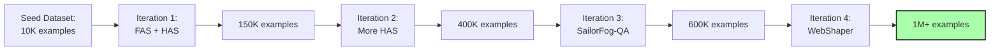

**Scaling Law (Empirical):**

```
Final_Dataset_Size ≈ Seed_Size × (1 + FAS_Factor) × (1 + HAS_Factor) × (1 + Obfuscation_Factor)

Where:
- FAS_Factor ≈ 5-10 (5-10× expansion)
- HAS_Factor ≈ 8-15 (8-15× from HAS)
- Obfuscation_Factor ≈ 1.5-3 (1.5-3× from obfuscation variants)
```

**Example:**
```
Seed: 10K examples
After FAS: 10K × 7 = 70K
After HAS: 70K × 10 = 700K
After Obfuscation: 700K × 2 = 1.4M
After Filtering (60% pass): 1.4M × 0.6 = 840K final examples
```

### 9.3 Quality Maintenance at Scale

**Challenge:** Maintaining quality as dataset scales

**Solution: Tiered Quality Control**

```python
class TieredQualityControl:
    def __init__(self):
        self.tier1_validator = FastValidator()  # Quick, basic checks
        self.tier2_validator = MediumValidator()  # More thorough
        self.tier3_validator = SlowValidator()  # Comprehensive

    def tiered_validation(self, candidates):
        """
        Multi-tier validation for efficiency
        """
        # Tier 1: Fast validation (all candidates)
        tier1_passed = []
        for candidate in candidates:
            if self.tier1_validator.validate(candidate):
                tier1_passed.append(candidate)

        print(f"Tier 1 passed: {len(tier1_passed)}/{len(candidates)}")

        # Tier 2: Medium validation (Tier 1 survivors)
        tier2_passed = []
        for candidate in tier1_passed:
            if self.tier2_validator.validate(candidate):
                tier2_passed.append(candidate)

        print(f"Tier 2 passed: {len(tier2_passed)}/{len(tier1_passed)}")

        # Tier 3: Slow validation (sample of Tier 2 survivors)
        sample_size = min(len(tier2_passed), 1000)
        tier2_sample = random.sample(tier2_passed, sample_size)

        tier3_passed = []
        for candidate in tier2_sample:
            if self.tier3_validator.validate(candidate):
                tier3_passed.append(candidate)

        tier3_pass_rate = len(tier3_passed) / sample_size

        # Estimate final quality
        estimated_high_quality = len(tier2_passed) * tier3_pass_rate

        print(f"Tier 3 pass rate: {tier3_pass_rate:.2%}")
        print(f"Estimated high-quality examples: {estimated_high_quality:.0f}")

        return tier2_passed  # Return Tier 2 passed (good enough for training)
```

**Tier Characteristics:**

| Tier | Checks | Time per Example | Pass Rate |
|------|--------|------------------|-----------|
| **Tier 1** | Basic format, length, syntax | 0.01s | 85% |
| **Tier 2** | Correctness, completeness | 1s | 70% |
| **Tier 3** | Quality, difficulty, diversity | 10s | 60% |

**Cost-Benefit:**
- Tier 1 filters 15% quickly → saves 15% × 11s = 1.65s per example
- Tier 2 filters additional 30% → saves 30% × 10s = 3s per example
- Net savings: ~40% time reduction with minimal quality loss

### 9.4 Continuous Improvement

**Feedback Loop:**

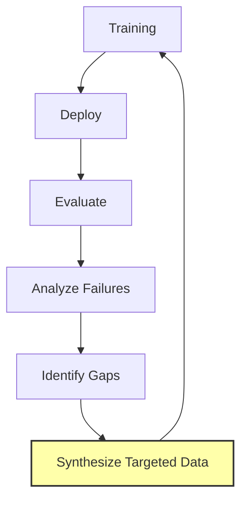

**Implementation:**

```python
class ContinuousSynthesis:
    def __init__(self):
        self.failure_analyzer = FailureAnalyzer()
        self.gap_identifier = GapIdentifier()
        self.targeted_synthesizer = TargetedSynthesizer()

    def improve_from_failures(self, model, eval_results):
        """
        Generate new training data to address weaknesses
        """
        # Analyze failures
        failure_patterns = self.failure_analyzer.analyze(eval_results)

        # Identify data gaps
        gaps = self.gap_identifier.identify(failure_patterns)

        # Synthesize targeted data
        new_data = []
        for gap in gaps:
            targeted_examples = self.targeted_synthesizer.synthesize(
                gap_type=gap['type'],
                difficulty=gap['difficulty'],
                topic=gap['topic'],
                count=gap['estimated_need']
            )
            new_data.extend(targeted_examples)

        # Quality check
        validated_data = self.validate_batch(new_data)

        return validated_data
```

---

## 10. Implementation Guide

### 10.1 Quick Start

**Minimal Setup:**

```bash
# Install dependencies
pip install transformers torch openai tiktoken networkx sentence-transformers

# Set environment variables
export OPENAI_API_KEY="your_key"
export SERPER_KEY="your_key"
export JINA_API_KEY="your_key"
```

**Basic Synthesis:**

```python
# synthesis_quickstart.py

from data_synthesis import (
    OpenWorldMemory,
    PlanningActionSynthesis,
    CorrectnessValidator
)

# Step 1: Initialize memory
memory = OpenWorldMemory()
memory.ingest_documents("./data/seed_documents/")

# Step 2: Generate questions
questions = memory.generate_questions(num_questions=1000)

# Step 3: Synthesize trajectories
synthesizer = PlanningActionSynthesis(
    teacher_model="gpt-4",
    tools=["search", "visit", "python"]
)

trajectories = []
for q in questions:
    traj = synthesizer.synthesize(
        question=q['question'],
        reference_answer=q['answer']
    )
    if traj:
        trajectories.extend(traj)

print(f"Generated {len(trajectories)} trajectories")

# Step 4: Validate
validator = CorrectnessValidator()
valid_trajectories = [
    t for t in trajectories
    if validator.validate_correctness(
        t['question'],
        t['final_answer'],
        t['reference_answer']
    )[0]
]

print(f"Valid trajectories: {len(valid_trajectories)}")

# Step 5: Save
with open("training_data.jsonl", "w") as f:
    for traj in valid_trajectories:
        f.write(json.dumps(traj) + "\n")
```

### 10.2 Full Pipeline Setup

```bash
# full_synthesis_pipeline.sh

#!/bin/bash

# Stage 1: Data Collection
python scripts/collect_web_data.py --output data/web_corpus/
python scripts/collect_papers.py --output data/papers/

# Stage 2: Memory Construction
python scripts/build_memory.py \
  --input data/web_corpus/ data/papers/ \
  --output data/memory.db

# Stage 3: QA Generation
python scripts/generate_qa.py \
  --memory data/memory.db \
  --output data/qa_seed.jsonl \
  --num_questions 10000

# Stage 4: FAS - Planning
python scripts/fas_planning.py \
  --input data/qa_seed.jsonl \
  --output data/fas_planning.jsonl \
  --teacher_model gpt-4 \
  --num_workers 32

# Stage 5: FAS - Reasoning
python scripts/fas_reasoning.py \
  --input data/qa_seed.jsonl \
  --memory data/memory.db \
  --output data/fas_reasoning.jsonl \
  --num_workers 32

# Stage 6: HAS
python scripts/has_expansion.py \
  --input data/fas_planning.jsonl \
  --output data/has_expanded.jsonl \
  --num_workers 64 \
  --alternatives_per_point 3

# Stage 7: SailorFog-QA
python scripts/sailorfog_generation.py \
  --memory data/memory.db \
  --output data/sailorfog_qa.jsonl \
  --difficulty_threshold 8.0 \
  --num_questions 50000

# Stage 8: WebShaper
python scripts/webshaper_expansion.py \
  --input data/fas_planning.jsonl \
  --output data/webshaper.jsonl \
  --expansion_per_seed 15

# Stage 9: Validation
python scripts/validate_all.py \
  --inputs data/fas_*.jsonl data/has_*.jsonl data/sailorfog_qa.jsonl data/webshaper.jsonl \
  --output data/final_validated.jsonl \
  --validation_tiers 3

# Stage 10: Merge and Split
python scripts/merge_datasets.py \
  --inputs data/final_validated.jsonl \
  --output_train data/train.jsonl \
  --output_dev data/dev.jsonl \
  --split_ratio 0.95

echo "Pipeline complete!"
echo "Training data: data/train.jsonl"
echo "Dev data: data/dev.jsonl"
```

### 10.3 Monitoring and Debugging

```python
# monitoring.py

import wandb
from collections import Counter

class SynthesisMonitor:
    def __init__(self, project_name="data-synthesis"):
        wandb.init(project=project_name)

    def log_generation_stats(self, stage_name, examples):
        """
        Log statistics for generated examples
        """
        stats = {
            f"{stage_name}/total_examples": len(examples),
            f"{stage_name}/avg_question_length": np.mean([
                len(ex['question']) for ex in examples
            ]),
            f"{stage_name}/avg_answer_length": np.mean([
                len(str(ex['answer'])) for ex in examples
            ])
        }

        # Difficulty distribution
        difficulties = [ex.get('difficulty', 5.0) for ex in examples]
        stats[f"{stage_name}/avg_difficulty"] = np.mean(difficulties)

        # Topic distribution
        topics = [ex.get('topic', 'unknown') for ex in examples]
        topic_counts = Counter(topics)
        for topic, count in topic_counts.most_common(10):
            stats[f"{stage_name}/topic_{topic}"] = count

        wandb.log(stats)

    def log_validation_results(self, validation_report):
        """
        Log validation pass rates
        """
        wandb.log({
            "validation/pass_rate": validation_report['pass_rate'],
            **{f"validation/reject_{name}": count
               for name, count in validation_report['rejection_breakdown'].items()}
        })
```

---

## 11. Performance Metrics

### 11.1 Synthesis Efficiency

**Throughput Benchmarks:**

| Method | Examples/Hour | GPU Usage | Cost per 1M |
|--------|---------------|-----------|-------------|
| **Open-World QA** | 50,000 | Low | $50 |
| **FAS - Planning** | 2,000 | High | $500 |
| **FAS - Reasoning** | 3,000 | Medium | $350 |
| **HAS** | 10,000 | High | $200 |
| **SailorFog-QA** | 1,500 | Medium | $650 |
| **WebShaper** | 5,000 | Medium | $250 |

**Total Cost for 1M Examples:** ~$2,000 - $3,000 (mixed synthesis)

### 11.2 Quality Metrics

**Validation Pass Rates:**

| Method | Correctness | Completeness | Diversity | Overall Pass |
|--------|-------------|--------------|-----------|--------------|
| **FAS - Planning** | 68% | 82% | 75% | 58% |
| **FAS - Reasoning** | 79% | 91% | 68% | 62% |
| **HAS** | 72% | 78% | 89% | 54% |
| **SailorFog-QA** | 45% | 71% | 92% | 38% |
| **WebShaper** | 81% | 88% | 85% | 73% |

**Overall Pipeline Pass Rate:** ~60% (weighted average)

### 11.3 Training Impact

**Model Performance vs. Data Source:**

| Training Data | GAIA | BrowseComp-en | WebWalkerQA | Avg |
|---------------|------|---------------|-------------|-----|
| Base Model | 35.9 | 0.5 | 46.9 | 27.8 |
| + Open-World QA only | 42.1 | 8.2 | 51.3 | 33.9 |
| + FAS (Planning + Reasoning) | 51.8 | 18.7 | 59.2 | 43.2 |
| + HAS | 58.3 | 25.4 | 64.8 | 49.5 |
| + SailorFog-QA | 65.2 | 32.1 | 68.9 | 55.4 |
| + WebShaper | 72.8 | 40.0 | 71.9 | 61.6 |

**Key Insight:** Each synthesis method contributes incrementally, cumulative benefit is substantial (+33.8 points)

---

## Conclusion

The data synthesis pipeline is the cornerstone of DeepResearch's success, enabling:

1. **Fully Automated Generation:** No human annotation required
2. **Massive Scale:** Millions of examples per month
3. **High Quality:** 60% validation pass rate maintained at scale
4. **Diverse Methods:** 6 complementary synthesis approaches
5. **Continuous Improvement:** Feedback loops for targeted synthesis

**Key Takeaways:**
- Automated synthesis is cost-effective (~$2-3K per 1M examples)
- Quality control is critical (multi-tier validation)
- Diversity ensures robust generalization
- Iterative expansion amplifies seed data 50-100×
- Each synthesis method targets different capabilities

The pipeline demonstrates that high-quality agentic training data can be generated at scale without human annotation, paving the way for scalable agent training.

---

**Document Version:** 1.0
**Last Updated:** 2025-11-12
**Related Documents:**
- [Agentic Training Paradigm](./Agentic_Training_Paradigm.md)
- [Architecture Study](./DeepResearch_Architecture_Study.md)
