# Tongyi DeepResearch: Architecture & Framework Analysis

## Table of Contents

- [1. Project Overview](#1-project-overview)
- [2. System Architecture](#2-system-architecture)
- [3. Core Components](#3-core-components)
- [4. ReAct Agent Workflow](#4-react-agent-workflow)
- [5. Tool System Architecture](#5-tool-system-architecture)
- [6. Parallel Execution System](#6-parallel-execution-system)
- [7. Evaluation Pipeline](#7-evaluation-pipeline)
- [8. Key Design Highlights](#8-key-design-highlights)
- [9. Data Flow](#9-data-flow)
- [10. Code Examples](#10-code-examples)

---

## 1. Project Overview

**Tongyi DeepResearch** is a 30.5B parameter Mixture-of-Experts (MoE) model designed for long-horizon, deep information-seeking tasks. The project implements a sophisticated agentic system based on the ReAct (Reasoning + Acting) paradigm.

### Key Features

| Feature | Description |
|---------|-------------|
| **Model Size** | 30.5B parameters (MoE architecture) |
| **Context Window** | 128K tokens (effective use: 110K) |
| **Agent Pattern** | ReAct (Reasoning + Acting) |
| **Tool Integration** | 5 core tools (Search, Visit, Python, Scholar, FileParser) |
| **Execution Mode** | Parallel multi-server inference |
| **Output Format** | XML-tagged structured generation |

### Technology Stack

```
┌─────────────────────────────────────────┐
│     Tongyi DeepResearch Stack           │
├─────────────────────────────────────────┤
│ LLM Framework: qwen-agent               │
│ Inference: vLLM / OpenRouter API        │
│ Python Sandbox: SandboxFusion           │
│ Web Search: Serper API                  │
│ Web Reading: Jina.ai API                │
│ Parallel Execution: ThreadPoolExecutor  │
│ Evaluation: LLM-as-Judge (Pydantic)     │
└─────────────────────────────────────────┘
```

---

## 2. System Architecture

### High-Level Architecture

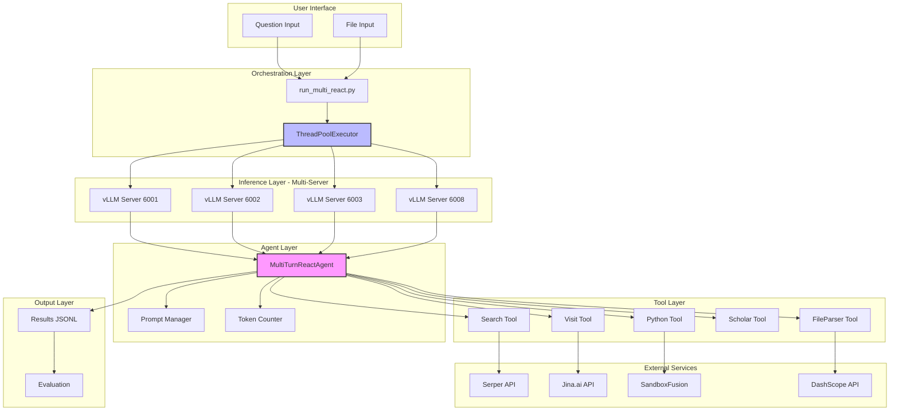

### Directory Structure

```
DeepResearch/
├── inference/               # Core inference implementation
│   ├── react_agent.py      # ReAct agent with tool orchestration
│   ├── run_multi_react.py  # Parallel execution orchestrator
│   ├── prompt.py           # System and tool prompts
│   ├── tool_search.py      # Google search via Serper
│   ├── tool_visit.py       # Webpage reading and summarization
│   ├── tool_python.py      # Sandboxed Python execution
│   ├── tool_scholar.py     # Google Scholar search
│   ├── tool_file.py        # Multi-format file parsing
│   ├── file_tools/         # File parsing utilities
│   └── eval_data/          # Test datasets and file corpus
├── evaluation/             # Benchmark evaluation scripts
│   ├── evaluate_hle_official.py
│   ├── evaluate_deepsearch_official.py
│   └── prompt.py
├── WebAgent/               # Research agent implementations
│   ├── WebWalker/
│   ├── WebDancer/
│   ├── WebSailor/
│   ├── WebWatcher/
│   └── ... (12 variants)
├── Agent/                  # Training methodologies
│   ├── AgentFounder/
│   └── AgentScaler/
└── scripts/                # Utility scripts
```

---

## 3. Core Components

### 3.1 MultiTurnReactAgent (react_agent.py)

The central orchestrator that implements the ReAct loop.

**Key Responsibilities:**
- Manages conversation history
- Calls LLM via OpenRouter or vLLM
- Parses XML-tagged outputs
- Executes tools
- Enforces token and round limits
- Handles graceful degradation

**Class Structure:**

```python
class MultiTurnReactAgent(FnCallAgent):
    def __init__(self, function_list, llm, **kwargs)
    def call_server(self, msgs, planning_port, max_tries=10)
    def count_tokens(self, messages)
    def _run(self, data: str, model: str, **kwargs) -> List[List[Message]]
    def custom_call_tool(self, tool_name: str, tool_args: dict, **kwargs)
```

**Key Parameters:**

| Parameter | Default | Description |
|-----------|---------|-------------|
| `MAX_LLM_CALL_PER_RUN` | 100 | Maximum reasoning rounds |
| `max_tokens` | 110K | Context window limit |
| `timeout` | 150 min | Maximum execution time |
| `temperature` | 0.85 | Sampling temperature |
| `presence_penalty` | 1.1 | Repetition penalty |

### 3.2 Parallel Orchestrator (run_multi_react.py)

Manages concurrent execution across multiple questions and rollouts.

**Key Features:**
- ThreadPoolExecutor with configurable workers
- Round-robin server assignment with sticky sessions
- Per-rollout output files
- Resume capability (skip processed questions)
- Dataset splitting for distributed execution
- Thread-safe file writing with locks

**Execution Flow:**

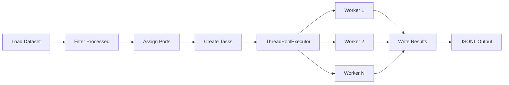

### 3.3 Prompt System (prompt.py)

Defines the agent's behavior and tool schemas.

**System Prompt Structure:**
```
Role Definition
    ↓
Tool Specifications (JSON schemas)
    ↓
Output Format Instructions (XML tags)
    ↓
Current Date Context
```

**Tool Schema Format:**
```json
{
  "type": "function",
  "function": {
    "name": "tool_name",
    "description": "What the tool does",
    "parameters": {
      "type": "object",
      "properties": {...},
      "required": [...]
    }
  }
}
```

---

## 4. ReAct Agent Workflow

### 4.1 Execution Loop

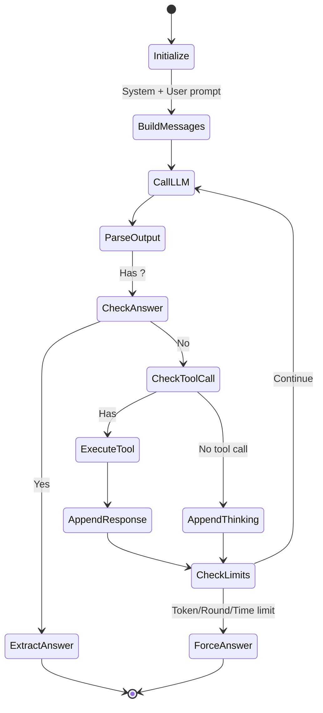

### 4.2 Detailed Workflow Stages

#### Stage 1: Initialization

```python
# Initial message construction
system_prompt = SYSTEM_PROMPT + today_date()
messages = [
    {"role": "system", "content": system_prompt},
    {"role": "user", "content": question}
]
```

#### Stage 2: Reasoning Loop

```python
while num_llm_calls_available > 0:
    # 1. Check time limit (150 minutes)
    if time.time() - start_time > 150 * 60:
        return timeout_result

    # 2. Call LLM
    content = self.call_server(messages, planning_port)
    messages.append({"role": "assistant", "content": content})

    # 3. Parse and execute tool calls
    if '<tool_call>' in content:
        tool_call = extract_tool_call(content)
        result = self.custom_call_tool(tool_name, tool_args)
        messages.append({"role": "user", "content": result})

    # 4. Check for answer
    if '<answer>' in content:
        return extract_answer(content)

    # 5. Check token limit
    token_count = self.count_tokens(messages)
    if token_count > 110 * 1024:
        return force_answer()
```

#### Stage 3: Output Parsing

The agent expects XML-tagged structured output:

```xml
<think>
    The user is asking about X. I should first search for Y,
    then visit the most relevant pages to gather detailed information.
</think>
<tool_call>
{"name": "search", "arguments": {"query": ["specific query"]}}
</tool_call>
```

After tool execution, the tool response is wrapped:

```xml
<tool_response>
Search results: ...
</tool_response>
```

Final answer format:

```xml
<think>
    Based on all the information gathered, I can now provide
    a comprehensive answer.
</think>
<answer>
The final answer to the question is...
</answer>
```

### 4.3 Termination Conditions

| Condition | Termination Type | Behavior |
|-----------|------------------|----------|
| `<answer>` tag found | Normal | Extract and return answer |
| Round limit (100) | Forced | Return "No answer found" |
| Token limit (110K) | Forced | Force answer generation |
| Time limit (150 min) | Timeout | Return timeout message |
| Server error | Error | Retry with exponential backoff |

---

## 5. Tool System Architecture

### 5.1 Tool Registry

All tools inherit from `BaseTool` (qwen-agent) and use the `@register_tool` decorator:

```python
from qwen_agent.tools.base import BaseTool, register_tool

@register_tool('tool_name', allow_overwrite=True)
class ToolName(BaseTool):
    name = 'tool_name'
    description = 'Tool description'
    parameters = {...}  # JSON schema

    def call(self, params: Union[str, dict], **kwargs) -> str:
        # Implementation
        return result
```

**Tool Registry (TOOL_MAP):**

```python
TOOL_CLASS = [
    FileParser(),
    Scholar(),
    Visit(),
    Search(),
    PythonInterpreter(),
]
TOOL_MAP = {tool.name: tool for tool in TOOL_CLASS}
```

### 5.2 Individual Tool Details

#### 5.2.1 Search Tool

**Purpose:** Google web search via Serper API

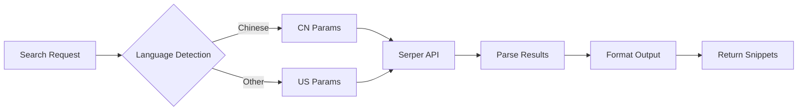

**Key Features:**
- Batch query support (array of queries)
- Language-specific localization (Chinese/English)
- Returns top 10 results per query
- Retry logic (5 attempts)
- Rich metadata (title, link, date, source, snippet)

**Output Format:**
```
A Google search for 'query' found 10 results:

## Web Results
1. [Title](URL)
Date published: 2024-01-01
Source: example.com
Snippet text...

2. [Title](URL)
...
```

#### 5.2.2 Visit Tool

**Purpose:** Fetch and summarize webpage content

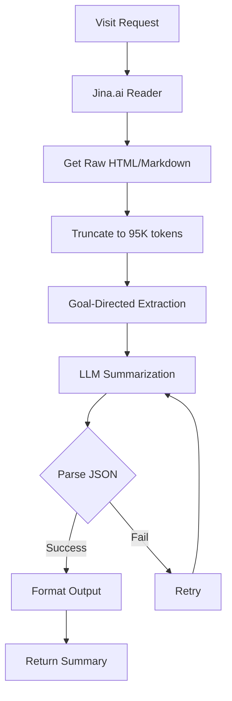

**Goal-Directed Extraction:**

The Visit tool uses a secondary LLM to extract goal-relevant information:

```python
EXTRACTOR_PROMPT = """
## **Webpage Content**
{webpage_content}

## **User Goal**
{goal}

## **Task Guidelines**
1. **Content Scanning**: Locate specific sections
2. **Key Extraction**: Extract relevant information (full original context)
3. **Summary Output**: Organize into concise paragraph

**Final Output Format: JSON with "rational", "evidence", "summary" fields**
"""
```

**Output Format:**
```
The useful information in [URL] for user goal [GOAL] as follows:

Evidence in page:
[Full extracted context from the page]

Summary:
[Concise summary organized logically]
```

**Key Features:**
- Multi-URL support (batch processing)
- Goal-directed extraction (focuses on relevant info)
- Automatic truncation for long pages
- Retry logic with progressive truncation
- Timeout protection (15 min per URL batch)

#### 5.2.3 Python Interpreter

**Purpose:** Execute Python code in sandboxed environment

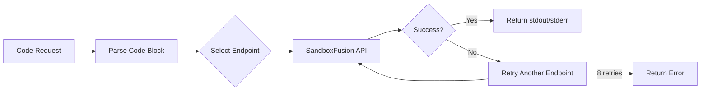

**Special Format:**

The Python tool requires a unique calling convention:

```xml
<tool_call>
{"name": "PythonInterpreter", "arguments": {}}
<code>
import numpy as np
result = np.mean([1, 2, 3, 4, 5])
print(f"Average: {result}")
</code>
</tool_call>
```

**Key Features:**
- Empty arguments `{}`
- Code in `<code>` tags outside JSON
- Multiple sandbox endpoints (load balancing)
- 50-second execution timeout
- Automatic retry with different endpoints (8 attempts)
- Returns stdout and stderr

**Execution Environment:**
- Isolated Python sandbox (SandboxFusion)
- Standard library + common packages (numpy, pandas, etc.)
- No persistent state between calls
- Network access disabled

#### 5.2.4 Scholar Tool

**Purpose:** Academic literature search via Google Scholar

**Key Features:**
- Multi-query support
- Also includes Google search results
- Academic metadata (citations, authors, year)

#### 5.2.5 FileParser Tool

**Purpose:** Parse uploaded files (PDF, DOCX, PPTX, CSV, XLSX, video, audio)

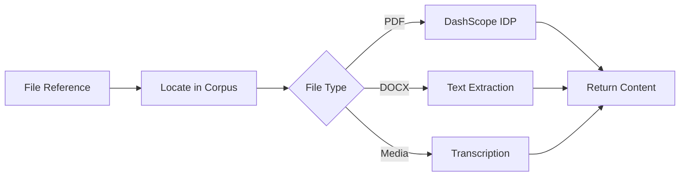

**Key Features:**
- Multi-format support
- Async execution
- DashScope API for complex formats
- File corpus path: `eval_data/file_corpus/`

### 5.3 Tool Invocation Flow

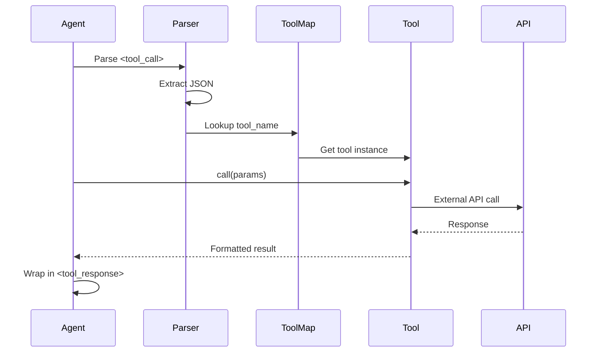

---

## 6. Parallel Execution System

### 6.1 Multi-Server Architecture

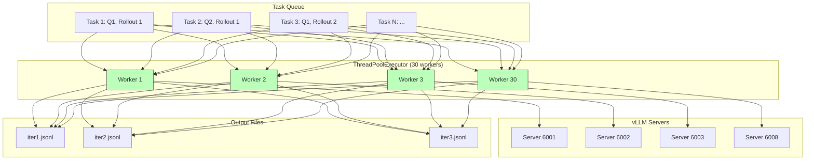

### 6.2 Port Assignment Strategy

**Sticky Assignment Per Question:**

```python
# Round-robin assignment
planning_ports = [6001, 6002, 6003, 6004, 6005, 6006, 6007, 6008]
planning_rr_idx = 0
question_to_ports = {}

for question in questions:
    if question not in question_to_ports:
        planning_port = planning_ports[planning_rr_idx % len(planning_ports)]
        question_to_ports[question] = planning_port
        planning_rr_idx += 1
```

**Benefits:**
- Load balancing across servers
- Same question always uses same server (cache benefits)
- Avoids port conflicts

### 6.3 Rollout System (Pass@K)

**Concept:** Run each question K times to improve reliability

```python
roll_out_count = 3  # Default

# Generate tasks for all rollouts
for rollout_idx in range(1, roll_out_count + 1):
    for item in items:
        tasks_to_run_all.append({
            "item": item,
            "rollout_idx": rollout_idx,
            "planning_port": planning_port
        })
```

**Output Files:**
```
outputs/
├── iter1.jsonl  # First attempt for all questions
├── iter2.jsonl  # Second attempt
└── iter3.jsonl  # Third attempt
```

**Evaluation:** Use majority voting or best-of-K strategy

### 6.4 Resume Capability

The system tracks completed questions to support resume:

```python
processed_queries = set()
if os.path.exists(output_file):
    with open(output_file, "r") as f:
        for line in f:
            data = json.loads(line)
            if "question" in data and "error" not in data:
                processed_queries.add(data["question"])

# Skip processed questions
if question not in processed_queries:
    tasks_to_run_all.append(task)
```

### 6.5 Thread-Safe Writing

```python
write_locks = {i: threading.Lock() for i in range(1, roll_out_count + 1)}

# In each worker
with write_locks[rollout_idx]:
    with open(output_file, "a", encoding="utf-8") as f:
        f.write(json.dumps(result, ensure_ascii=False) + "\n")
```

### 6.6 Dataset Splitting

For distributed execution across machines:

```python
# Split dataset into chunks
total_splits = 4       # 4 machines
worker_split = 1       # This is machine 1

items_per_split = math.ceil(total_items / total_splits)
start_idx = (worker_split - 1) * items_per_split
end_idx = min(worker_split * items_per_split, total_items)

items = items[start_idx:end_idx]

# Output files get split suffix
output_file = f"iter{i}_split{worker_split}of{total_splits}.jsonl"
```

---

## 7. Evaluation Pipeline

### 7.1 LLM-as-Judge Architecture

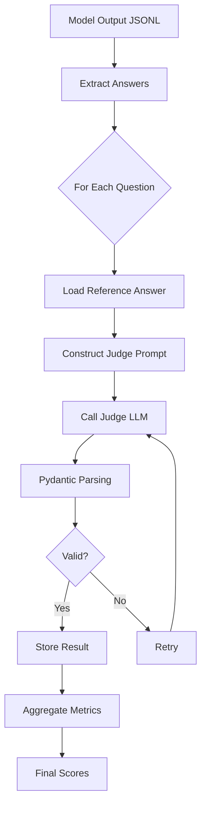

### 7.2 Judge Prompt Template

```python
JUDGE_PROMPT = """
Judge whether the following [response] to [question] is correct
or not based on the precise and unambiguous [correct_answer] below.

[question]: {question}
[response]: {response}
[correct_answer]: {correct_answer}

Your judgement must be in the format:
- extracted_final_answer: The extracted answer
- reasoning: Why it's correct/incorrect
- correct: yes/no
- confidence: 0-100%
"""
```

### 7.3 Structured Output (Pydantic)

```python
class ExtractedAnswer(BaseModel):
    extracted_final_answer: str
    reasoning: str
    correct: Literal["yes", "no"]
    confidence: int
    strict: Literal[True]

# Parse with structured output
response_obj = client.beta.chat.completions.parse(
    model=JUDGE_MODEL,
    messages=[{"role": "user", "content": prompt}],
    response_format=ExtractedAnswer,
)
content = response_obj.choices[0].message.parsed
```

### 7.4 Evaluation Metrics

| Metric | Description | Calculation |
|--------|-------------|-------------|
| **Accuracy** | Percentage of correct answers | `correct / total` |
| **Confidence** | Average confidence score | `mean(confidences)` |
| **Coverage** | Questions with valid answers | `answered / total` |
| **Error Rate** | Failed executions | `errors / total` |

### 7.5 Benchmark Support

The evaluation system supports multiple benchmarks:

```
evaluation/
├── evaluate_hle_official.py         # HLE benchmark
├── evaluate_deepsearch_official.py  # DeepSearch, BrowseComp, GAIA
└── prompt.py                        # Judge prompts
```

**Supported Benchmarks:**
- **HLE**: Long-form research questions
- **DeepSearch**: Multi-hop reasoning
- **BrowseComp**: Web browsing comprehension
- **GAIA**: General AI assistant evaluation

---

## 8. Key Design Highlights

### 8.1 Context Window Management

**Challenge:** 128K context, but need headroom for tool responses

**Solution:**
```python
max_tokens = 110 * 1024  # Reserve 18K for overhead

token_count = self.count_tokens(messages)
if token_count > max_tokens:
    # Force answer generation
    messages[-1]['content'] = """
    You have reached the maximum context length.
    Provide your best answer now in the format:
    <think>final thinking</think>
    <answer>your answer</answer>
    """
```

**Token Counting:**
```python
def count_tokens(self, messages):
    tokenizer = AutoTokenizer.from_pretrained(self.llm_local_path)
    full_prompt = tokenizer.apply_chat_template(messages, tokenize=False)
    tokens = tokenizer(full_prompt, return_tensors="pt")
    return len(tokens["input_ids"][0])
```

### 8.2 XML-Tagged Output Parsing

**Why XML tags instead of JSON?**
- More robust for LLM generation
- Easier to parse with regex
- Supports nested structures
- Clear visual boundaries

**Tag Hierarchy:**
```xml
<think>...</think>        # Reasoning (always present)
<tool_call>...</tool_call> # Tool invocation (JSON inside)
<code>...</code>           # Python code (special case)
<answer>...</answer>       # Final answer (terminates)
<tool_response>...</tool_response> # Tool output (system-generated)
```

### 8.3 Graceful Degradation

**Termination Priority:**
1. `<answer>` tag found → Extract and return
2. Round limit → Force answer
3. Token limit → Force answer with special prompt
4. Time limit → Return timeout message
5. Server error → Retry with exponential backoff

**No Harsh Failures:** System always returns a result, even if incomplete

### 8.4 Retry Logic with Exponential Backoff

```python
base_sleep_time = 1
for attempt in range(max_tries):
    try:
        response = client.chat.completions.create(...)
        return response
    except Exception as e:
        if attempt < max_tries - 1:
            sleep_time = base_sleep_time * (2 ** attempt) + random.uniform(0, 1)
            sleep_time = min(sleep_time, 30)  # Cap at 30 seconds
            time.sleep(sleep_time)
```

### 8.5 Goal-Directed Tool Use

**Visit Tool Example:**

Instead of returning raw webpage content, the Visit tool:
1. Accepts a `goal` parameter
2. Uses LLM to extract goal-relevant information
3. Returns structured output (rational, evidence, summary)

**Benefits:**
- Reduces token consumption
- Improves signal-to-noise ratio
- Enables focused reasoning

### 8.6 Batched Tool Calls

**Search and Scholar tools accept arrays:**

```json
{
  "name": "search",
  "arguments": {
    "query": [
      "quantum computing basics",
      "quantum computing applications 2024",
      "quantum computing vs classical"
    ]
  }
}
```

**Benefits:**
- Reduces round trips
- Parallel API calls (ThreadPoolExecutor)
- Comprehensive coverage in single turn

### 8.7 Sandboxed Execution

**Python Tool Safety:**
- Isolated via SandboxFusion
- No persistent state
- Network access disabled
- Execution timeout (50s)
- Multiple endpoints for reliability

### 8.8 Sticky Server Assignment

**Why Sticky?**
- KV cache benefits (same question → same server)
- Reduces context switching
- Improves cache hit rates

**How?**
```python
question_to_ports[question] = assigned_port
# All rollouts of same question use same port
```

### 8.9 Modular Tool System

**Easy to Add New Tools:**

1. Inherit from `BaseTool`
2. Add `@register_tool` decorator
3. Implement `call(params)` method
4. Add to `TOOL_CLASS` list
5. Update system prompt with tool schema

**Example:**
```python
@register_tool('new_tool', allow_overwrite=True)
class NewTool(BaseTool):
    name = 'new_tool'
    description = 'What it does'
    parameters = {...}

    def call(self, params, **kwargs):
        # Implementation
        return result
```

### 8.10 Dataset Format Flexibility

**Supports:**
- JSON (list of objects)
- JSONL (one object per line)
- File references (prepend filename to question)
- Custom message formats

**File Handling:**
```json
{
  "question": "report.pdf What are the key findings?",
  "answer": "..."
}
```

System automatically:
1. Extracts filename (`report.pdf`)
2. Locates in `eval_data/file_corpus/`
3. Calls FileParser tool
4. Injects content into context

---

## 9. Data Flow

### 9.1 End-to-End Execution Flow

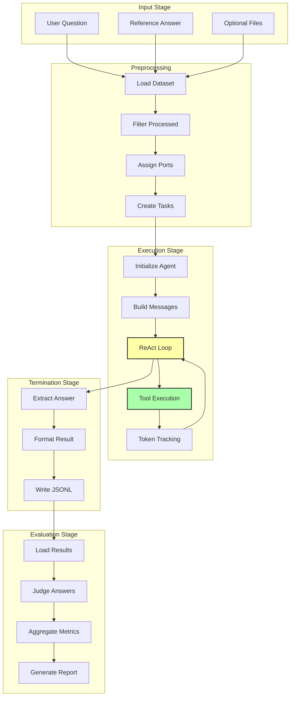

### 9.2 Message History Evolution

**Round 1:**
```json
[
  {"role": "system", "content": "You are a deep research assistant..."},
  {"role": "user", "content": "What is quantum computing?"}
]
```

**Round 2 (after LLM response with tool call):**
```json
[
  {"role": "system", "content": "..."},
  {"role": "user", "content": "What is quantum computing?"},
  {"role": "assistant", "content": "<think>...</think><tool_call>...</tool_call>"},
  {"role": "user", "content": "<tool_response>Search results...</tool_response>"}
]
```

**Round 3 (after another turn):**
```json
[
  ... previous messages ...,
  {"role": "assistant", "content": "<think>...</think><tool_call>...</tool_call>"},
  {"role": "user", "content": "<tool_response>Page summary...</tool_response>"}
]
```

**Final Round (answer):**
```json
[
  ... previous messages ...,
  {"role": "assistant", "content": "<think>...</think><answer>Final answer</answer>"}
]
```

### 9.3 Token Budget Allocation

```
Total: 128K tokens
├── System Prompt: ~2K
├── User Question: ~0.5K
├── Tool Schemas: ~1.5K
├── Conversation History: ~80K
├── Tool Responses: ~20K
├── LLM Generations: ~10K
└── Overhead/Buffer: ~14K
```

**Dynamic Truncation:**
- Long tool responses truncated
- Old conversation turns summarized
- File content compressed

---

## 10. Code Examples

### 10.1 Basic Usage

**Single Question Inference:**

```bash
conda activate react_infer_env
cd inference

python -u run_multi_react.py \
  --dataset eval_data/test.jsonl \
  --output ./outputs \
  --max_workers 30 \
  --model $MODEL_PATH \
  --temperature 0.85 \
  --presence_penalty 1.1
```

**test.jsonl:**
```jsonl
{"question": "What is the capital of France?", "answer": "Paris"}
{"question": "Calculate the factorial of 5", "answer": "120"}
```

### 10.2 Multi-Server Setup

**run_react_infer.sh:**

```bash
#!/bin/bash

MODEL_PATH="/path/to/model"
DATASET="eval_data/test.jsonl"
OUTPUT_PATH="./outputs"

# Start 8 vLLM servers
for port in {6001..6008}; do
  gpu=$((port - 6001))
  CUDA_VISIBLE_DEVICES=$gpu python -m vllm.entrypoints.openai.api_server \
    --model $MODEL_PATH \
    --port $port \
    --tensor-parallel-size 1 &
done

# Wait for servers to be ready
sleep 60

# Run inference
python -u run_multi_react.py \
  --model $MODEL_PATH \
  --dataset $DATASET \
  --output $OUTPUT_PATH \
  --max_workers 30 \
  --roll_out_count 3
```

### 10.3 Custom Tool Example

**Adding a Calculator Tool:**

```python
# tool_calculator.py
from qwen_agent.tools.base import BaseTool, register_tool
from typing import Union

@register_tool('calculator', allow_overwrite=True)
class Calculator(BaseTool):
    name = 'calculator'
    description = 'Perform basic arithmetic operations'
    parameters = {
        "type": "object",
        "properties": {
            "expression": {
                "type": "string",
                "description": "Mathematical expression to evaluate"
            }
        },
        "required": ["expression"]
    }

    def call(self, params: Union[str, dict], **kwargs) -> str:
        try:
            expression = params["expression"]
            result = eval(expression)  # Use safely in production!
            return f"Result: {result}"
        except Exception as e:
            return f"[Calculator Error]: {str(e)}"

# In react_agent.py, add to TOOL_CLASS:
TOOL_CLASS = [
    FileParser(),
    Scholar(),
    Visit(),
    Search(),
    PythonInterpreter(),
    Calculator(),  # New tool
]
```

**Update System Prompt:**

```json
{"type": "function", "function": {"name": "calculator", "description": "Perform basic arithmetic operations", "parameters": {"type": "object", "properties": {"expression": {"type": "string", "description": "Mathematical expression to evaluate"}}, "required": ["expression"]}}}
```

### 10.4 Agent Invocation Example

**Python API:**

```python
from react_agent import MultiTurnReactAgent

# Configure LLM
llm_cfg = {
    'model': '/path/to/model',
    'generate_cfg': {
        'max_input_tokens': 320000,
        'max_retries': 10,
        'temperature': 0.85,
        'top_p': 0.95,
        'presence_penalty': 1.1
    },
    'model_type': 'qwen_dashscope'
}

# Create agent
agent = MultiTurnReactAgent(
    llm=llm_cfg,
    function_list=["search", "visit", "PythonInterpreter"]
)

# Run on a question
data = {
    'item': {
        'question': 'What is the latest news about AI?',
        'answer': 'reference answer'
    },
    'planning_port': 6001
}

result = agent._run(data, model='/path/to/model')
print(result['prediction'])
```

### 10.5 Evaluation Example

**evaluate_custom.py:**

```python
from evaluate_hle_official import extract_answer
import json

# Load model outputs
results = []
with open('outputs/iter1.jsonl', 'r') as f:
    for line in f:
        results.append(json.loads(line))

# Evaluate each result
scores = []
for result in results:
    evaluation = extract_answer(
        question=result['question'],
        correct_answer=result['answer'],
        response=result['prediction']
    )
    scores.append(evaluation['correct'] == 'yes')

# Calculate accuracy
accuracy = sum(scores) / len(scores)
print(f"Accuracy: {accuracy * 100:.2f}%")
```

### 10.6 OpenRouter API Usage

**Modify react_agent.py:**

```python
def call_server(self, msgs, planning_port, max_tries=10):
    # Use OpenRouter instead of vLLM
    openai_api_key = os.getenv("OPENROUTER_API_KEY")
    openai_api_base = "https://openrouter.ai/api/v1"

    client = OpenAI(
        api_key=openai_api_key,
        base_url=openai_api_base,
        timeout=600.0,
    )

    chat_response = client.chat.completions.create(
        model="alibaba/tongyi-deepresearch-30b-a3b",
        messages=msgs,
        stop=["\n<tool_response>", "<tool_response>"],
        temperature=self.llm_generate_cfg.get('temperature', 0.6),
        top_p=self.llm_generate_cfg.get('top_p', 0.95),
        max_tokens=10000,
        presence_penalty=self.llm_generate_cfg.get('presence_penalty', 1.1)
    )

    content = chat_response.choices[0].message.content
    return content.strip()
```

**Run:**

```bash
export OPENROUTER_API_KEY="your_key_here"
bash inference/run_react_infer_openrouter.sh
```

### 10.7 File-Based Questions

**Dataset with File References:**

```jsonl
{"question": "report.pdf What are the key findings in section 3?", "answer": "..."}
{"question": "data.csv Calculate the average of column B", "answer": "..."}
```

**File Corpus Structure:**

```
inference/eval_data/file_corpus/
├── report.pdf
└── data.csv
```

**Agent Behavior:**

1. Detects filename prefix (`report.pdf`)
2. Calls `parse_file` tool automatically
3. Extracts text/data
4. Processes question with file content

---

## Summary

The Tongyi DeepResearch project demonstrates a sophisticated agentic system with several key innovations:

1. **Scalable Architecture**: Multi-server parallel execution with sticky assignment
2. **Robust Tool System**: Modular, goal-directed tools with retry logic
3. **Context Management**: Dynamic truncation and token tracking for 110K context
4. **Graceful Degradation**: Multiple termination strategies, no harsh failures
5. **Structured Output**: XML-tagged generation for robust parsing
6. **Comprehensive Evaluation**: LLM-as-judge with Pydantic structured output
7. **Production-Ready**: Resume capability, error handling, distributed execution

The codebase serves as an excellent reference for building production-grade LLM agents with tool use, demonstrating best practices in:
- Agent orchestration
- Parallel execution
- Context window management
- Tool integration
- Evaluation pipelines

---

**Document Version:** 1.0
**Last Updated:** 2025-11-12
**Author:** Architecture Study
**Repository:** [Alibaba-NLP/DeepResearch](https://github.com/Alibaba-NLP/DeepResearch)
