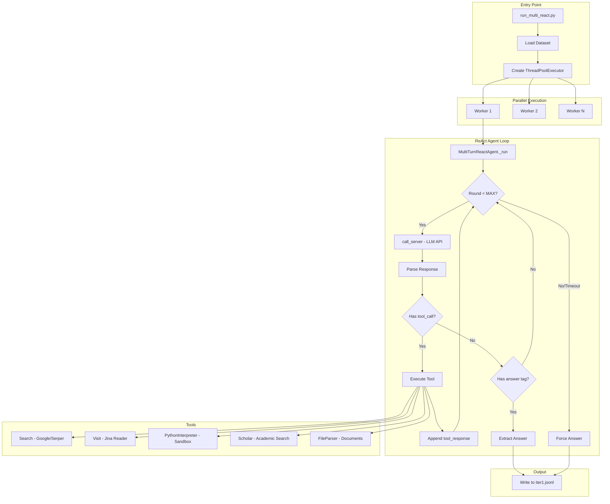
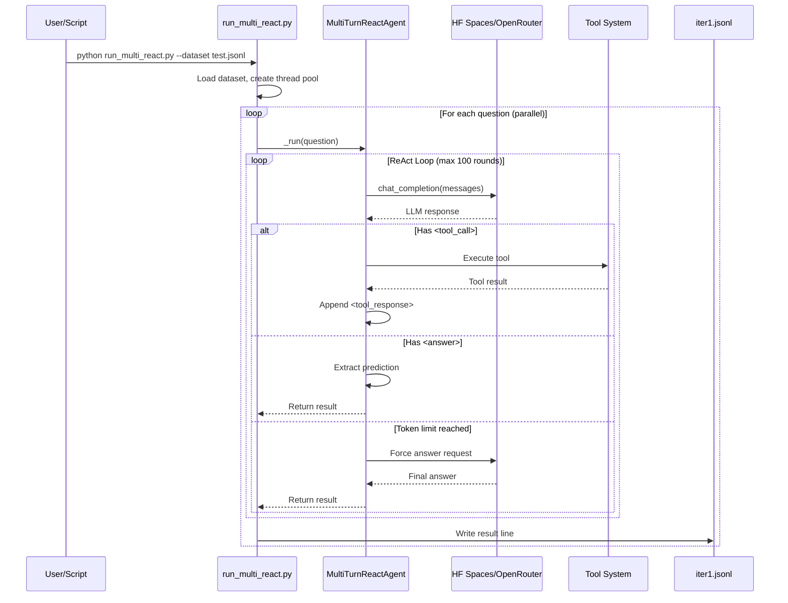
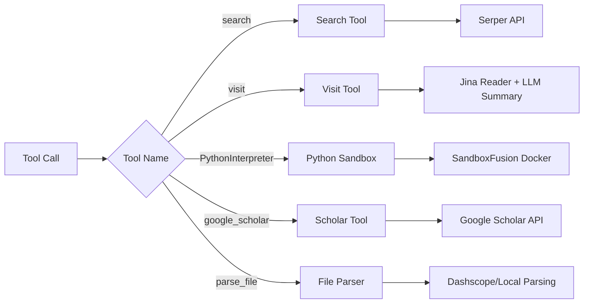

# Tongyi DeepResearch Inference Architecture

This document provides a comprehensive explanation of how the inference pipeline works, from running a command to getting results.

## Table of Contents

1. [Overview](#overview)
2. [Architecture Diagram](#architecture-diagram)
3. [Component Deep Dive](#component-deep-dive)
4. [Data Flow](#data-flow)
5. [ReAct Loop Explained](#react-loop-explained)
6. [Tool System](#tool-system)
7. [Output Format](#output-format)
8. [Key Code References](#key-code-references)

---

## Overview

The inference system implements a **ReAct (Reasoning + Acting) agent** that:
1. Receives a question
2. Reasons about what information is needed
3. Calls tools (search, visit, python, etc.) to gather information
4. Iterates until it has enough information
5. Produces a final answer

### Key Components

| Component | File | Purpose |
|-----------|------|---------|
| Entry Point | `run_multi_react.py` | Orchestrates parallel execution |
| Agent | `react_agent.py` | Implements ReAct loop |
| API Client | `hf_spaces_client.py` | Handles LLM API calls |
| Tools | `tool_*.py` | Search, Visit, Python, etc. |
| Prompts | `prompt.py` | System prompts and templates |

---

## Architecture Diagram



---

## Component Deep Dive

### 1. Entry Point: `run_multi_react.py`

This script orchestrates the entire inference process:

```python
# Key initialization (lines 161-176)
llm_cfg = {
    'model': model,
    'generate_cfg': {
        'max_input_tokens': 320000,
        'max_retries': 10,
        'temperature': args.temperature,      # Default: 0.6
        'top_p': args.top_p,                  # Default: 0.95
        'presence_penalty': args.presence_penalty  # Default: 1.1
    },
    'model_type': 'qwen_dashscope'
}

test_agent = MultiTurnReactAgent(
    llm=llm_cfg,
    function_list=["search", "visit", "google_scholar", "PythonInterpreter"]
)
```

**Parallelization:**
```python
# Lines 180-189
with ThreadPoolExecutor(max_workers=args.max_workers) as executor:
    future_to_task = {
        executor.submit(test_agent._run, task, model): task
        for task in tasks_to_run_all
    }

    for future in tqdm(as_completed(future_to_task), total=len(tasks_to_run_all)):
        # Process completed tasks
```

**Resume Capability:**
```python
# Lines 97-114 - Skip already processed questions
for rollout_idx in range(1, roll_out_count + 1):
    output_file = output_files[rollout_idx]
    processed_queries = set()
    if os.path.exists(output_file):
        with open(output_file, "r", encoding="utf-8") as f:
            for line in f:
                data = json.loads(line)
                if "question" in data and "error" not in data:
                    processed_queries.add(data["question"].strip())
```

### 2. ReAct Agent: `react_agent.py`

The core agent implementing the ReAct reasoning loop:

```python
class MultiTurnReactAgent(FnCallAgent):
    def __init__(self, function_list, llm, **kwargs):
        # Initialize API client (HF Spaces or OpenRouter)
        use_openrouter = os.getenv("USE_OPENROUTER", "false").lower() == "true"
        self.api_client = create_client(use_openrouter=use_openrouter)
```

**Main Loop (`_run` method, lines 115-221):**

```python
def _run(self, data: str, model: str, **kwargs):
    question = data['item']['question']
    messages = [
        {"role": "system", "content": system_prompt},
        {"role": "user", "content": question}
    ]

    num_llm_calls_available = MAX_LLM_CALL_PER_RUN  # Default: 100
    round = 0

    while num_llm_calls_available > 0:
        # 1. Check time limit (150 minutes)
        if time.time() - start_time > 150 * 60:
            return result_with_timeout

        round += 1
        num_llm_calls_available -= 1

        # 2. Call LLM
        content = self.call_server(messages, planning_port)
        print(f'Round {round}: {content}')

        # 3. Append assistant response
        messages.append({"role": "assistant", "content": content.strip()})

        # 4. Check for tool calls
        if '<tool_call>' in content and '</tool_call>' in content:
            tool_call = content.split('<tool_call>')[1].split('</tool_call>')[0]
            result = execute_tool(tool_call)
            messages.append({"role": "user", "content": f"<tool_response>\n{result}\n</tool_response>"})

        # 5. Check for answer
        if '<answer>' in content and '</answer>' in content:
            termination = 'answer'
            break

        # 6. Check token limit (110K)
        token_count = self.count_tokens(messages)
        if token_count > 110 * 1024:
            # Force answer generation
            messages[-1]['content'] = "You have reached max context. Provide your answer now."
            content = self.call_server(messages, planning_port)
            break
```

### 3. API Client: `hf_spaces_client.py`

Handles communication with the LLM API (HF Spaces or OpenRouter):

```python
class HFSpacesClient:
    def __init__(self, api_key, api_base, model, timeout=600.0, use_openrouter=False):
        if use_openrouter:
            self.api_base = "https://openrouter.ai/api/v1"
            self.model = "alibaba/tongyi-deepresearch-30b-a3b"
        else:
            self.api_base = "https://alibaba-nlp-tongyi-deepresearch.hf.space/api/v1"

        self.client = OpenAI(api_key=self.api_key, base_url=self.api_base)
```

**Retry Logic:**
```python
def chat_completion(self, messages, max_retries=10):
    for attempt in range(max_retries):
        try:
            response = self.client.chat.completions.create(
                model=self.model,
                messages=messages,
                temperature=0.85,
                max_tokens=10000,
                stop=["\n<tool_response>", "<tool_response>"]
            )
            return response
        except Exception as e:
            # Exponential backoff
            wait_time = min(2 ** attempt, 60)
            time.sleep(wait_time)
```

---

## Data Flow



---

## ReAct Loop Explained

### Message Format Evolution

**Initial State:**
```json
[
  {"role": "system", "content": "You are a deep research assistant..."},
  {"role": "user", "content": "What is 2^100 mod 1000000007?"}
]
```

**After Round 1 (Tool Call):**
```json
[
  {"role": "system", "content": "..."},
  {"role": "user", "content": "What is 2^100 mod 1000000007?"},
  {"role": "assistant", "content": "<tool_call>\n{\"name\": \"PythonInterpreter\", \"arguments\": {}}\n<code>\nprint(pow(2, 100, 1000000007))\n</code>\n</tool_call>"},
  {"role": "user", "content": "<tool_response>\n976371285\n</tool_response>"}
]
```

**After Round 2 (Answer):**
```json
[
  {"role": "system", "content": "..."},
  {"role": "user", "content": "What is 2^100 mod 1000000007?"},
  {"role": "assistant", "content": "<tool_call>...</tool_call>"},
  {"role": "user", "content": "<tool_response>976371285</tool_response>"},
  {"role": "assistant", "content": "<answer>976371285</answer>"}
]
```

### Termination Conditions

| Condition | Termination Value | Behavior |
|-----------|------------------|----------|
| `<answer>` tag found | `"answer"` | Normal completion |
| Token limit (110K) | `"generate an answer as token limit reached"` | Force answer |
| Time limit (150 min) | `"No answer found after 2h30mins"` | Timeout |
| LLM call limit (100) | `"exceed available llm calls"` | Max rounds |

---

## Tool System

### Available Tools



### Tool Call Format

**Search Tool:**
```json
{
  "name": "search",
  "arguments": {
    "query": ["graviton KK mode", "spin-2 Kaluza-Klein mass"]
  }
}
```

**Visit Tool:**
```json
{
  "name": "visit",
  "arguments": {
    "url": ["https://arxiv.org/abs/2301.12345"],
    "goal": "Extract the formula for graviton masses"
  }
}
```

**Python Tool (Special Format):**
```xml
<tool_call>
{"name": "PythonInterpreter", "arguments": {}}
<code>
import math
result = pow(2, 100, 1000000007)
print(result)
</code>
</tool_call>
```

### Tool Execution Flow

```python
# react_agent.py lines 154-174
if '<tool_call>' in content and '</tool_call>' in content:
    tool_call = content.split('<tool_call>')[1].split('</tool_call>')[0]

    if "python" in tool_call.lower():
        # Special handling for Python - extract code from <code> tags
        code_raw = content.split('<code>')[1].split('</code>')[0].strip()
        result = TOOL_MAP['PythonInterpreter'].call(code_raw)
    else:
        # Standard JSON tool call
        tool_call = json5.loads(tool_call)
        tool_name = tool_call.get('name', '')
        tool_args = tool_call.get('arguments', {})
        result = self.custom_call_tool(tool_name, tool_args)

    result = "<tool_response>\n" + result + "\n</tool_response>"
    messages.append({"role": "user", "content": result})
```

---

## Output Format

### Result Structure (iter1.jsonl)

Each line in the output file is a JSON object:

```json
{
  "question": "What is 2^100 mod 1000000007?",
  "answer": "976371285",
  "messages": [
    {"role": "system", "content": "..."},
    {"role": "user", "content": "What is 2^100 mod 1000000007?"},
    {"role": "assistant", "content": "<tool_call>...</tool_call>"},
    {"role": "user", "content": "<tool_response>976371285</tool_response>"},
    {"role": "assistant", "content": "<answer>The answer is 976371285...</answer>"}
  ],
  "prediction": "The answer is 976371285...",
  "termination": "answer"
}
```

### Field Descriptions

| Field | Description |
|-------|-------------|
| `question` | Original question from dataset |
| `answer` | Ground truth answer (for evaluation) |
| `messages` | Full conversation history |
| `prediction` | Content extracted from `<answer>` tags |
| `termination` | How the agent finished (`answer`, `token limit`, `timeout`, etc.) |

---

## Key Code References

### File Locations

```
inference/
├── run_multi_react.py    # Entry point, parallelization
├── react_agent.py        # ReAct agent implementation
├── hf_spaces_client.py   # API client (HF Spaces/OpenRouter)
├── prompt.py             # System prompts
├── tool_search.py        # Google search via Serper
├── tool_visit.py         # Web page visiting via Jina
├── tool_python.py        # Python sandbox execution
├── tool_scholar.py       # Google Scholar search
└── tool_file.py          # File parsing (PDF, DOCX, etc.)
```

### Important Constants

```python
# react_agent.py
MAX_LLM_CALL_PER_RUN = 100          # Maximum reasoning rounds
MAX_TOKENS = 110 * 1024              # Context window limit (110K)
TIME_LIMIT = 150 * 60                # 150 minutes per question

# run_multi_react.py
DEFAULT_TEMPERATURE = 0.6
DEFAULT_TOP_P = 0.95
DEFAULT_PRESENCE_PENALTY = 1.1
DEFAULT_MAX_WORKERS = 20
```

### Environment Variables

| Variable | Purpose | Example |
|----------|---------|---------|
| `USE_OPENROUTER` | Use OpenRouter API | `true` |
| `OPENROUTER_API_KEY` | OpenRouter API key | `sk-or-v1-...` |
| `SANDBOX_FUSION_ENDPOINT` | Python sandbox URL | `http://localhost:8080` |
| `SERPER_KEY_ID` | Serper search API key | `...` |
| `JINA_API_KEYS` | Jina reader API key | `...` |

---

## Execution Example

### Command

```bash
python inference/run_multi_react.py \
    --dataset eval_data/test.jsonl \
    --output outputs/test \
    --model Alibaba-NLP/Tongyi-DeepResearch-30B-A3B \
    --roll_out_count 1 \
    --max_workers 5 \
    --temperature 0.7
```

### Expected Output

```
Model name: Tongyi-DeepResearch-30B-A3B
Data set path: eval_data/test.jsonl
Output directory: outputs/test/Tongyi-DeepResearch-30B-A3B_sglang/eval_data/test
Number of rollouts: 1
Total items in dataset: 5
Processing items 0 to 4 (5 items)
Rollout 1: already successfully processed: 0, to run: 5
✅ API client initialized: OpenRouter
--- Calling API service ---
Processing All Rollouts:  20%|██        | 1/5 [00:14<00:56, 14.17s/it]
Round 1: <tool_call>
{"name": "PythonInterpreter", "arguments": {}}
<code>
print(pow(2, 100, 1000000007))
</code>
</tool_call>
SUCCESS RUNNING TOOL
round: 1, token count: 939
--- Calling API service ---
Round 2: <answer>976371285</answer>
...
All tasks completed!
```

---

## Troubleshooting

### Common Issues

1. **Sandbox Connection Error**
   - Symptom: `HTTPConnectionPool(host='localhost', port=8080): Max retries exceeded`
   - Fix: Start Docker container: `docker start sandbox-fusion`

2. **API Rate Limiting**
   - Symptom: `429` errors or slow responses
   - Fix: Reduce `--max_workers` parameter

3. **Token Limit Reached**
   - Symptom: `termination: "generate an answer as token limit reached"`
   - This is normal for complex questions requiring many tool calls

4. **Empty Responses**
   - Symptom: `API server error: empty response`
   - Fix: Check API key and endpoint configuration

---

*Document generated: 2025-11-28*
*Version: 1.0*
