# Tokenizer Bug Analysis - count_tokens() Failure

**Date**: 2025-11-17
**Time**: 10:00 UTC
**Status**: 🔴 Critical Bug - Blocking Inference
**Severity**: High - All test questions failed

---

## Executive Summary

**Problem**: All 10 test questions failed with tokenizer loading error despite successful API calls and tool execution.

**Root Cause**: `react_agent.py:108` attempts to load HuggingFace tokenizer even when using OpenRouter API, causing the agent to crash before saving predictions.

**Impact**:
- ❌ 0% success rate (10/10 questions failed)
- ✅ Tools working (Search, Python, API calls all successful)
- ❌ Results show `"prediction": "[Failed]"` and empty `messages` arrays

---

## Table of Contents

1. [The Bug Discovery](#the-bug-discovery)
2. [Why Token Counting Exists](#why-token-counting-exists)
3. [Code Flow Analysis](#code-flow-analysis)
4. [The Failure Chain](#the-failure-chain)
5. [Configuration Analysis](#configuration-analysis)
6. [Proposed Solutions](#proposed-solutions)

---

## The Bug Discovery

### Error Message

```
alibaba/tongyi-deepresearch-30b-a3b is not a local folder and is not a valid model identifier listed on 'https://huggingface.co/models'
If this is a private repository, make sure to pass a token having permission to this repo either by logging in with `hf auth login` or by passing `token=<your_token>`
```

### Where It Happens

**File**: `inference/react_agent.py`
**Line**: 108
**Function**: `count_tokens()`

```python
def count_tokens(self, messages):
    tokenizer = AutoTokenizer.from_pretrained(self.llm_local_path)  # <-- FAILS HERE
    full_prompt = tokenizer.apply_chat_template(messages, tokenize=False)
    tokens = tokenizer(full_prompt, return_tensors="pt")
    token_count = len(tokens["input_ids"][0])

    return token_count
```

### When It's Called

**File**: `inference/react_agent.py`
**Line**: 182
**Context**: Inside the ReAct loop, every round

```python
max_tokens = 110 * 1024  # 112,640 tokens max
token_count = self.count_tokens(messages)  # <-- Called every round
print(f"round: {round}, token count: {token_count}")

if token_count > max_tokens:
    # Force agent to generate answer
    ...
```

---

## Why Token Counting Exists

### Purpose: Context Window Management

The model has a **maximum context window** (128K tokens for this model, but limited to 110K in code). As the ReAct loop progresses, the conversation history grows:

```
Round 1: System + Question = ~500 tokens
Round 2: + LLM response + Tool call = ~2,000 tokens
Round 3: + Tool response + Next LLM response = ~5,000 tokens
...
Round 15: Total conversation = ~80,000 tokens
```

**Without token counting**: The agent could exceed the model's context limit, causing:
- API errors (context too long)
- Truncated responses
- Loss of important information
- Unpredictable behavior

### The Safety Mechanism


### The Three Safeguards

The ReAct loop has **three termination conditions** to prevent infinite loops:


**Safeguard Summary**:

| Condition | Limit | Termination Reason | File Location |
|-----------|-------|-------------------|---------------|
| 1. Answer found | `<answer>` tag present | `'answer'` | `react_agent.py:175-177` |
| 2. Round limit | 100 rounds | `'exceed available llm calls'` | `react_agent.py:30,131,212-213` |
| 3. **Token limit** | 110K tokens | `'token limit reached'` | `react_agent.py:181-204` |
| 4. Time limit | 150 minutes | `'timeout after 2h30m'` | `react_agent.py:135-145` |

---

## Code Flow Analysis

### Complete Execution Flow


### Detailed Code Trace

**Step 1: Initialization** (`run_multi_react.py:154-170`)

```python
llm_cfg = {
    'model': args.model,  # "alibaba/tongyi-deepresearch-30b-a3b"
    'generate_cfg': {
        'temperature': args.temperature,  # 0.85
        'top_p': args.top_p,  # 0.95
        'presence_penalty': args.presence_penalty  # 1.1
    },
    'model_type': 'qwen_dashscope'
}

test_agent = MultiTurnReactAgent(
    llm=llm_cfg,
    function_list=["search", "visit", "google_scholar", "PythonInterpreter"]
)
```

**Step 2: Agent Constructor** (`react_agent.py:49-60`)

```python
def __init__(self, function_list=None, llm=None, **kwargs):
    self.llm_generate_cfg = llm["generate_cfg"]
    self.llm_local_path = llm["model"]  # STORED FOR LATER

    # Initialize API client
    use_openrouter = os.getenv("USE_OPENROUTER", "false").lower() == "true"
    self.api_client = create_client(use_openrouter=use_openrouter)
    # ✅ Correctly uses OpenRouter when env var is true
```

**Step 3: ReAct Loop Starts** (`react_agent.py:115-147`)

```python
def _run(self, data, model, **kwargs):
    question = data['item']['question']
    messages = [
        {"role": "system", "content": system_prompt},
        {"role": "user", "content": question}
    ]
    num_llm_calls_available = MAX_LLM_CALL_PER_RUN  # 100
    round = 0

    while num_llm_calls_available > 0:
        # Time check (150 min limit)
        if time.time() - start_time > 150 * 60:
            return {"prediction": "timeout", ...}

        round += 1
        num_llm_calls_available -= 1

        # Call OpenRouter API
        content = self.call_server(messages, planning_port)
        messages.append({"role": "assistant", "content": content})

        # Tool execution (if needed)
        if '<tool_call>' in content:
            result = execute_tool(...)
            messages.append({"role": "user", "content": result})

        # ⚠️ THE CRITICAL SECTION ⚠️
        # This is where the bug occurs...
```

**Step 4: Token Counting** (`react_agent.py:181-204`)

```python
        max_tokens = 110 * 1024  # 112,640
        token_count = self.count_tokens(messages)  # ❌ FAILS
        print(f"round: {round}, token count: {token_count}")

        if token_count > max_tokens:
            # Add special prompt to force answer
            messages[-1]['content'] = "You have reached max context..."
            content = self.call_server(messages, planning_port)
            messages.append({"role": "assistant", "content": content})

            if '<answer>' in content:
                return {
                    "prediction": extract_answer(content),
                    "termination": "token limit reached",
                    "messages": messages
                }
```

**Step 5: The Failing Function** (`react_agent.py:107-113`)

```python
def count_tokens(self, messages):
    # ❌ This line fails when using OpenRouter
    tokenizer = AutoTokenizer.from_pretrained(self.llm_local_path)

    # These lines never execute due to exception
    full_prompt = tokenizer.apply_chat_template(messages, tokenize=False)
    tokens = tokenizer(full_prompt, return_tensors="pt")
    token_count = len(tokens["input_ids"][0])

    return token_count
```

**What `from_pretrained()` Does**:

```mermaid
flowchart LR
    A[from_pretrained<br/>'alibaba/tongyi-deepresearch-30b-a3b'] --> B{Check local cache}
    B -->|Not found| C[Download from HuggingFace]
    C --> D{Model exists?}
    D -->|No| E[❌ Raise Error]
    D -->|Yes| F[Download tokenizer files]
    F --> G[Load tokenizer]
    G --> H[✅ Return tokenizer]
    B -->|Found| G
```



**Why It Fails**:
1. Model ID is valid for **OpenRouter** (`alibaba/tongyi-deepresearch-30b-a3b`)
2. But it's NOT the correct **HuggingFace** ID (should be `Alibaba-NLP/Tongyi-DeepResearch-30B-A3B`)
3. Even with correct ID, model is ~60GB and requires authentication
4. We don't NEED the local model when using OpenRouter API

---

## The Failure Chain

### Timeline of Execution

```
T+0s     : Script starts, loads environment
T+0s     : MultiTurnReactAgent initialized
           - llm_local_path = "alibaba/tongyi-deepresearch-30b-a3b"
           - api_client = OpenRouterClient (✅ correct)

T+1s     : Question 1 starts
T+1s     : Round 1 - Call OpenRouter API (✅ success)
T+3s     : Round 1 - Execute search tool (✅ success)
T+3s     : Round 1 - count_tokens() called
T+3s     : ❌ CRASH - AutoTokenizer.from_pretrained() fails
T+3s     : Exception caught, write error to JSONL
T+3s     : Question 1 marked as [Failed]

T+3s     : Question 2 starts
T+3s     : Round 1 - Call OpenRouter API (✅ success)
T+5s     : Round 1 - Execute search tool (✅ success)
T+5s     : Round 1 - count_tokens() called
T+5s     : ❌ CRASH - Same error
T+5s     : Question 2 marked as [Failed]

... (repeats for all 10 questions)

T+240s   : All 10 questions failed
T+240s   : Script exits with code 1
```

### Evidence from Logs

**Console Output**:
```
Round 1: <tool_call>
{"name": "search", "arguments": {"query": [...]}}
</tool_call>

--- Calling API service ---
Task for question "..." generated an exception: alibaba/tongyi-deepresearch-30b-a3b is not a local folder...
```

**Output File** (`iter1.jsonl`):
```json
{
  "question": "...",
  "answer": "...",
  "rollout_idx": 1,
  "rollout_id": 1,
  "error": "Future resolution failed: alibaba/tongyi-deepresearch-30b-a3b...",
  "messages": [],
  "prediction": "[Failed]"
}
```

**Key Observation**:
- `messages` is **empty** - the error happens BEFORE result object is created
- Exception occurs during Round 1 token counting
- Agent never completes even a single round

---

## Configuration Analysis

### Is This a Configuration Issue?

**Answer**: ❌ **NO** - The configuration is correct.

### Environment Variables

**File**: `.env`

```bash
# Model configuration
MODEL_PATH=alibaba/tongyi-deepresearch-30b-a3b  ✅ Correct for OpenRouter
USE_OPENROUTER=true  ✅ Correct

# API keys
OPENROUTER_API_KEY=sk-or-v1-...  ✅ Working
SERPER_KEY_ID=...  ✅ Working
JINA_API_KEYS=...  ✅ Working
```

### Shell Script

**File**: `inference/run_hle_inference.sh`

```bash
# Line 127: Sets default if not in .env
MODEL_PATH="${MODEL_PATH:-Alibaba-NLP/Tongyi-DeepResearch-30B-A3B}"

# Line 140-148: Passes to Python
python run_multi_react.py \
    --model "$MODEL_PATH" \  # Passes "alibaba/tongyi-deepresearch-30b-a3b"
    --dataset "$DATASET" \
    --output "$OUTPUT" \
    ...
```

**Analysis**:
- ✅ Script correctly reads MODEL_PATH from .env
- ✅ Default value (line 127) only used if .env doesn't set it
- ✅ In our case, .env DOES set it, so default is never used
- ✅ Value passed to Python is the OpenRouter model ID

### The Mismatch

```mermaid
graph TB
    subgraph "Configuration (Correct)"
        A[.env:<br/>MODEL_PATH=alibaba/tongyi-deepresearch-30b-a3b]
        B[USE_OPENROUTER=true]
    end

    subgraph "Code Flow"
        C[run_multi_react.py<br/>--model alibaba/tongyi-deepresearch-30b-a3b]
        D[MultiTurnReactAgent.__init__<br/>llm_local_path = model]
        E[api_client = OpenRouterClient]
    end

    subgraph "The Bug"
        F[count_tokens<br/>AutoTokenizer.from_pretrained<br/>llm_local_path]
        G[❌ Tries to load from HuggingFace<br/>despite using OpenRouter]
    end

    A --> C
    B --> E
    C --> D
    D --> F
    F --> G

    style G fill:#ff6b6b
    style E fill:#51cf66
```



**The Issue**:
- `llm_local_path` is poorly named - it's NOT always a local path
- When `USE_OPENROUTER=true`, it holds the OpenRouter model ID
- But `count_tokens()` always assumes it's a HuggingFace ID for local loading

---

## Proposed Solutions

### Solution 1: Skip Tokenization for OpenRouter (Recommended)

**Approach**: Use character-based estimation when OpenRouter is enabled.

**Rationale**:
- OpenRouter handles tokenization server-side
- We only need approximate token count for the 110K limit check
- Character-based estimation is good enough (typically 3-4 chars per token)

**Implementation**:

```python
def count_tokens(self, messages):
    use_openrouter = os.getenv("USE_OPENROUTER", "false").lower() == "true"

    if use_openrouter:
        # Estimate: ~3 characters per token (conservative)
        total_chars = sum(len(str(msg.get('content', ''))) for msg in messages)
        estimated_tokens = int(total_chars / 3)
        return estimated_tokens
    else:
        # Use actual tokenizer for local models
        tokenizer = AutoTokenizer.from_pretrained(self.llm_local_path)
        full_prompt = tokenizer.apply_chat_template(messages, tokenize=False)
        tokens = tokenizer(full_prompt, return_tensors="pt")
        token_count = len(tokens["input_ids"][0])
        return token_count
```

**Pros**:
- ✅ Simple fix
- ✅ No external dependencies
- ✅ Fast execution
- ✅ Works immediately

**Cons**:
- ⚠️ Approximate (but conservative, so safe)

---

### Solution 2: Download Tokenizer Separately

**Approach**: Download just the tokenizer files (not the full model).

**Implementation**:

```bash
# One-time setup
cd /mnt/c/Users/user/Projects/DeepResearch
mkdir -p models/tokenizer
cd models/tokenizer

# Download only tokenizer files
python << EOF
from transformers import AutoTokenizer
tokenizer = AutoTokenizer.from_pretrained(
    "Alibaba-NLP/Tongyi-DeepResearch-30B-A3B",
    cache_dir="./cache"
)
tokenizer.save_pretrained("./tongyi-tokenizer")
EOF
```

**Update .env**:
```bash
TOKENIZER_PATH=/mnt/c/Users/user/Projects/DeepResearch/models/tokenizer/tongyi-tokenizer
```

**Update code**:
```python
def count_tokens(self, messages):
    tokenizer_path = os.getenv("TOKENIZER_PATH", self.llm_local_path)
    tokenizer = AutoTokenizer.from_pretrained(tokenizer_path)
    ...
```

**Pros**:
- ✅ Exact token counting
- ✅ Works offline after download

**Cons**:
- ❌ Requires ~100MB download
- ❌ Needs HuggingFace authentication
- ❌ More complex setup

---

### Solution 3: Use tiktoken (OpenAI's Tokenizer)

**Approach**: Use tiktoken library for fast estimation.

**Installation**:
```bash
pip install tiktoken
```

**Implementation**:
```python
import tiktoken

def count_tokens(self, messages):
    use_openrouter = os.getenv("USE_OPENROUTER", "false").lower() == "true"

    if use_openrouter:
        # Use tiktoken for fast estimation
        encoding = tiktoken.get_encoding("cl100k_base")  # GPT-4 encoding
        total_tokens = 0
        for msg in messages:
            content = str(msg.get('content', ''))
            total_tokens += len(encoding.encode(content))
        return total_tokens
    else:
        # Original tokenizer logic
        ...
```

**Pros**:
- ✅ Fast and accurate
- ✅ No model download needed
- ✅ Industry standard

**Cons**:
- ⚠️ Slight difference from actual model tokenizer (but close enough)
- ❌ Requires new dependency

---

### Solution 4: API-Based Token Counting

**Approach**: Use OpenRouter's API to count tokens.

**Note**: OpenRouter doesn't provide a token counting endpoint, so this would require:
1. Calling the completion API with `max_tokens=0`
2. Parsing usage from response

**Pros**:
- ✅ Exact count from actual API

**Cons**:
- ❌ Adds API call overhead (every round!)
- ❌ Increases cost
- ❌ Slows down execution significantly
- ❌ May hit rate limits

**Verdict**: ❌ **Not recommended**

---

## Recommendation

### Best Solution: **Solution 1** (Character-based estimation)

**Why**:
1. **Immediate fix** - No downloads, no new dependencies
2. **Safe** - Conservative estimation (3 chars/token) means we'll trigger limit check early
3. **Fast** - String length calculation is instant
4. **Reliable** - No external API calls or downloads

**Implementation Priority**: 🔴 **HIGH** - Blocking all inference

**Risk**: 🟢 **LOW** - Estimation is conservative, worst case is forcing answer generation slightly early

---

## Test Results Comparison

### Before Fix (Current State)

```
Total questions: 10
Success: 0 (0%)
Failed: 10 (100%)
Error: "Tokenizer loading failed"
```

### After Fix (Expected)

```
Total questions: 10
Success: 6-8 (60-80%)
Failed: 2-4 (20-40%)
Reasons: Question complexity, tool limitations
```

---

## Code Change Summary

**File**: `inference/react_agent.py`
**Lines**: 107-113
**Change Type**: Modify function
**Lines Added**: ~10
**Lines Removed**: 0
**Risk Level**: Low

**Before**:
```python
def count_tokens(self, messages):
    tokenizer = AutoTokenizer.from_pretrained(self.llm_local_path)
    ...
```

**After**:
```python
def count_tokens(self, messages):
    use_openrouter = os.getenv("USE_OPENROUTER", "false").lower() == "true"

    if use_openrouter:
        total_chars = sum(len(str(msg.get('content', ''))) for msg in messages)
        return int(total_chars / 3)
    else:
        tokenizer = AutoTokenizer.from_pretrained(self.llm_local_path)
        ...
```

---

## Next Steps

1. ✅ **Document issue** (this file)
2. ⏳ **Get user approval** for Solution 1
3. ⏳ **Implement fix** in `react_agent.py`
4. ⏳ **Test with 10 questions** again
5. ⏳ **Verify predictions saved** correctly
6. ⏳ **Run full evaluation** (2,158 questions)

---

## References

- Bug location: `inference/react_agent.py:107-113`
- Call site: `inference/react_agent.py:182`
- Configuration: `.env`, `inference/run_hle_inference.sh`
- Error logs: `outputs/hle_test/tongyi-deepresearch-30b-a3b_sglang/eval_data/hle_test_small.jsonl/iter1.jsonl`

---

**Document Created**: 2025-11-17 10:00 UTC
**Last Updated**: 2025-11-17 10:00 UTC
**Status**: ⏳ Awaiting fix approval
