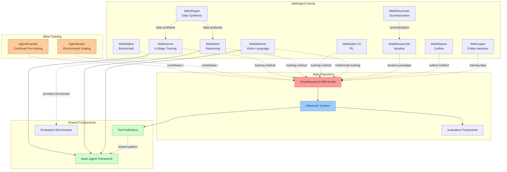
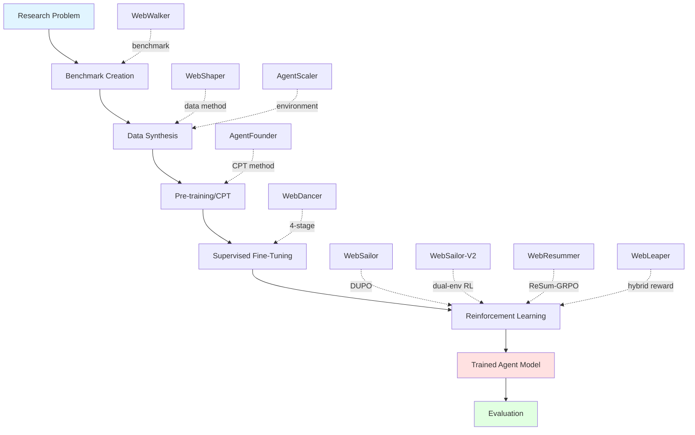
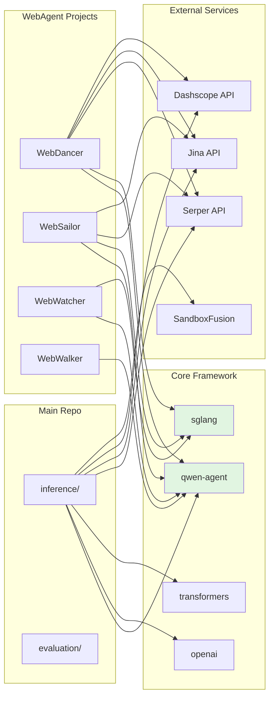
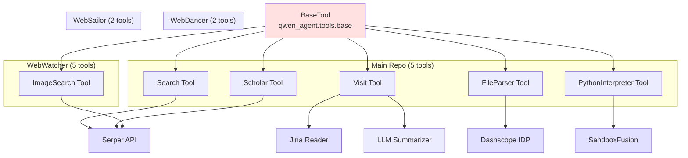
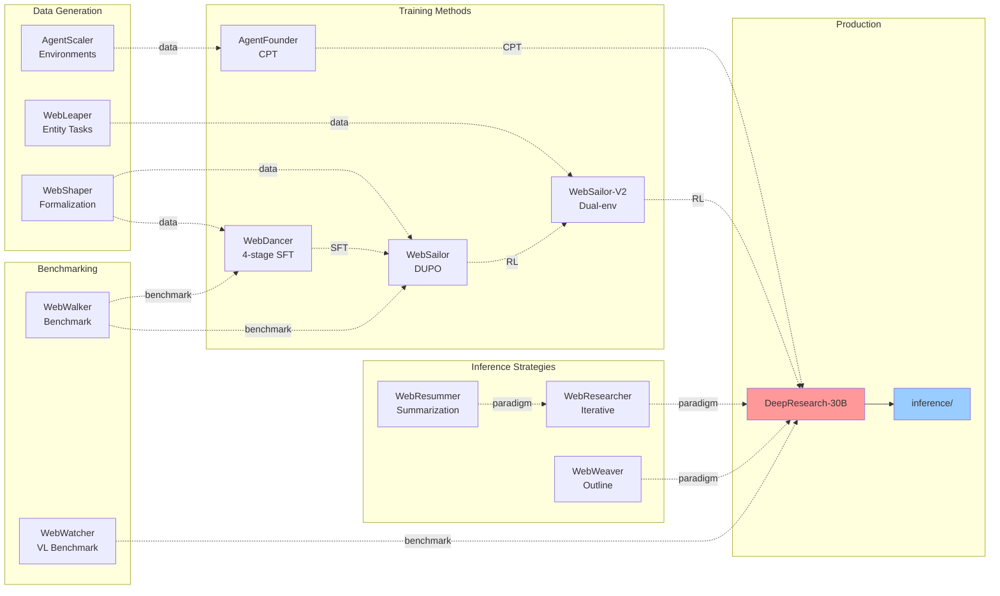

# WebAgent Architecture and Dependency Analysis

**Document**: Deep Research Repository Structure Investigation
**Date**: 2025-11-10
**Analysis Focus**: WebAgent family relationships, dependencies, and architecture

***

## Table of Contents

1. [Executive Summary](#executive-summary)
2. [Repository Structure Overview](#repository-structure-overview)
3. [Architecture Relationships](#architecture-relationships)
4. [WebAgent Family Analysis](#webagent-family-analysis)
5. [Code Structure Comparison](#code-structure-comparison)
6. [Dependency Analysis](#dependency-analysis)
7. [Tool System Architecture](#tool-system-architecture)
8. [Training Paradigms](#training-paradigms)

***

## Executive Summary

The DeepResearch repository is a **monorepo** containing:

* **1 Main Inference System** (`inference/`) - Unified inference framework for the DeepResearch-30B model

* **11 WebAgent Research Projects** - Independent agent implementations with different specializations

* **2 Meta-Training Frameworks** (`Agent/`) - AgentFounder (continual pre-training) and AgentScaler (environment scaling)

* **1 Evaluation Framework** - Benchmark evaluation scripts

**Key Finding**: The WebAgent projects are **largely independent** implementations, each representing different research directions in web-based information seeking. They share architectural patterns and the `qwen-agent` framework but have **minimal direct code dependencies** between each other.

***

## Repository Structure Overview

```
DeepResearch/
├── inference/                    # Main unified inference system
│   ├── react_agent.py           # Core ReAct agent (MultiTurnReactAgent)
│   ├── run_multi_react.py       # Parallel execution framework
│   ├── tool_*.py                # Tool implementations (5 tools)
│   ├── prompt.py                # System prompts
│   └── run_react_infer.sh       # Deployment script
│
├── WebAgent/                     # WebAgent research family
│   ├── WebWalker/               # Benchmark & Multi-agent framework (ACL 2025)
│   ├── WebDancer/               # 4-stage training (NeurIPS 2025)
│   ├── WebSailor/               # Super-human reasoning (3B/7B/32B models)
│   ├── WebSailor-V2/            # Dual-environment RL
│   ├── WebWatcher/              # Vision-language agent (7B/32B models)
│   ├── WebShaper/               # Formalization-driven data synthesis
│   ├── WebResearcher/           # Iterative deep-research paradigm
│   ├── WebResummer/             # Context summarization (ReSum)
│   ├── WebWeaver/               # Dynamic outline optimization
│   └── WebLeaper/               # Entity-intensive training
│
├── Agent/                        # Meta-training frameworks
│   ├── AgentFounder/            # Continual pre-training approach
│   └── AgentScaler/             # Environment scaling approach
│
├── evaluation/                   # Benchmark evaluation scripts
│   ├── evaluate_deepsearch_official.py
│   └── evaluate_hle_official.py
│
└── requirements.txt             # Unified dependencies for main repo
```

***

## Architecture Relationships

### High-Level Relationship Diagram



### Training Pipeline Flow



***

## WebAgent Family Analysis

### 1. WebWalker - Benchmark & Multi-Agent Framework

**Release**: 2025-01-14 | **Conference**: ACL 2025 | **ArXiv**: 2501.07572

**Purpose**: Benchmarking LLMs in web traversal

**Key Contributions**:

* **WebWalkerQA Dataset**: 680 queries across 1373 webpages

* Multi-agent framework for memory management

* Vertical exploration strategy

**Architecture**:

```python
# WebWalker/src/app.py - Multi-agent setup
class WebWalkerAgent:
    def __init__(self):
        self.router = RouterAgent()      # Routes queries
        self.navigator = NavigatorAgent() # Web navigation
        self.reader = ReaderAgent()      # Content extraction
        self.summarizer = SummarizerAgent() # Memory management
```

**Tools**: Search, Visit (via Crawl4AI)
**Dependencies**: `crawl4ai`, `qwen-agent`, `requests`
**No direct code sharing** with other agents

***

### 2. WebDancer - 4-Stage Training Paradigm

**Release**: 2025-06-23 | **Conference**: NeurIPS 2025 | **ArXiv**: 2505.22648

**Purpose**: End-to-end agentic training framework

**Four-Stage Training**:

1. **Browsing Data Construction** - Synthetic QA generation
2. **Trajectory Sampling** - Expert trajectory generation
3. **Supervised Fine-Tuning** - Cold start with LLaMA-Factory
4. **Reinforcement Learning** - DAPO (modified verl)

**Architecture**:

```python
# WebDancer/demos/agents/search_agent.py
class SearchAgent(Assistant):
    def __init__(self, llm, reasoning=True, max_llm_calls=50):
        self.reasoning = reasoning  # <think> tags
        self.max_llm_calls = max_llm_calls

    def _run(self, messages, **kwargs):
        # Custom ReAct loop with thinking mode
        for step in range(self.max_llm_calls):
            response = self.llm.chat(messages)
            # Parse <think>, <tool_call>, <answer>
            if self.is_final_answer(response):
                break
```

**Tools**: Search (Serper), Visit (Jina + Dashscope summarization)
**Dependencies**: `sglang[all]`, `qwen-agent[gui,rag,code_interpreter,mcp]`
**Response Format**:

```
<think> reasoning here </think>
<tool_call>{"name": "search", "arguments": {...}}</tool_call>
<tool_response>results</tool_response>
<answer>final answer</answer>
```

***

### 3. WebSailor - Super-Human Reasoning

**Release**: 2025-07-03 (3B), 2025-08-26 (7B/32B) | **ArXiv**: 2507.02592

**Purpose**: Extreme uncertainty and complex reasoning

**Key Innovations**:

* **SailorFog-QA**: Knowledge graph + information obfuscation

* **DUPO** (Duplicating Sampling Policy Optimization)

* Two-stage: RFT cold start → DUPO RL

**Architecture**:

```python
# WebSailor/src/react_agent.py
class MultiTurnReactAgent(FnCallAgent):
    def call_server(self, msgs, max_tries=10):
        # Uses SGLang server at port 6001
        client = OpenAI(
            api_key="EMPTY",
            base_url="http://127.0.0.1:6001/v1"
        )

    def _run(self, data, model, user_prompt):
        # Standard ReAct loop
        while num_llm_calls_available > 0:
            content = self.call_server(messages)
            # Parse and execute tools
```

**Tools**: Search, Visit
**Dependencies**: `sglang[all]`, `qwen-agent[gui,rag,code_interpreter,mcp]`
**Performance**:

* BrowseComp-en: 12.0%

* BrowseComp-zh: 30.1%

* GAIA: 55.4%

***

### 4. WebSailor-V2 - Dual-Environment RL

**Release**: 2025 | **ArXiv**: 2509.13305

**Purpose**: Bridging gap to proprietary agents

**Key Innovations**:

* **SailorFog-QA-2**: Densely interconnected knowledge graph

* **Dual-environment RL**: Simulator + real-world environment

* Symbiotic data-policy feedback loop

**Performance**:

* BrowseComp-en: 35.3

* BrowseComp-zh: 44.1

* HLE: 30.6

* **Outperforms DeepSeek-V3.1 (671B)**

***

### 5. WebWatcher - Vision-Language Agent

**Release**: 2025-08-27 | **ArXiv**: 2508.05748

**Purpose**: Multimodal deep research agent

**Key Innovations**:

* **BrowseComp-VL Benchmark**: Multimodal benchmark

* **Multimodal Tools**: Web Image Search, OCR, Code Interpreter

* Vision-language reasoning

**Architecture**:

```python
# WebWatcher uses enhanced tool set
tools = [
    'web_image_search',    # Image search via Serper
    'web_text_search',     # Text search
    'visit',               # Web page visit
    'code_interpreter',    # Python execution
    'ocr'                  # Built-in OCR
]
```

**Models**: WebWatcher-7B, WebWatcher-32B
**Performance** (HLE-VL): 13.6% (vs GPT-4o: 9.8%)

***

### 6. WebShaper - Formalization-Driven Data Synthesis

**Release**: 2025-08-28 | **ArXiv**: 2507.15061

**Purpose**: Systematic IS task generation

**Key Innovations**:

* **Task Formalization**: Knowledge Projection (KP) representation

* **Layer-wise Structure**: Traverses and replaces variables

* **Agentic Expander**: Iterative validation

**Data Format**:

```json
{
  "id": "ws-001",
  "question": "natural language question",
  "formalization": ["KP", ["R-Union", ...], ...],
  "answer": "ground truth",
  "urls": ["source1.com", "source2.com"]
}
```

**Dataset**: WebShaper-500 (500 QA pairs released)
**Performance**:

* GAIA: 60.19%

* WebWalkerQA: 52.50%

***

### 7. WebResearcher - Iterative Deep Research

**Release**: 2025 | **ArXiv**: 2509.13309

**Purpose**: Unbounded reasoning capability

**Paradigm Shift**:

* **Iterative Rounds** instead of linear accumulation

* **Report-Based Memory**: Evolving summary report

* **Workspace Reconstruction**: Prevents cognitive suffocation

**Response Structure**:

```
<Think> internal reasoning (not carried forward) </Think>
<Report> evolved central memory (carried forward) </Report>
<Action> tool call or final answer </Action>
```

**Training**:

1. RFT (Rejection Sampling Fine-Tuning)
2. RLVR (RL with Verifiable Rewards)
3. TTS (Test-Time Scaling) with `last-k-fusion`

***

### 8. WebResummer (ReSum) - Context Summarization

**Release**: 2025 | **ArXiv**: 2509.13313

**Purpose**: Unlimited exploration via summarization

**Key Innovations**:

* **ReSum Paradigm**: Periodic compression of conversation history

* **ReSumTool-30B**: Specialized summarization model

* **ReSum-GRPO**: Tailored RL algorithm

**Performance Impact**:

* +4.5% average Pass\@1 improvement across WebSailor agents

* BrowseComp-zh: 33.3% (from ReSum-GRPO training)

***

### 9. WebWeaver - Dynamic Outline Optimization

**Release**: 2025 | **ArXiv**: 2509.13312

**Purpose**: Open-ended deep research with structure

**Key Innovations**:

* **Dual-Agent Framework**: Planner + Writer

* **Dynamic Outline**: "Living document" that evolves

* **Memory-Grounded Synthesis**: Hierarchical, section-by-section

**Architecture**:

```
Planner Agent → Web Search → Outline Refinement → Loop
                                    ↓
Writer Agent → Targeted Retrieval → Section Synthesis → Report
```

**Dataset**: WebWeaver-3k (SFT dataset for knowledge distillation)

***

### 10. WebLeaper - Entity-Intensive Training

**Release**: 2025 | **ArXiv**: 2510.24697

**Purpose**: Efficient, info-rich seeking

**Key Innovations**:

* **Entity-Intensive Tasks**: Dense target packing

* **Three Synthesis Modes**: Basic, Union, Reverse-Union

* **Hybrid Reward System**: Soft F-score for RL

**Metrics**:

```python
# Information-Seeking Rate
ISR = |Retrieved ∩ Required| / |Required|

# Information-Seeking Efficiency
ISE = num_targets / num_steps
```

**Training**:

1. SFT with ISR/ISE filtering (coverage + efficiency)
2. RL with hybrid rewards (granular F-score)

***

## Code Structure Comparison

### Tool Implementation Pattern

All agents follow similar tool patterns but with variations:

**Main Repo** (`inference/tool_search.py`):

```python
@register_tool("search", allow_overwrite=True)
class Search(BaseTool):
    name = "search"
    description = "Performs batched web searches..."
    parameters = {
        "type": "object",
        "properties": {
            "query": {"type": "array", "items": {"type": "string"}}
        },
        "required": ["query"]
    }

    def google_search_with_serp(self, query: str):
        conn = http.client.HTTPSConnection("google.serper.dev")
        # Chinese detection and localization
        if contains_chinese_basic(query):
            payload = {"q": query, "location": "China", "gl": "cn", "hl": "zh-cn"}
        else:
            payload = {"q": query, "location": "United States", "gl": "us"}
```

**WebDancer** (`WebAgent/WebDancer/demos/tools/private/search.py`):

```python
@register_tool("search", allow_overwrite=True)
class Search(BaseTool):
    name = "search"
    description = "Performs batched web searches..."

    def call(self, params: str, **kwargs) -> str:
        query = params["query"][:MAX_MULTIQUERY_NUM]  # Limit to 3

        if isinstance(query, List):
            with ThreadPoolExecutor(max_workers=3) as executor:
                results = list(executor.map(self.google_search, query))
```

**WebSailor** (`WebAgent/WebSailor/src/tool_search.py`):

```python
@register_tool("search", allow_overwrite=True)
class Search(BaseTool):
    # Similar structure but different API integration
    def google_search(self, query: str):
        url = 'https://google.serper.dev/search'
        headers = {'X-API-KEY': GOOGLE_SEARCH_KEY}
        data = {"q": query, "num": 10}
```

**Key Differences**:

1. **API Integration**: Main repo uses `http.client`, WebDancer uses `requests`
2. **Localization**: Main repo detects Chinese and adjusts parameters
3. **Batch Handling**: WebDancer explicitly uses ThreadPoolExecutor
4. **Error Handling**: Different retry strategies (5 attempts vs 3 attempts)

### Agent Core Pattern

**Main Repo** (`inference/react_agent.py`):

```python
class MultiTurnReactAgent(FnCallAgent):
    def __init__(self, function_list, llm, **kwargs):
        self.llm_generate_cfg = llm["generate_cfg"]
        self.llm_local_path = llm["model"]

    def call_server(self, msgs, planning_port, max_tries=10):
        # Multi-port load balancing
        openai_api_base = f"http://127.0.0.1:{planning_port}/v1"
        # Temperature, top_p, presence_penalty configuration
        # Stops at: ["\n<tool_response>", "<tool_response>"]

    TOOL_CLASS = [FileParser(), Scholar(), Visit(), Search(), PythonInterpreter()]
```

**WebSailor** (`WebAgent/WebSailor/src/react_agent.py`):

```python
class MultiTurnReactAgent(FnCallAgent):
    def call_server(self, msgs, max_tries=10):
        # Fixed port 6001
        openai_api_base = "http://127.0.0.1:6001/v1"
        # Similar configuration
        # Stops at: ["\n<tool_responseF", "<tool_response>"]  # Note: typo in stop token

    # Only Search and Visit tools
```

**WebDancer** (`WebAgent/WebDancer/demos/agents/search_agent.py`):

```python
class SearchAgent(Assistant):  # Different base class!
    def __init__(self, llm, reasoning=True, max_llm_calls=50):
        self.reasoning = reasoning

    def _run(self, messages, **kwargs):
        # Custom ReAct loop (not using FnCallAgent's loop)
        # Adds <think> tags when reasoning=True
        for step in range(self.max_llm_calls):
            # Manual tool parsing and execution
```

**Key Architectural Differences**:

1. **Base Class**: Main/WebSailor use `FnCallAgent`, WebDancer uses `Assistant`
2. **Tool Set**: Main repo has 5 tools, WebSailor has 2, WebDancer has 2
3. **ReAct Loop**: WebDancer implements custom loop, others use inherited
4. **Reasoning Mode**: WebDancer adds explicit `<think>` tag support

***

## Dependency Analysis

### Framework Dependencies



### Python Package Dependencies

| Component       | qwen-agent | sglang   | transformers | openai | vllm | Special         |
| --------------- | ---------- | -------- | ------------ | ------ | ---- | --------------- |
| **Main Repo**   | ✓          | -        | ✓            | ✓      | ✓    | sandbox-fusion  |
| **WebDancer**   | ✓ \[full]  | ✓ \[all] | -            | -      | -    | -               |
| **WebSailor**   | ✓ \[full]  | ✓ \[all] | -            | -      | -    | -               |
| **WebWatcher**  | ✓          | ✓        | ✓            | ✓      | ✓    | alibabacloud-\* |
| **WebWalker**   | ✓          | -        | -            | -      | -    | crawl4ai        |
| **WebResummer** | ✓ \[full]  | ✓ \[all] | -            | -      | -    | -               |

**qwen-agent variants**:

* `qwen-agent` - Base package

* `qwen-agent[gui,rag,code_interpreter,mcp]` - Full features

***

## Tool System Architecture

### Tool Hierarchy



### Tool Definition Pattern

All tools follow the `BaseTool` interface:

```python
from qwen_agent.tools.base import BaseTool, register_tool

@register_tool("tool_name", allow_overwrite=True)
class CustomTool(BaseTool):
    name = "tool_name"

    description = "What the tool does..."

    parameters = {
        "type": "object",
        "properties": {
            "param1": {"type": "string", "description": "..."},
            "param2": {"type": "array", "items": {"type": "string"}}
        },
        "required": ["param1"]
    }

    def call(self, params: str, **kwargs) -> str:
        # Parse params (JSON string)
        # Execute tool logic
        # Return results as string
        pass
```

**Shared Pattern**:

1. **Decorator**: `@register_tool()` registers with qwen-agent
2. **Schema**: OpenAI function calling format
3. **Call Method**: Main execution entry point
4. **String I/O**: Input and output are JSON strings

***

## Training Paradigms

### Training Evolution Timeline

```mermaid
graph TD
    BASE[Base LLM<br/>Qwen2.5/Qwen3] --> CPT[Continual Pre-training]
    CPT --> SFT[Supervised Fine-Tuning]
    SFT --> RL[Reinforcement Learning]
    RL --> FINAL[Trained Agent]

    AF[AgentFounder<br/>Agentic CPT] -.->|32K→128K context| CPT
    AS[AgentScaler<br/>Environment Scaling| -.->|synthetic envs| SFT

    WSH[WebShaper<br/>Formalization] -.->|structured QA| SFT
    WD[WebDancer<br/>4-stage] -.->|trajectory SFT| SFT
    WS[WebSailor<br/>RFT→DUPO] -.->|cold start| SFT
    WS -.->|DUPO| RL
    WL[WebLeaper<br/>Entity-Intensive] -.->|ISR/ISE filtered| SFT
    WL -.->|Hybrid Reward| RL
    WRM[WebResummer<br/>ReSum-GRPO] -.->|GRPO| RL
    WS2[WebSailor-V2<br/>Dual-env RL] -.->|simulator+real| RL
    WR[WebResearcher<br/>RLVR] -.->|verifiable rewards| RL

    style CPT fill:#ffe1e1
    style SFT fill:#e1ffe1
    style RL fill:#e1e1ff
    style FINAL fill:#ffe1ff
```

### Training Paradigm Comparison

| Project           | CPT          | SFT Method               | RL Method            | Key Innovation         |
| ----------------- | ------------ | ------------------------ | -------------------- | ---------------------- |
| **AgentFounder**  | ✓ (32K→128K) | FAS+HAS                  | -                    | First agentic CPT      |
| **AgentScaler**   | -            | Environment scaling      | -                    | Synthetic environments |
| **WebDancer**     | -            | Trajectory sampling      | DAPO                 | 4-stage paradigm       |
| **WebSailor**     | -            | RFT (rejection sampling) | DUPO                 | SailorFog-QA + DUPO    |
| **WebSailor-V2**  | -            | RFT                      | Dual-env RL          | Simulator + real-world |
| **WebShaper**     | -            | Formalization-driven     | -                    | Task formalization     |
| **WebLeaper**     | -            | ISR/ISE filtered         | GRPO + Hybrid Reward | Entity-intensive tasks |
| **WebResearcher** | -            | RFT                      | RLVR                 | Iterative paradigm     |
| **WebResummer**   | -            | -                        | ReSum-GRPO           | Summarization-aware    |
| **WebWatcher**    | -            | Multimodal trajectory    | RL                   | Vision-language        |
| **WebWeaver**     | -            | Dual-agent trajectories  | -                    | Outline-based          |

**Training Data Sources**:

* **Synthetic**: WebShaper, AgentScaler, WebLeaper

* **Trajectory-based**: WebDancer, WebSailor, WebWatcher

* **Benchmark-derived**: WebWalkerQA, SailorFog-QA

* **Hybrid**: Most projects combine multiple sources

***

## Key Insights

### 1. **Independent Research Projects**

Each WebAgent is a **standalone research contribution** with:

* Own paper and methodology

* Own training pipeline

* Own evaluation benchmarks

* Minimal code reuse across projects

### 2. **Shared Framework, Different Implementations**

All use `qwen-agent` but:

* Different tool selections

* Different agent loop implementations

* Different prompt engineering

* Different serving strategies (sglang vs vllm)

### 3. **Complementary Contributions**

Projects contribute to different aspects:

* **Data**: WebShaper, AgentScaler, WebLeaper

* **Training**: WebDancer, WebSailor, AgentFounder

* **Inference**: WebResearcher, WebResummer

* **Benchmarking**: WebWalker

* **Multimodal**: WebWatcher

* **Long-form**: WebWeaver

### 4. **Evolution Pattern**

```
WebWalker (Benchmark)
    → WebDancer (Basic Training)
    → WebSailor (Advanced RL)
    → WebSailor-V2 (SOTA RL)
    → DeepResearch-30B (Production)
```

### 5. **Main Repo Integration**

The `inference/` directory represents the **unified production system**:

* Combines learnings from all WebAgent projects

* Uses vLLM for efficient serving

* Supports 5 tools (most comprehensive)

* Designed for DeepResearch-30B model

***

## Dependency Graph

### Inter-Project Dependencies



### External Service Dependencies

All projects depend on:

* **Serper API** (Google Search) - `SERPER_KEY_ID` / `GOOGLE_SEARCH_KEY`

* **Jina API** (Web page reading) - `JINA_API_KEY`

* **Dashscope API** (File parsing, summarization) - `DASHSCOPE_API_KEY`

* **SandboxFusion** (Python execution) - `SANDBOX_FUSION_ENDPOINT`

***

## Conclusion

The DeepResearch repository is a **research-focused monorepo** where:

1. **WebAgent projects are independent research contributions**, each advancing the field of web-based information seeking in different directions

2. **Shared architectural patterns** (qwen-agent, ReAct, tool-based) provide consistency, but implementations vary significantly

3. **AgentFounder and AgentScaler** represent meta-level training innovations that improve the base model capabilities

4. **Main** **`inference/`** **system** is the unified production framework that integrates learnings from all projects

5. **Minimal direct code sharing** between WebAgent projects - they're parallel research efforts, not sequential dependencies

6. **Each project contributes** different puzzle pieces:

   * Data synthesis methods

   * Training paradigms

   * Inference strategies

   * Benchmarking frameworks

   * Evaluation metrics

The repository demonstrates **research breadth** rather than code reuse, with each WebAgent pushing the boundaries of agent capabilities in complementary ways.
